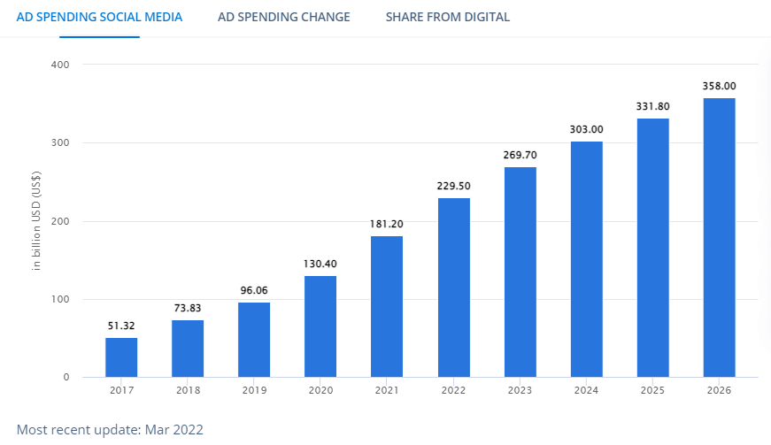

数字化转型是一个很难准确定义的广义术语。将数字化转型视为企业面向未来的一种方式。但是，您可以将其视为业务活动的变化，优先考虑您的企业的数字存在。不同的行业和部门以不同的方式使用这个短语。

例如，在人力资源方面，数字化转型需要简化运营和数字化人事数据。会计部门可以考虑利用电子合同、数据收集和报告作为数字化转型的一部分。

在这里，您可以快速了解世界如何走向数字化，这意味着，如果您正在寻求数字化转型，您的业务将拥有广阔的发展空间。

当您可以在营销中使用新兴的自动化、机器学习 (ML) 和人工智能 (AI) 技术时，您的业务数字化转型成为可能。

然而，在营销数字化转型方面，营销人员使用现代工具和技术的方式发生了更大的革命。在营销领域引领成功的数字化转型的关键在于使用和最大化企业数字化存在的能力。换句话说，这意味着使用技术来不断改进整个公司模式，包括产品、客户服务和运营。

## 数字营销方法

您的主要营销领导者的任务应该负责帮助组织实现显着增长，以便他们现在和将来都可以产生可观的价值。

利用数字营销的一种方法是为营销自动化定义 KPI。这些通常包括：

- 潜在客户转化率，
- 广告活动的点击率，
- 收件人打开的电子邮件数量，
- 完成一个特定目标（下载、调用、点击等）

产生预期的结果将需要一个具有自动化关键活动技巧的营销专业人员。首先，他们需要选择正确的工具，让营销团队能够评估组织的进展并更好地了解客户的行为。

一些关键的营销自动化工具包括：

- Oracle Eloqua
- HubSpot
- LeadSquared
- Pardot by Salesforce
- Constant Contact

此外，您的营销自动化专家可以利用这些工具来识别和监控与正在进行的活动相关的数字营销活动。

## 推动成功数字化转型的步骤

一旦您知道为什么数字化转型对于业务增长是必要的，成功的数字营销团队就可以帮助企业以正确的战略发展。他们可以在正确的时间、正确的位置向正确的人传递正确的信息。这种方法需要将数据与数字技术相结合，以便您的客户从您的服务、广告和优惠中获得更多价值。也就是说，现在我们将看看您需要遵循的一些关键步骤，以确保成功的营销数字化转型。

### 一、数字营销自动化的基本范围

营销自动化可能会将一些与营销操作相关的最耗时的程序自动化，例如发送电子邮件。其他任务包括：

- **跟踪和报告数字营销活动：**您的自动化 KPI 应该包括监控活动和报告活动，因为您的团队利用各种渠道接触目标受众。一些[营销仪表板工具](https://www.datafocus.ai/infos/marketing-dashboard-software-tools)允许您生成自动化的在线仪表板和报告，以便在一个地方跟踪您最相关的 KPI。
- **转换潜在客户：**这涉及自动化生成和转换潜在客户的过程，是一个漫长的过程，但它可能会很快实现自动化。例如，您可以在潜在客户从您的网站下载任何内容后向他们发送电子邮件。此类电子邮件可能包含专门用于将这些潜在客户转化为客户的信息或内容。
- **社交媒体：**您可以使用各种社交网络平台发布照片、撰写文字和定位特定网站。HootSuite 等工具可以帮助在预定义的时间自动发布各种帖子。
- **电子邮件通讯：**自动创建和分发电子邮件通讯以节省时间。

### 2.创建营销漏斗

您可以将数字营销纳入传统营销漏斗的概念中，该漏斗衡量对潜在消费者反应的影响，最终导致购买承诺。

营销漏斗是在数字技术到来之前，包括以下阶段：

- **意识：**在这里，您的潜在客户最初会意识到您提供了他们可能感兴趣的产品或服务。
- **兴趣：**接下来，您将拥有一组有兴趣了解更多关于您的业务以及它是否能满足他们的需求的客户。
- **考虑：**这时您有一组潜在买家考虑购买您的产品和服务。在这里，他们表现出的兴趣不仅仅是产生好奇。
- **意图：**当个人因为认为他们需要该产品或服务而开始朝着支持产品的方向发展时。
- **决定：**最后阶段是客户选择与您开展业务的阶段。

为您的营销部门带来数字化转型，并重新定义数据支持的采购流程。您的[数字营销 KPI](https://www.datafocus.ai/infos/best-digital-marketing-kpis-and-metrics)可以通过其他重要的多阶段交互和分析工具帮助营销人员。当您设定 KPI 并获得合适的数字营销工具后，您的企业将从以下方面受益：

### 3\. 优化数字渠道

您的数字营销团队可以确定现有营销工具和平台的价值。这包括更详细地考虑网站、自动化工具、社交媒体、客户数据库和分析平台。

之后，您的团队可以找到提供更高投资回报率的正确渠道。另外，他们可能会考虑这些渠道是否有助于提取决策的数据？彻底检查渠道和可用资源可以确保您在成功开展业务时为任何变化做好充分准备。

### 4\. 打破孤岛

全面的数字营销计划可确保您的所有营销渠道相互沟通并协同运作。在10个不同的账户中反复登录来跟踪客户的行程并不是一个好主意。

借助集成营销方法，您的团队可以将数据管理流程整合为数字化转型的一部分，从而打破数据孤岛。这样，您的团队可以更高效地协作。这样做的目标是清楚地了解您的受众、他们的行为以及可能的后续步骤。为此，您可以从交互式在线[营销报告](https://www.datafocus.ai/infos/daily-weekly-monthly-marketing-report-examples)中获益，该报告提供了一个集中视图来支持相关决策并保持团队之间的联系。

### 5.交互驱动的社交营销

您的潜在客户可能会在社交媒体上与您的公司帐户联系，并提出有助于他们做出决定的问题。他们可能会使用这些平台对他们刚刚互动过的内容发表评论或反馈。有时，他们可能只是喜欢您分享的帖子，甚至将其发布在他们的个人资料分享中。此类情况下，将需要您使用社交营销工具（例如用于社交参与的 BuzzSumo、用于#hashtag分析的Keyhole等）来增强您的业务。

## 主要数字营销领域

当您采用“全数字化”时，您需要考虑几个方面以实现 360 度增长。您需要利用多种数字媒体方法的组合，将一些列针对不同营销垂直市场的特定解决方案融合在一起。作为转型计划的一部分，全面的数字营销将使您的团队解决以下领域。

### 1.按点击付费（PPC）

每次点击付费广告是另一种著名的数字营销方法。通常，您会利用搜索引擎（Google）、社交媒体平台（Facebook、Instagram 等）或视频流媒体网站（YouTube、Vimeo 等）来展示您的广告。

这是一种按点击付费的广告模式，意味着从这些链接每次访问您的网站都会花费您一定的费用。这是将流量吸引到公司网站的流行方式之一，因为您在投放广告的平台上具有很高的可见性。

### 2\. 搜索引擎优化

如果没有 SEO，您向数字空间的转变是不完整的，因为它是一种提高网站知名度和推动高质量线索的绝佳技术。简而言之，SEO 是一种将您的网站置于搜索引擎结果顶部的某些术语（称为查询）的技术。当有人搜索与您的公司或产品相关的内容时，您希望名列前茅以获得吸引力。这将需要您的 SEO 团队使用相关工具采取一些措施。

- **关键字研究：**使用 Ahrefs、SEMrush、Google Ads 等工具来识别正确的关键字集，从而提高排名。
- **网络流量分析：**您可以依赖 Google Analytics、Google Search Console、Ahrefs、Adobe Analytics、Mixpanel 等。
- **链接建设：**使用这些顶级 SEO 工具中的任何一个来确定您的竞争对手在哪里生成反向链接，并针对这些网站构建链接，通过链接将流量传递到您的网站。活动包括来宾发帖、论坛评论、创建帐户等。

### 3\. 社交媒体营销

使用社交媒体来宣传您的内容和品牌可以显著影响您的底线。您的整体营销组合可能会在社交媒体的帮助下受益，因为大多数人至少在其中一个网站上拥有帐户。这可以从社交媒体广告支出的增长中看出，预计未来几年将呈指数增长，如下图所示。

您可以选择创建社交媒体公司帐户，以帮助产生潜在客户、增加网站流量并提高您的品牌知名度，同时成为一种有效的免费营销工具。以下是您在社交媒体营销中应该使用的一些社交媒体网站。

- Pinterest
- Snapchat
- Instagram
- Linkedin
- Twitter
- Facebook

此外，要跟踪你所有社交活动的成功和表现，您可以从交互式[社交媒体报告](https://www.datafocus.ai/infos/social-media-reports-examples-and-templates#examples)中受益。这些报告提供了所有 SMM 营销活动的集中视图，让您可以随时随地找到改进机会。下图是跟踪 4 个社交渠道表现的记分卡报告示例。这个工具的价值在于它的视觉特性。红色和绿色可以一目了然地告诉您 KPI 是否按预期执行或是否需要进行更改。

## 底线

广泛的业务运营和营销活动受到数字化转型的影响。首先，您的营销人员需要抓住受众，向其他行业的数字先驱学习，然后为您的企业提供正确的数据。

保持和提高数字营销的投资回报率需要不断改进和迭代。如果您在一项或多项活动后停下来，瞬息万变的数字环境会使您面临落后的风险。要想让你的企业在未来几年保持在数字增长的前沿，你必须紧跟当前的营销趋势，并愿意不断尝试新事物。做到这一点的一种方法包括在您的组织中推动[营销 BI 。](https://www.datafocus.ai/infos/business-intelligence-marketing)这些解决方案将允许每个人以一种简单直观的方式采用数字方法来进行决策。
