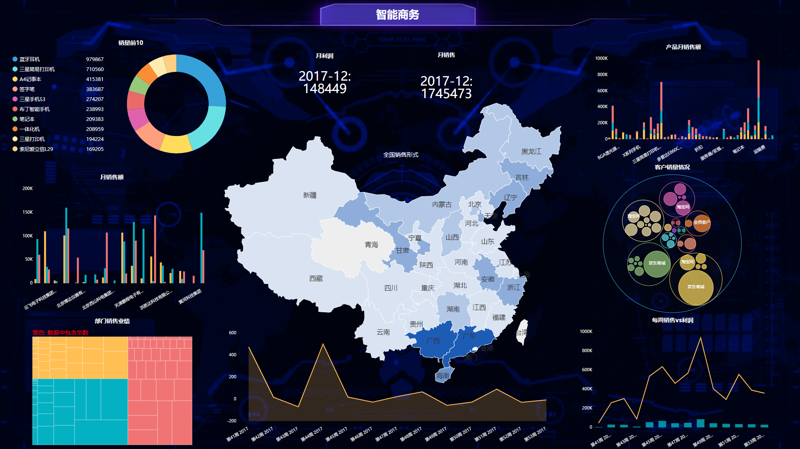

我现在是一名大学的在读生，有一次在完成老师布置的课程论文的时候，在网上搜到了一款叫DataFocus的可视化工具。因为可以在官网免费申请试用，我本着好奇的心理，就去尝试了一下，没想到最后的可视化效果超出了我自己的预期，将其运用在自己的课程论文上，也受到了老师的肯定，因此打算写一下我的使用体验，给大家推荐一下这款可视化工具。

现在网上的可视化工具层出不穷，相当丰富，那么我为什么会选择这款工具呢？其一，当然是因为这个工具可以免费试用了；第二点，是因为这款工具上手操作非常简单，不像R、Python还要编写代码，这款工具只需要简单的凭借鼠标点击和搜索就能得出你想要分析的结果，大大缩短了我的学习成本；第三点，可视化效果优，整个页面是属于比较感觉朴素的，没有太多花里胡哨的东西，可以自己设置想要的背景、图表类型等等，美中不足的是，预设的样式有点少，希望能出一下好看的样式可以直接供我们使用。

据我自己对这款工具的了解，它的主要目标是想要达到“数据和搜索一样简单”，虽然现在似乎还没有完全吻合这个目标，但是通过几次更新，可以看出来，这款工具的研发人员正在朝着这个方向不断努力，我也期待未来能够真正打成这个目标，让普通人也能揭开数据神秘的面纱！
