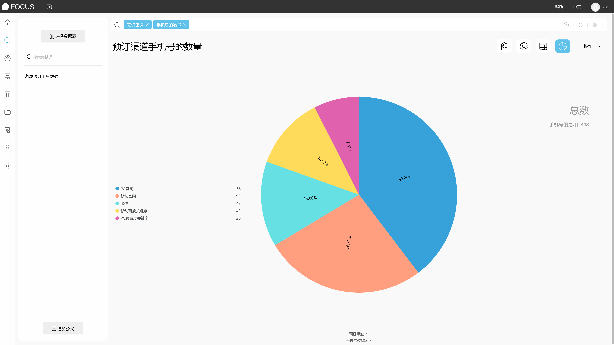
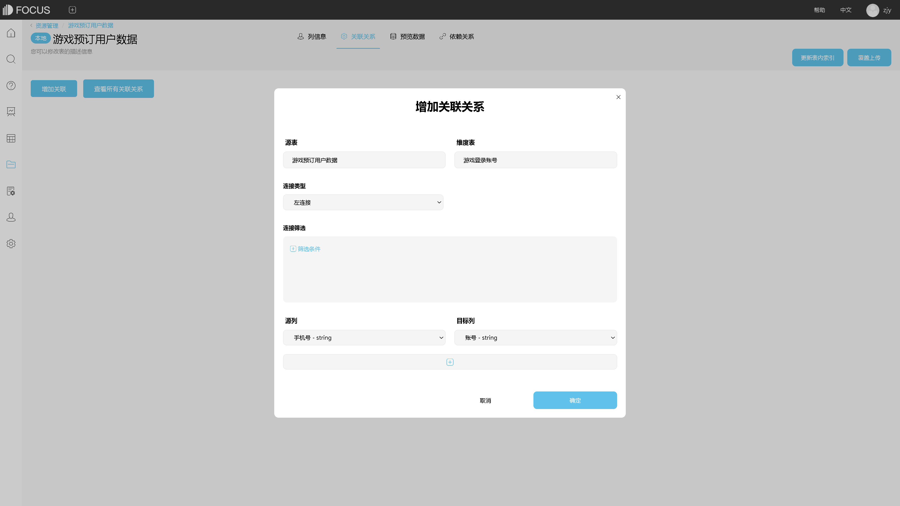

**推荐一款超好用的可视化工具**

提到可视化这个词，大家脑海中最先想到的是什么？可能很多人会想到“可视化很酷炫”，就像这样的酷炫大屏一样。

另外大多数人来说，可能会想到“可视化很难”，专业的数据分析师才能做出好看的可视化，一般的人只能默默仰望。

那事实上呢？一般人真的没法做出好看酷炫的可视化吗？如果按照传统的可视化手段，通过代码，sql语句，或者复杂的可视化工具，那么确实，一般人可能需要经过长时间的学习培训，才能实现可视化。

那如果现在有这么一款可视化工具，不需要花太多时间学习，没有任何代码，操作非常简单，10分钟即可上手，做出酷炫好看的可视化大屏，我认为，这样的可视化工具就值得推荐。有人会疑问了，真的会有这样简单的可视化工具吗？本文就是要告诉你，真的有，DataFocus就是这样的一款可视化工具。

DataFocus，一款采用自然语言搜索分析并展示的可视化工具，是国内第一个用自然语言搜索的可视化工具，拥有其专利权。DataFocus在图形样式以及配色方面，极大地满足了我们对美的追求，可视化的一大重点就是美，美是第一驱动力。另外DataFocus操作非常简单，只要你会用谷歌搜索，百度搜索等，你就能用DataFocus，是类似于一种“傻瓜式”的可视化工具，虽然操作简单，但并不代表着DataFocus的功能就很简单，相反，对比其他可视化工具，DataFocus有过之而无不及，它集数据仓库，数据分析，数据可视化，报表系统于一身，功能强大却如此简单，这就是我要推荐这款工具的原因。

一款好用的可视化工具，可以降低可视化的门槛，使只能仰望的人也能尝试进行可视化，使有基础的人可视化做得更好更美。
