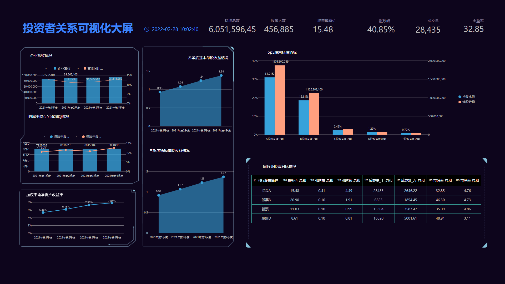

对于企业管理层人员而言，管理是一大不可忽视的难题，但同时，管理也是一门深邃的艺术。

彼得·德鲁克认为，“管理是一种有自己的技巧、工具和方法的工作。”

如果管理没有使用合适的技巧、工具或者方法，那它只会让工作或生活中的人或事成为一盘握不住的散沙。

管理可视化大屏便是一种工具，它将集中在一个位置显示所有重要的管理KPI，通过有效的方式与企业高管共享数据见解，并帮助管理层根据最新信息快速做出数据驱动的决策。

当面临战略决策时，往往需要汇总复杂的数据并将其转换为可操作的见解和报告时，管理可视化大屏就发挥了作用。它可以通过使用BI数据分析平台轻松完成，高级管理人员能通过事实和实时数据详细了解主要指标的业务绩效。这些信息将帮助他们清楚地了解当前组织的情况，识别业务问题和机遇，确定如何改进KPI管理，从而产生更多的收入和利润。

下面将介绍三款主要的管理KPI可视化大屏，您可以使用它们来完善业务。

## 财务概览仪表盘

第一个管理可视化大屏示例展示了企业财务状况，侧重于营收情况、现金流量、资产负债情况等方面。

每个企业高层管理者都需要关注的KPI之一就是企业营收、成本及利润。

营业收入管理是企业财务管理的重要方面，它将直接关系到企业的生存与发展。就像在大屏中看到的每个季度的营收变化情况，可以从宏观上了解企业随时间发展情况。而对于描述营业利润，大屏中的营业收入及成本具体项也取了其中关键指标，展示当前营业收入和成本的详情。

现金流量则可衡量企业经营状况是否良好，是否有足够的现金偿还债务，资产的变现能力等。

大屏中展示了企业三类经济活动产生的现金流入流出总量情况，分别是经营活动、投资活动、筹资活动，体现企业较高的经济活力。

现金流量主要是企业的动态体现，而资产负债就是企业的静态表现。大屏中展示了企业全部资产、负债及所有者权益的概况，并按照是否流动资产对资产和负债细分。

总的来看，这张大屏直接了当地展示企业财务状况，是公司经营管理活动结果的集中体现。

## 投资者关系可视化大屏

对于公司管理高层而言，不仅要追踪企业运营KPI，还要计算和传达有关公司整体情况的指标。这些信息对于跟踪关键投资者至关重要。上面这个管理可视化大屏示例显示股东在查看企业运营指标前更感兴趣的关键数据，它显示了企业营收情况、股东持股情况、企业股票详情等。

大屏上方记录了股东持股相关KPI，如持股总数、股东人数；还记录了股票相关KPI，例如股票最新价、涨跌幅、成交量、市盈率。

此外还记录了企业Top5股东持股情况，以便股东了解公司股东结构以及现有股东实力。

当然对于股东而言，最关注的财务指标之一还是利润。大屏中展示了企业各季度营收情况及同比增长情况，体现企业的发展实力。还有归属于股东的净利润及同比增长情况，让股东直观地看到利润及收益变化。

大屏中还放置了一个KPI指标，加权平均净资产收益率（ROE），它是净利润与平均所有者权益（股东权益）的百分比，该指标也反映了股东权益的收益水平，用以衡量公司运用自由资本的效率。通常指标值越高，说明投资带来的收益越高。

当然对于投资者来说，最重要和最关注的数字还包括股价以及股票收益。股价涨幅越高，您的股东通过投资您的公司盈利就越多。此外，大屏中还包括各季度每股收益情况，清晰直观地展示股票收益。

股东除了需要关注您的企业发展情况，当然还要关注同行业其它企业发展。因此大屏中放置了同行业股票对比情况，其中字段包括股票简称、最新价、涨跌幅、涨跌额、成交量、成交额、市盈率、市净率。

密切关注您的股价以及其它指标，可作为一种监控业务运营和保持不断增长的业务有效的手段。

## 销售管理可视化大屏

最后一个管理可视化大屏是关于销售管理，侧重于销售业绩及达标情况、客户管理等。它通过为您提供销售额及增长、达标信息，以及不同阶段的客户统计信息来提供此信息。

每个区的销售主管最重要的KPI之一便是和自己收入、企业收入直接挂钩的销售业绩。正如该销售管理可视化大屏中，将目标销售额和实际销售额相关联，通过简单易懂的可视化效果——水位图，展示目标销售额达标率。除了销售额，还有销售量，大屏中按照产品、渠道两个维度来将销量细分，可调整不同的销售策略以应对不同的情况。此外，将一定时期内的销售业绩与去年同期的销售业绩进行比较可以很好地表明业务的发展情况，因此上面的可视化大屏中销售业绩数据都包含了同比增长数据。

更重要的是，此管理可视化大屏中的实时可视化对于持续监控您的情况并解决问题至关重要。这些指标可以通过智能警报来轻松实现，如果出现问题，警报将立即通知您。

当然除了业绩，还包括客户管理。大屏中按照业务的不同阶段，将客户分成潜在客户、意向客户、下单客户和成交客户，并绘制成了客户的销售漏斗。您可以在漏斗图中看到每一个阶段客户的转化率，一旦没有满足预期，可以分析原因找到对策，以提升每一步的转化率，最终帮助业务获利。

现在我们已经展示了企业稳定管理应该是什么样子，不同场景使用各种管理可视化大屏，以及您可以关注哪些业务指标来发展业务并创造可持续的进步。使用合适的工具后，请记住定期跟踪您的指标，并将您的结果和之前具体的目标进行比较。想要创建您自己的可视化搭配或使用我们提供的模板，请开始DataFocus的14天免费试用！
