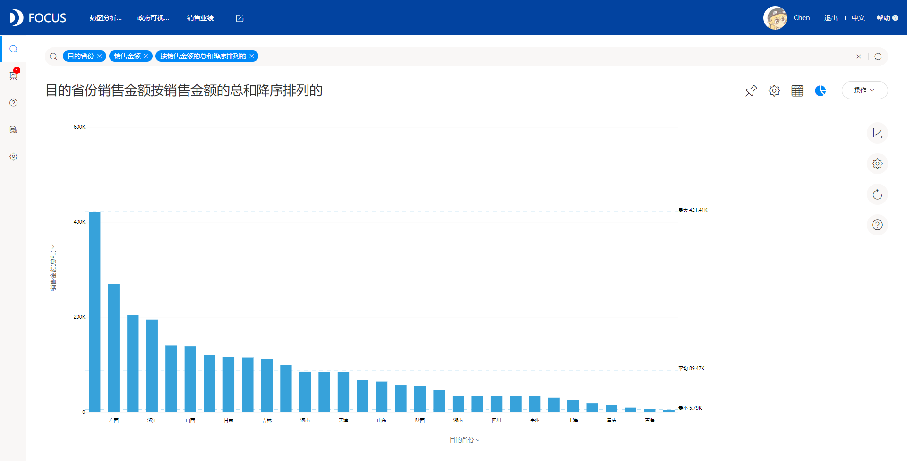
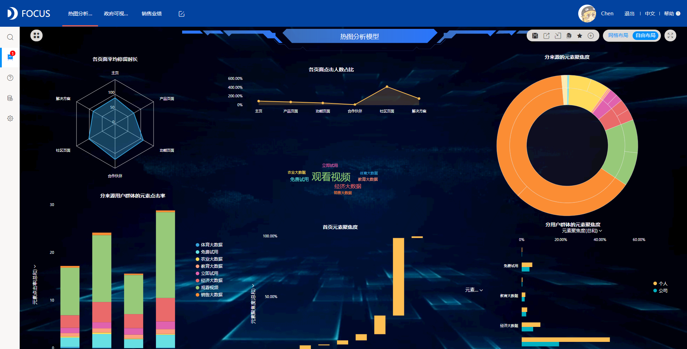

数据可视化是我们经常能够使用到的一项工作技能，对于刚刚接触这项技能的用户来说，在处理数据时，应当尽可能地以高效、准确的方式将图表呈现给他人。这其中，遵循一定的可视化最佳实践非常重要。我们通过以下几项简单、快捷的小技巧，就可以有效提升整个可视化图形的可读性。

**按规则过滤**

按规则过滤是指为数据添加快速筛选选项，对于需要每天关注销售额数据的公司高管来说，这非常重要。例如，如果你每天都像下面看到的那样，是很难读懂数据的。通过将数据过滤到最后30天或7天等条件，你就可以更清楚地看到低销售额和高销售额的具体日期了。

此外，你也可以通过描绘数据点来达到同样的效果。例如，你所在的公司可能拥有众多产品，可以根据此创建一个可视化图表，在按规则进行过滤后，就可以轻松看到那些表现优异的产品。

**添加层次结构**

可以向可视化数据中添加层次结构，这样可以在查看数据过程中，进一步深入查看具体内容。例如，添加一个层次结构，就可以显示每个区域的总销售额，然后按产品进一步细分。

DataFocus还支持上下钻取，即使是不使用分层图表的情况下，也可以直接在相应的区块右键选择钻取，在不同层级维度中查看，并对应切换合适的图表。

**格式化数据**

格式化数据是一种快速、简单的方法，使你的数据在视觉上更有冲击力，也更容易让别人阅读。对于常见的图表（如条形图和柱形图），你可以相应的调整数据格式，如小数位数、货币缩写等。

**对数据排序**

如果你的数据不是基于面向日期的查看方式，那么按照降序或升序对数据进行排序，会更加直观地显示你想要讲述的故事。

**数据对比**

你可以通过将图表见进行比较来改进和增加对可视化结果的更多见解。例如，可以根据日期显示数据（如按照年份、月份显示数据），也可以基于图表的两个分类进行比较。

**图表标题**

借助数据可视化，我们可以讲出很好的故事，但这需要保持图表标题简单明了，标题应该与图表有高度关联。

