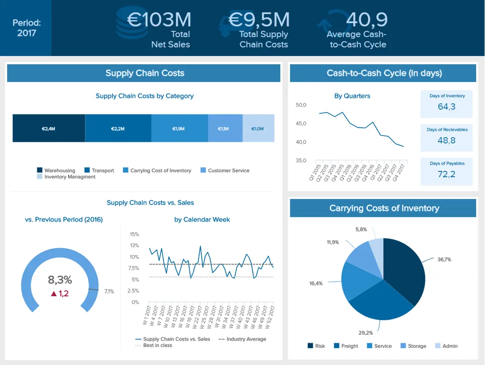

## 一、引言：供应链，企业增长的隐形翅膀

在竞争激烈的商业环境中，供应链已成为企业成功不可或缺的一环。一个高效、协同的供应链能够确保企业快速响应市场变化，满足客户需求，从而驱动企业持续增长。而要实现这一目标，精确监控和合理优化供应链关键绩效指标（KPI）至关重要。本文将为您深入解析供应链中的20大关键绩效指标，并结合实战案例，让您全面了解这些指标的作用与实战应用。

## 二、供应链KPI详解：从理论到实战的全面解析

1. **现金到现金的时间周期（Cash-to-Cash Cycle Time）**

- 定义：衡量从支付供应商款项到从客户处收回款项所需的时间。
- 作用：反映企业资金周转效率，帮助企业识别现金流管理的瓶颈，优化资金使用。
- 实战案例：某电商企业通过优化库存管理和物流效率，缩短了现金到现金的时间周期，提高了资金利用率。

2. **货运单准确性（Shipping Accuracy）**

- 定义：衡量发货过程中货运信息的准确性。
- 作用：减少物流错误和延误，提高客户满意度。
- 实战案例：一家物流公司通过引入先进的物流管理系统，提高了货运单准确性，显著减少了物流错误和投诉。

3. **完美的订单率（Perfect Order Rate）**

- 定义：衡量企业无差错地满足客户需求的能力。
- 作用：反映企业运营能力和客户服务水平，是企业竞争力的重要体现。
- 实战案例：一家制造企业通过优化生产流程和产品质量，提高了完美的订单率，赢得了客户的信任和市场的认可。

4. **应收账款周转天数（Days Sales Outstanding, DSO）**

- 定义：衡量从销售商品或服务到收回款项所需的时间。
- 作用：反映企业收款效率和现金流状况，帮助企业优化收款策略，降低坏账风险。
- 实战案例：某企业通过加强信用管理和优化收款流程，降低了DSO，提高了现金流水平。

5. **库存周转率（Inventory Turnover Ratio）**

- 定义：衡量在一定时期内库存商品的销售次数。
- 作用：反映企业库存管理能力，帮助企业优化库存结构，降低库存成本。
- 实战案例：一家零售企业通过引入先进的库存管理系统，提高了库存周转率，降低了库存积压和资金占用。

6. **毛利率投资回报率（Gross Margin Return on Investment, GMROI）**

- 定义：衡量库存投资的盈利能力。
- 作用：帮助企业优化库存投资结构，提高资金利用效率。
- 实战案例：某服饰品牌通过分析GMROI数据，调整了库存投资策略，提高了整体盈利能力。

7. **仓储成本（Warehouse Cost）**

- 定义：衡量仓库运营过程中的各项费用。
- 作用：揭示仓储环节的成本结构，帮助企业识别成本控制的关键点。
- 实战案例：一家物流公司通过引入智能仓储系统，降低了仓储成本，提高了运营效率。

8. **供应链成本（Supply Chain Cost）**

- 定义：衡量整个供应链过程中发生的各项费用。
- 作用：反映企业供应链管理效率，帮助企业识别成本节约的潜力点。
- 实战案例：某企业通过优化供应链流程，降低了供应链成本，提高了整体竞争力。

9. **供应链成本与销售额比率（Supply Chain Cost to Sales Ratio）**

- 定义：衡量供应链成本占销售额的比例。
- 作用：帮助企业了解供应链成本对整体盈利能力的影响。
- 实战案例：某企业通过分析供应链成本与销售额比率，调整了成本控制策略，提高了盈利能力。

10. **准时发货率（On-Time Delivery Rate）**

- 定义：衡量企业按照客户要求的时间准时发货的能力。
- 作用：提高客户满意度和忠诚度，有助于企业建立良好的市场口碑。
- 实战案例：一家制造企业通过优化生产计划和物流安排，提高了准时发货率，赢得了客户的信赖。

11. **交货时间（Delivery Time）**

- 定义：衡量从订单发货到客户收到货物所需的时间。
- 作用：反映企业物流效率和客户服务水平。
- 实战案例：一家电商企业通过引入先进的物流管理系统，缩短了交货时间，提高了客户满意度。

12. **退货原因（Return Reasons）**

- 定义：分析导致客户退货的各种原因。
- 作用：帮助企业识别产品和服务中的问题，进行针对性的改进。
- 实战案例：某企业通过分析退货原因数据，改进了产品质量和服务流程，降低了退货率。

13. **库存与销售比率（Inventory-to-Sales Ratio）**

- 定义：衡量库存量与销售额的比例。
- 作用：帮助企业保持合理的库存水平，避免库存积压和缺货现象。
- 实战案例：一家零售企业通过实时监控库存与销售比率数据，调整了库存采购策略，保持了合理的库存水平。

14. **库存速度（Inventory Velocity）**

- 定义：预计下一个期间内库存的消耗速度。
- 作用：帮助企业预测库存需求，优化库存结构。
- 实战案例：某制造企业通过分析库存速度数据，预测了未来几个月的库存需求，提前进行了库存调整。

15. **库存供应天数（Days of Inventory on Hand, DOH）**

- 定义：衡量如果不补充库存，现有库存能维持的天数。
- 作用：帮助企业为紧急情况做准备，避免库存短缺导致的生产中断或客户流失。
- 实战案例：一家医疗设备制造商通过分析库存供应天数数据，提前预测了库存短缺的风险，及时进行了库存补充。

16. **拣货和包装周期时间（Picking and Packing Cycle Time）**

- 定义：衡量从拣货到包装完成所需的时间。
- 作用：反映企业仓储和物流环节的运营效率。
- 实战案例：一家电商企业通过引入自动化拣货和包装系统，缩短了拣货和包装周期时间，提高了物流效率。

17. **填充率（Fill Rate）**

- 定义：衡量首次成功履行的客户订单比例。
- 作用：反映企业订单处理能力和客户满意度水平。
- 实战案例：一家分销企业通过优化订单处理流程和提高库存准确性，提高了填充率，赢得了客户的信赖。

18. **按时全额交付（On-Time and In-Full, OTIF）**

- 定义：衡量订单按时且足额交付的比例。
- 作用：确保满足客户需求，提高客户满意度和忠诚度。
- 实战案例：一家制造企业通过优化生产计划和物流协调，提高了OTIF比例，赢得了客户的长期合作。

19. **每单位运费（Cost per Unit Shipped）**

- 定义：衡量每个单位产品运输的平均成本。
- 作用：帮助企业优化运输成本结构，提高物流效率。
- 实战案例：一家跨国公司通过分析每单位运费数据，选择了更经济的运输方式和合作伙伴，降低了运输成本。

20. **包装材料的使用（Packaging Material Usage）**

- 定义：衡量拣货和包装过程中使用的包装材料数量。
- 作用：帮助企业降低包装成本，关注环保问题。
- 实战案例：一家环保型企业通过引入可回收包装材料并优化包装流程，降低了包装材料使用量，提高了企业的环保形象和市场竞争力。

## 三、如何最大化供应链KPI的价值？

了解这些供应链KPI并掌握其实战应用只是第一步，关键在于如何将它们转化为实际的商业价值。企业可以借助先进的供应链管理软件和工具，实时监控和分析这些KPI数据，通过数据驱动的决策来优化供应链流程。同时，企业还需要建立跨部门的协作机制，确保供应链各环节之间的顺畅沟通和高效协同。

## 四、结语：优化供应链KPI，驱动企业持续增长

通过精确监控和优化供应链KPI，企业可以不断提高供应链的效率和可靠性，降低成本，提升客户满意度和忠诚度。这将有助于企业在激烈的市场竞争中脱颖而出，实现持续增长和盈利。希望本文介绍的20大供应链KPI能够帮助您更好地理解和优化供应链，为您的企业增长提供有力支持。
