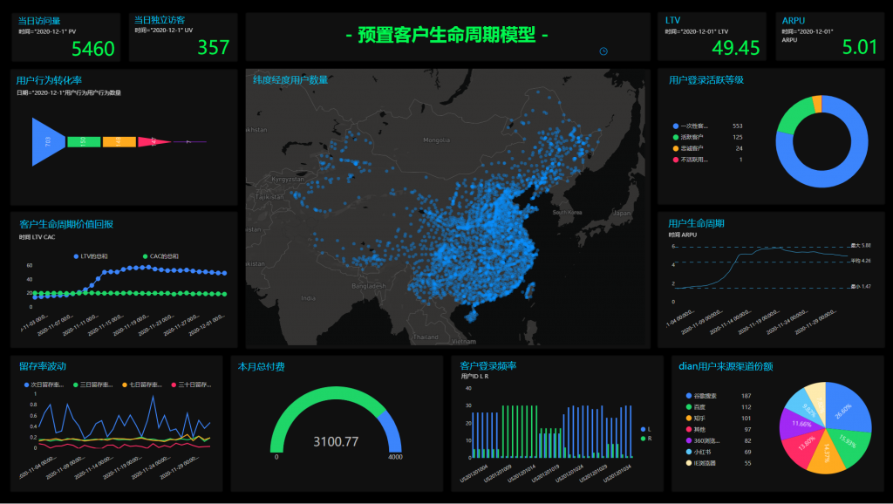

试想一下，投入大量时间、金钱和其它资源，结果最终企业数字化战略却以失败而告终。 你会如何防止这种事发生？您已经雇佣了最好的商业智能 （BI） 分析领导者，您的CEO也已经投资了您的数字化项目，并且您拥有市场上最好的技术。那么，到底离成功还差什么吗？ 成功或失败在项目开始前也许早就已经决定了。 如果你在开始一个项目之前考虑这些因素，你成功的机会将会大大提高。

这些因素是什么呢？

## 将数据视为实用工具，而不是奢侈品

### 豪华

最常见的因素之一：几乎每个人都把数据视为奢侈品。想想你生活中的其他奢侈品——珠宝、金钱、汽车。我们喜欢这些东西，但我们把它们锁起来，这样只有经过批准的人才能访问它们。 听起来就像是我们的数据，不是吗？我们不仅使用安全控制来限制访问，还限制了技能门槛。

您想创建自己的报告吗？先去学习和实操。

是否要访问该数据集？您未获批准，您不在正确的部门。

### 效用

地球上最宝贵的资源是什么？可能你会说是水，没有它，生活就不可能存在。我们都需要它。没有它，我们什么也做不了。这不就是我们希望我们的组织如何看待数据吗？ 如果你真的相信并且想要建立一个数据驱动的组织，开始考虑数据作为一种实用工具，而不是一种奢侈品。您对数据做出的所有其他决定都将由您对如何处理数据的看法所驱动。除非您业务中的每个人都认为这是理所当然的，并且没有它就不会做出决定，否则您无法真正打造一个数据驱动型组织。

## 将数据带给人们

一旦我们接受数据应该是一种实用工具，而不是奢侈品，我们就必须考虑如何让人们访问数据。任何未来的解决方案都应围绕将数据提供给部门所在人员，而不是让人员去获取数据。 这里有一个例子：假设您的销售副总裁需要数据来确定谁是她最成功的销售人员。 我们回答此业务问题的传统方式，是确定哪些解决方案最符合您的目标。一旦实施，您将与副总裁会面，并请他定义驱动其业务的指标。然后，您将构建符合这些要求的仪表板和报告，并培训最终用户使用解决方案。也许您还会为销售部门指派一名分析师来回答任何临时问题。 现在这样的工作正在迅速变化。新方法如下：与副总裁会面，要求她定义推动其业务的指标。在销售人员已经使用的工具中提供这些指标。 找到使用户能够将数据提供给他们的解决方案，不需要他们学习新的工具和 了解新的流程。

## 从业务驱动

BI项目是由需求驱动的。总的来说，很好地定义了需求，并构建了满足这些要求的解决方案没错，只是没有在正确的时间做。 大多数技术实现都由 IT 驱动，要求首先来自整体架构准则，其次来自业务 线。我们通常会需要按照IT部门的节奏来制定仪表盘和报告的要求。 到那时，已经太晚了。我们所能输出的数据信息受到我们已经做出的平台选择的限制。我们甚至都不用谈论失败的项目，因为我们的 BI 部门花了 6 个月的时间在业务继续发展并做其他事情时实施了完美的解决方案。 相反，采取迭代成本小的方法，有价值的交付给企业用户。每个部分都与特定业务价值相关联，找到业务问题中最有价值的部分，并解决它。

那么，这些对你的企业会有怎样的思考呢？
