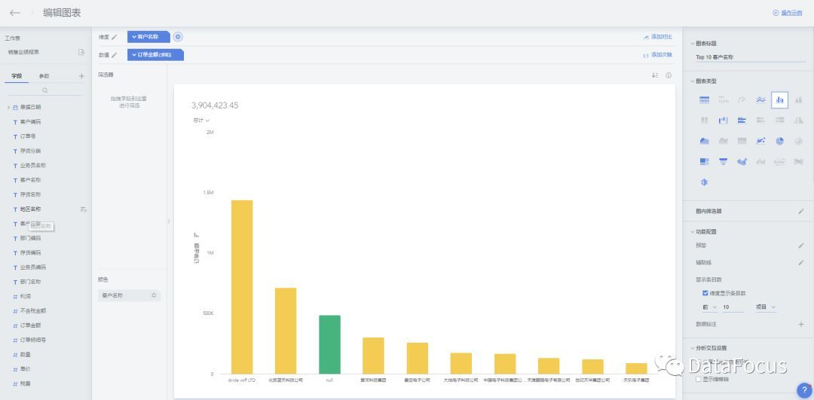
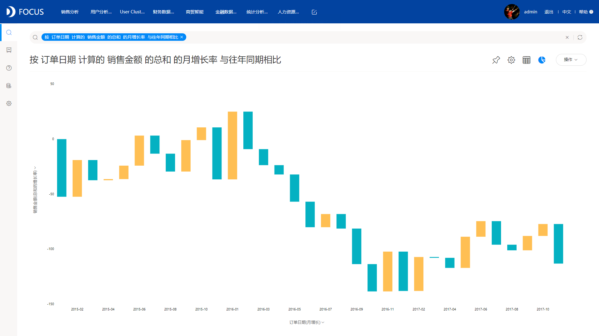
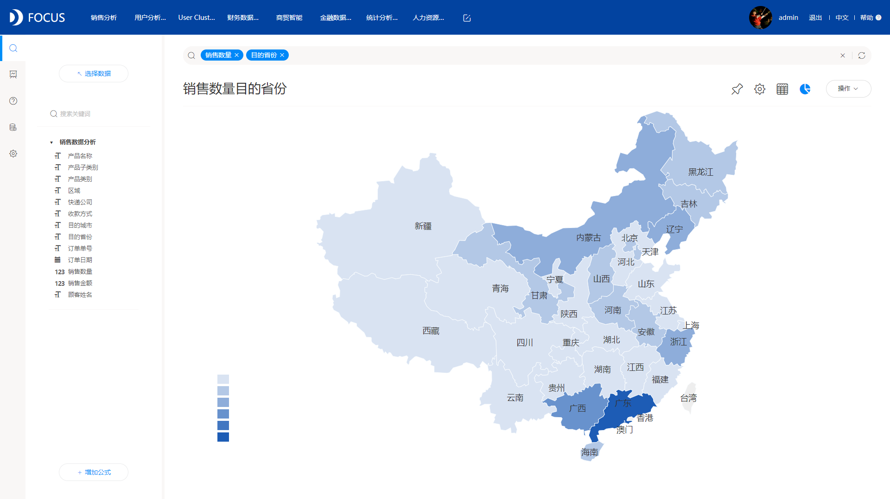

传统式BI的落寞，自助式BI的崛起，是顺应社会发展的必然结果。在众多自助式BI中，大多都是沿用了最初自助式BI所采用的交互方式，也就是拖拽式。但是也有部分有个性的BI，不随大众主流，另辟蹊径，选择搜索的方式，将BI分析做的像谷歌搜索一样。

**什么是拖拽式BI？**

市场上大多的自助式BI产品都采用的拖拽式，拖拽，顾名思义就是选中某些列，然后拖动到固定位置，如下图，这种方式在列较少的情况下可能缺点不是很明显，但是在列多的情况下，要一个个进行拖拽，而且给每个拖拽的列安排好位置，这就变得有点麻烦了。

**什么是搜索式BI？**

搜索式BI，即BI采用的交互方式是搜索式而不是拖拽式，如下图，以DataFocus为例，DataFocus是国内首个采用搜索式分析的BI工具。在主界面，可以看到一个搜索框，在框内可手动输入相应的列或者关键信息，系统会实时的搜索并返回结果，或者直接在左侧的数据源中双击选择列，系统会自动将该列加入到搜索框内。这种搜索的方式，无论需要分析的数据多还是少，都不会变得复杂，在实际业务中，这种搜索式分析更简单更高效。而且在搜索框输入内容时，系统会猜想用户下一步要输入什么，进行智能提示，只需要根据提示选择选项就可以，大大地提高了用户的输入效率。

综合对比，搜索式BI似乎更胜一筹，更能适应企业变化多端的需求。而且现在是科技信息时代，BI也只会越来越智能，越来越简便，搜索式分析，必将成为BI的下一个爆点。
