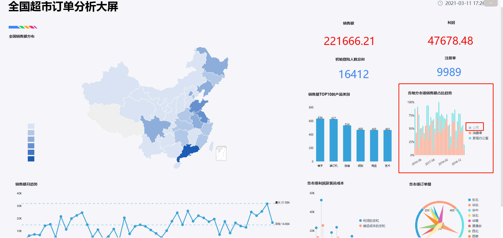
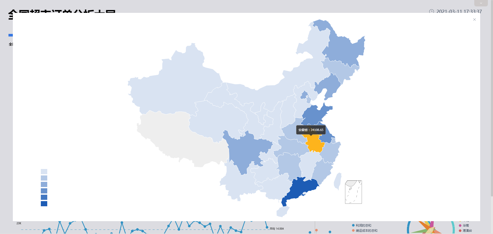

首先，小编想要向大家报告一个好消息——全国除湖北以外地区单日新增确诊病例已出现“6连降”：2月3日890例、2月4日731例、2月5日707例、2月6日696例、2月7日558例、2月8日509例、2月9日444例。在艰难的阻击战中，大家终于可以暂时地歇口气了。

新疆，虽然距离武汉较远，但面对突发疫情，新疆维吾尔自治区并未松懈。自2020年1月25日启动重大突发公共卫生事件一级响应起，从铁路、机场、公共交通、客运各个方面实施了及时高效的管理机制，以应对本次疫情。截止2月9号，新疆累计确诊49例，其中新疆维吾尔自治区38例，新疆生产建设兵团11例。

今天，就随小编脚步来看看最新的新疆疫情数据。

新疆确诊病例呈现直线式上升趋势，每日新增病例数保持在3-5人区间。

来看看新疆每个地区的病例分布，从下图中可以看到，乌鲁木齐的病例数占全省的比例最大，为20人；其次为伊犁州的10人。除这两个地区之外，其余地区的病例均为10例以下。据小编了解，新疆近几日在新地区发现了病例，虽然只有1到2例，但对于这种扩散还是要保持谨慎、严格防控。

将接受医学观察人数、确诊人数、重症人数、危重人数放于时间轴上观察其变化趋势，可以看到，接受医学观察人数的斜率较大，重症人数整体增加但于近几日处于波动状态，危重人数也有相应增加。

新疆日前无死亡和治愈病例，小编将确诊率（确诊人数除以接受医学观察人数）与重症率（重症人数除以接受医学观察人数）结合查看医学成果。从下图折线图中可以看到，确诊率近日稳定在0.015左右，重症率处于波动状态并无明显增长趋势。

鼠年已经过了半个月，也许地震，禽流感，新型冠状病毒，让大家痛心和无奈，在这种时候，我们更需要守望相助、共度难关。80岁的哈萨克族老人阿布拉黑·吾塔什捐款10万元支援疫情防控；乌鲁木齐每天装运10吨洋葱和350箱洗手液支援湖北武汉；新疆的最美逆行者也已经驻扎在武汉一线。

请大家再等等，等2020的春暖花开。在新疆、在武汉、在中国，齐心抗争，我们能赢！
