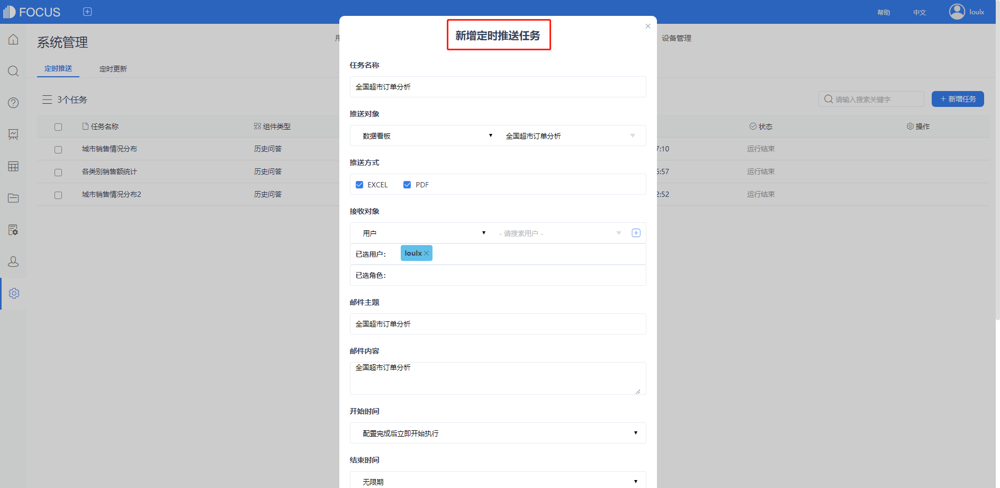

大家有没有发现，生活中很多现象都有点反直觉。不信看一下下面这个有趣的案例。

你想在披萨店买一个12寸的披萨，但不巧的是12寸的卖光了，于是店员问你，能不能换两个6寸的？

在直觉的驱动下，你会善解人意地说“好”，还是拒绝店员这个“无理的要求”呢？

如果你同意了店员的提议，那很遗憾地告诉你，你亏了2个6寸的披萨！

虽然12=6×2，但是披萨算的是面积，这不是一个一维的问题，而是一个二维的问题。

1个12寸的披萨等于4个6寸披萨的面积，所以要换4个才合理！

图1：披萨（来自网络）

怎么样，你的选择正确吗？

其实这是一个很典型的反直觉思考的例子，这在我们商业社会里非常常见。当我们谈论披萨的直径或半径的时候，人类的信息处理能力遭到了挑战：我们不善于把它想象成面积，以致于商家都没有敢把价格制定得非常透明。

**于是你需要不断地锻炼反直觉思考的能力，比如，如何把一维的直径变成二维的面积。**

在人类漫长的演化过程中，由于没有足够的脑容量来处理外界的所有信息，所以经常要靠直觉来应对复杂环境，这为我们的生活提供了诸多便利。

2016年的一项调查就发现，90%的决策者会更偏向听从自己的直觉，即凭借以往的经验来做决策。这听起来很不可思议，但它是真实存在的。决策者有时候会因为对数据的来源不确信，有时不确定数据的准确性，也有可能仅仅是因为决策者自身性格的原因。**各种各样的因素都会导致决策者不相信数据，反而遵从直觉去做决策。**

图2：决策者会倾向于利用直觉做决定

出自 Data Storytelling: Engage Decision Makers With Data

**随处可见的直觉偏差**

除了在“维度”上的反直觉，还有哪些呢？

如果你去买一个牙刷，需要15块钱。而你后边的人告诉你说，隔壁街区的店只卖7块钱，你会不会说我现在不买了，跑到隔壁街区去买？

有可能，你想省这个钱。

但如果你买衣服，衣服是500块钱，而你后边的人告诉你说，隔壁街区的店卖492块钱，你还会去吗？

大部分人都选择放弃了。

虽然都是省8块钱，但人会倾向于做出不一样的选择。

人为什么会这样？很简单，就是当你花钱的时候，8块钱相对于15块钱是一个巨大的节省，但是8块钱相对于500块钱是一个很小的节省，**这和我们的视觉偏差是一样的。**

图3：视觉偏差，那个圆更大？

**正确的做法就是，尊重数据事实，在两个选择中，我要做出的决策都是8块钱值不值得我花20分钟去节省它。也就是说，在做这个决策的时候，我们要用数据说话，抵抗人的直觉型决策。**

**用数据洞察对抗直觉型决策**

**什么是理性？理性本质上就是抵抗人先天性的直觉、反直觉。如果从来都不挑战直觉的话，很多决策就可能出错。**

在生活中，我们还能依赖直觉型决策图个方便，但是在公司经营、商业管理、

平台运营方面呢？依赖直觉型决策会很危险！

图4：直觉与大数据

**这就是我们必须要做数字化转型的原因。企业的数据量呈倍数增长，而且每年新增的数据量只会越来越大，早就超出了人脑能够处理的数据量级。我们再也不能通过直觉做决策了，而应该整合、分析海量数据，从数据中获取智能洞察。数字化转型的本质也就是利用数字技术为企业发展赋能，为决策提供智能大脑。**

图5：用数据洞察对抗直觉型决策

**数据可视化**

然而拥有数据并不意味着拥有了数据洞察能力，一个个独立的数字也没有充分的说服力。比如我们看到一句描述“2018年某个门店的销售业绩为20万”。你能得到什么信息？这个门店业绩很好？比2017年高还是低？我接下来要做什么？没有其他背景信息，这个数字说明不了任何问题。从一张密密麻麻的Excel表格中，很难获取有用的信息，而且读起来很费时间。因为它们都是一个个抽象的数据，需要实时计算与记忆能力来分析这些数据。

利用DataFocus把原始数据转化成图表，再制作成可视化大屏，只需要一张大屏就可以承载上万条Excel中的数据。

图6：DataFocus制作的可视化大屏

**动态展示**

DataFocus的可视化大屏是一个动态展示的大屏。提供了联动、跳转、上卷下钻、筛选等交互式分析能力。比如你点击地图中的“广东省”，可以继续查看“广东省”下面的各市级的数据情况。还可以筛选“浙江省”，此时大屏中的图表会动态联动展示“浙江省”的数据情况。**大屏中的数据是跟随原始数据自动更新的，真正实现了实时数据决策。**

**（这里放一下SaaS版本的录屏操作视频）**

**智能监控**

DataFocus支持对制作好的图表和可视化大屏设置定时推送任务，及时监控数据异常情况，用数据变化指导决策。

图7：设置定时推送任务

访问datafocus.ai，注册即可免费试用14天商业分析师版，还可在公众号菜单栏点击“申请试用”，联系客服获取企业共享版试用机会。

用数据洞察对抗直觉型决策，开启数字化转型之路~
