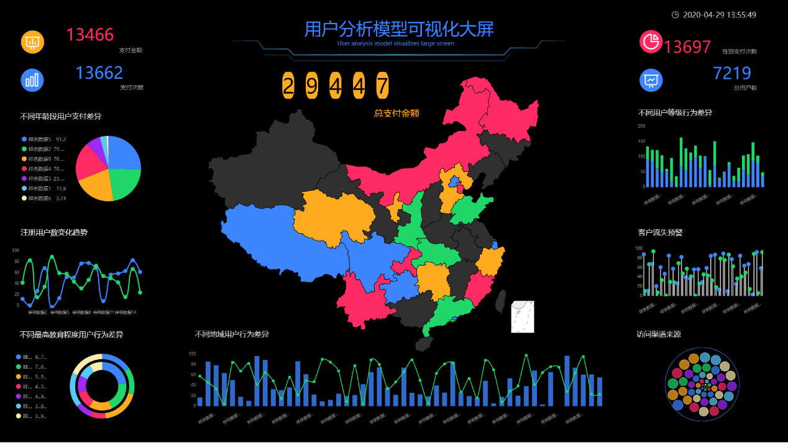

可视化大屏作为企业领导最喜爱的大数据落地项目，几乎稍微上规模的公司都会配备。印象中，大部分的可视化大屏风格都很一致，要么是深蓝色的背景，点缀科技元素，总之暗黑系风格居多。我们以前讨论过为什么数据可视化大屏的蓝色背景居多。但在这个多元化的社会，不同的风格需求肯定都是存在的。今天我们就来探讨以下数据可视化大屏的风格设计，是否有规律可循。

我们说没有最好看的可视化大屏，只有最相配的。什么意思呢，简单来讲，就是可视化大屏的风格要和展示的数据相匹配，和公司业务相契合。比如，你如果是用在医院卫生部门，搞个暗黑游戏界面的风格，可能不太合适。你在一家科技公司，用白底的屏幕，则显得太low。

另外一个，就是大屏的组件元素设计风格。大屏主要是图表构成的，图表的边框、标题样式等等，往往是设计师发挥的地方。有些边框设计的非常冗余，搞得和游戏界面一样一样的，比如有些政府的可视化大屏就搞成这样，显得非常不合时宜。一般情况下，我们说图表的边框、标题等设计，最好是简单的装饰就好，切忌过度设计；另外一点就是大屏的结构。有些人喜欢把大屏搞得异常复杂，数十个图表各种复杂的堆叠，这对展示数据没有一点好处，往往还让受众获取信息效率降低，全无头绪。

好的大屏要遵循简洁、明了，适当突出重点，布局要有侧重，既不要平均分配，也不要头重脚轻（一个图特别大，其他的图都是陪衬。）一张大屏展示的图表不要超过12张，也不要全部都用图形，可以适当有一些关键数字，便于用户迅速抓住关键信息。
