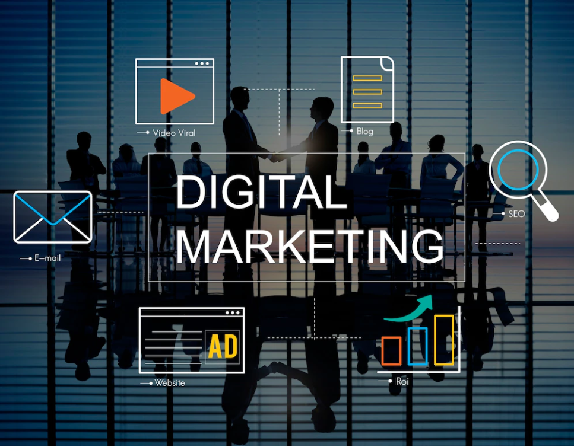
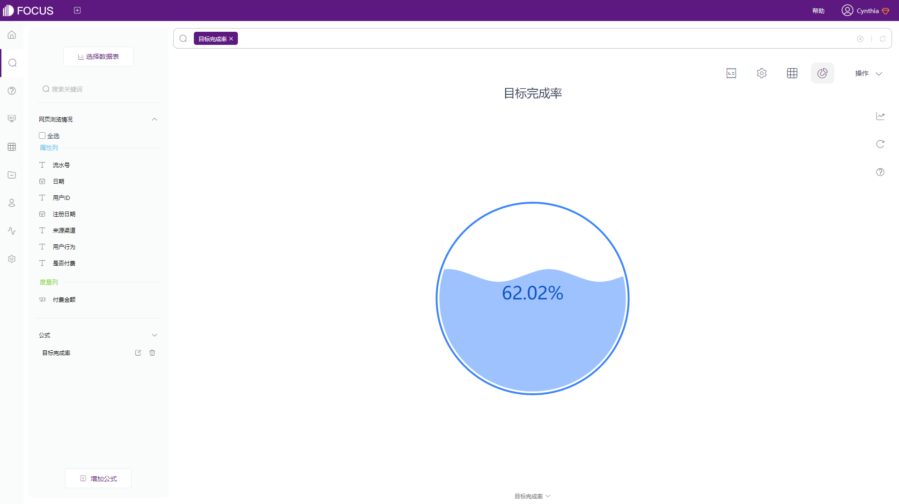
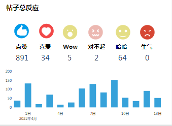

随着社交媒体和视频网站的普及，一种更及时、相关性强且节约成本的营销方式开始异军突起。

与传统的推广营销方式相比，数字营销受到的时间和空间限制更小，覆盖受众更广，触达广度和灵活度都远超传统线下营销。同时，数字营销可以更好地控制预算，精准定位消费者的需求，使得营销活动更加集中和高效。

无论何种营销方式，收入都会是最主要的KPI。但数字营销更微妙、更复杂。因此，文章将通过介绍10个数据营销的KPI指标来监控你的数字营销绩效。

## **什么是数字营销KPI？**

数字营销KPI就是借助一个可量化的值，衡量企业在制定时间段内是实现部门或业务目标的效率。

可以举几个数字营销KPI指标的示例：

- 到本年度年末，增加自然网络流量50%
- 到本年第二季度末，营销合格线索（MQL）增加25%
- 将CAC投资回报期从18个月缩短至12个月

设定目标KPI后，数字营销团队就可以制定针对性的策略去实现这些目标，并在此过程中跟踪相关指标。

## **2022年要跟踪的10大数字营销指标和KPI**

让我们看一下可用于衡量2022年数字营销绩效的主要指标和KPI。

### 1\. **MQL到SQL的转换率**

营销合格线索(MQL)，衡量的是营销工作产生的潜在客户数量，他们一般是比其他潜在客户对产品或服务更感兴趣但还没有完全准备好的个人。理想状态下，企业可以通过特定的行为触发将潜在客户转化为MQL，例如请求演示、购买课程等。

销售合格线索(SQL)，由MQL进一步转化而来，是满足销售团队特定阈值，可以跟进销售行为的个人。

基于上述定义，计算MQL到SQL的转换率是确定潜在客户质量的最佳方法之一。通过转换率计算，可以确保营销团队在移交销售团队潜在客户的质量方面保持出色和高质量；当然，在线索总数较少的情况下，销售团队也可以控制转换率稍低，漏入更多的营销合格线索。

### **2.客户终生价值（CLV/LTV/CLTV）**

客户生命周期价值（CLTV）是一个特定的指标，量化的是客户在流失之前建产生的平均总收入的估计。按客户终生价值划分客户群，可以帮助营销人员了解哪类客户群对企业最具价值。

更进一步，还可以衡量LTV与CAC的比率，指标的含义是花费了多少来获取客户。对比基准，可以了解到是否在每位客户身上花费过多，或者因花费不足而错过机会。

LTV与CAC比率为1:1，则意味着你卖的越多，就越亏钱。LTV与CAC比率的良好基准是3:1或更高。当比率为5:1或更高，则意味着您在营销方面的投资不足，可能错失了机会。

### **3.获客成本**

客户获取成本(CAC)是营销和销售共享的指标。CAC衡量与获得新客户相关的所有成本费用之和。了解获得客户的成本以及其他收入指标，可以让营销人员了解哪些细分市场对企业有利可图，以及在哪里可以加倍关注。

同样的，客户获取成本(CAC)可以与客户终生价值（CLV）联立使用，计算其比率。

### **4.目标完成情况**

在上文介绍中，我们可能会根据实际工作，设立数据营销KPI目标。此时，跟踪目标完成情况就变得非常重要，因为它代表了企业营销工作的成果完成度，营销内容是否成功吸引了企业的目标客户进行转化。特别是如果您的营销策略中有转化率KPI，那么跟踪目标完成情况是很有必要的。

_DataFocus目标完成水位图_

### **5.广告支出回报率**

顾名思义，广告支出回报率(ROAS)衡量的是固定广告渠道的盈利能力。量化ROAS，可以让企业清楚地了解在广告上花费的每一元所产生的收入。在数字营销中，一般会与数字广告活动挂钩，将总广告支出与活动产生的收入进行比较，对未来的广告工作会有极大的改善。

营销的终极目标是盈利，广告支出回报率是收入增长的一个杠杆。

### **6.展示次数**

展示次数统计一段时间内您的网页、内容、广告或社交帖子出发关键词，出现在搜索结果的总次数。通过展现次数，对网页内容关键词的可见性和质量度有一个清晰的了解，衡量您的信息是否引起用户共鸣。例如，您发布在社交媒体的贴子存在较高的展现，但点击率却不高，很可能是贴子的标题不够吸引人，需要及时修改。

### **7.点击率**

如果要追踪广告系列效果，点击率(CTR)是当仁不让的。一般情况下，若要跟踪展现次数不同的广告系列，点击率比点击次数更能衡量广告效果。

CTR也是一个可应用于多种营销渠道的指标，包括登录页面、数字广告、社交媒体或电子邮件营销等。密切关注点击率，您的点击率越高，就越有可能直击市场需求或痛点。

_DataFocus广告营销数据看板_

### **8.内容参与**

想知道您的数字营销活动在哪些方面有效以及有哪些改进空间？内容参与度是必须要跟踪的指标。对社媒内容的点赞、评论、转发和收藏，都可以统计为内容参与。对于营销人员而言，统计内容参与可以判定粉丝粘性——您的粉丝或受众是否愿意与您进行互动，他们的参与度是否会对营销活动的成功产生影响？

_DataFocus内容参与问答_

### **9.平均页面停留时间**

用户在您的网站上停留了多长时间？平均页面停留时间通常用于网站分析，评估用户体验，针对性的进行页面改善；其次可以针对停留时间较长的用户进行再营销策略等。网页的平均页面停留时间越长，说明网页能给用户带来更多有用的信息，对用户吸引力强；反之，则说明网站需要对该网页的内容或排版进行优化。

### **10.跳出率**

跳出率指标是指在未触发页面活动的情况下直接退出的用户百分比。网站的平均页面停留时间与跳出率高度相关。一般来说，跳出率越高，则平均页面停留时间就越短。

值得一提，一般情况下，网站不会直接跟踪跳出率指标，而是同步跟踪跳出率和退出率，或者直接反过来关注参与度。

**总结**

数字营销是一类快节奏的营销方式，营销团队需要设立KPI来衡量他们的产出。

首先，设立恰当的目标，激发大家的热情和动力；然后通过DataFocus等现代化BI可视化工具完善指标监控体系，将数字营销可视化，使小伙伴们朝着目标一起努力。

最后祝所有和我一样的营销人员都可以大获成功！

