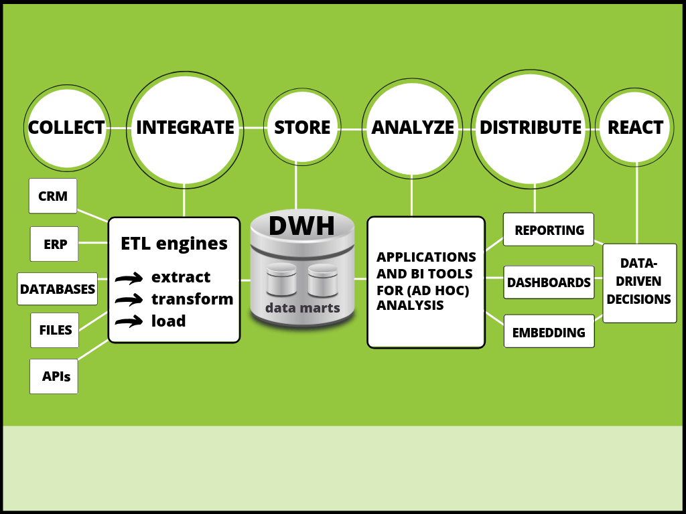
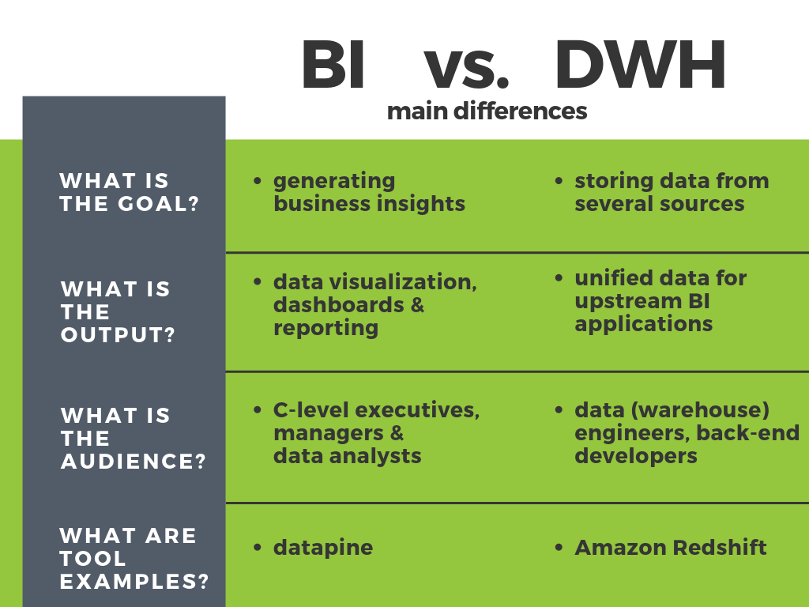

企业中有效的决策过程依赖于高质量的信息。在当今竞争激烈的商业环境中，这是一个事实，该环境要求对[数据存储仓库](https://www.datafocus.ai/infos/data-storage)进行敏捷访问，以提高业务绩效，提供快速、准确和相关的数据洞察力。BI 架构的出现就是为了满足这些要求，数据仓库是这些流程的支柱。

[在这篇文章中，我们将解释数据仓库和商业智能](https://www.datafocus.ai/infos/bi-skills-for-business-intelligence-career)之间的定义、联系和区别，并提供一个 BI 架构图，可以直观地解释这些术语的相关性以及它们运行的​​框架。首先，让我们从基本定义开始。

## 什么是 BI 架构？

商业智能架构是一个术语，用于描述借助基于计算机的技术和技术组织数据的标准和策略，这些技术创建了用于[在线数据可视化](https://www.datafocus.ai/infos/data-visualization-tools)、报告和分析的商业智能系统。

BI 架构组件之一是数据仓库。数据的组织、存储、清理和提取必须由中央存储库系统（即数据仓库）执行，它被认为是商业智能的基本组成部分。但它们究竟是如何连接在一起的？

## 什么是数据仓库和商业智能？

数据仓库和商业智能是用于描述将公司所有数据从各种来源存储在内部或外部数据库中的过程的术语，重点是通过[在线 BI 工具](https://www.datafocus.ai/infos/online-bi-tools)进行分析和生成可操作的见解。

没有一个另一个也将不起作用，我们现在将通过使用 BI 架构图来解释围绕其框架的前提，以充分了解数据仓库如何增强 BI 流程。

## 现代商业中的BI架构框架

商业智能架构包含各种组件和层。这些组件中的每一个都有其自己的用途，我们将在集中讨论数据仓库时更详细地讨论这些用途。我们先看看这些组件究竟是由什么组成的。

一个坚实的 BI 架构框架包括：

1. **数据收集**：第一步涉及从各种外部和内部来源收集相关数据，这些来源可以是数据库、ERP 或 CRM 系统、平面文件或 API等等。
2. **数据整合**：在这个阶段，收集到的数据被整合到一个集中的系统中，通常借助于ETL过程。这里还对数据进行了清理，并为分析做好了准备。
3. **数据存储：**这就是数据仓库的用武之地。仓库是存储结构化数据的地方。它使其可用于查询和分析。
4. **数据分析**：信息经过处理、存储和清理后，即可进行分析。在正确工具的帮助下，数据被可视化并用于战略决策。
5. **数据分布**：数据现在以图形和图表的形式，以不同的格式分布。这可以是[在线报告](https://www.datafocus.ai/infos/online-reporting)、仪表板或嵌入解决方案。
6. **基于洞察力的反应**：架构过程的最后阶段是从数据中提取可操作的洞察力，并使用它们做出改进的决策，以确保公司的发展。

_\*\*点击放大\*\*_

我们可以在我们的 BI 架构图中看到流程是如何流经各个层的，现在我们将重点关注到每一层。

### 1\. 数据收集

创建稳定架构的第一步是从各种数据源（如 CRM、ERP、数据库、文件或 API）收集数据，具体取决于公司的需求和资源。现代 BI 工具提供了许多不同的、快速且简单的[数据连接器](https://www.datafocus.ai/infos/data-connectors)，通过在后台使用智能 ETL 引擎使此过程变得顺畅和轻松。它们支持分散的部门和不同系统之间的通信。从业务角度来看，这是创建成功的数据驱动型决策文化的关键要素，可以消除错误、提高生产力和简化运营。您必须收集数据，以便能够对其进行操作。

### 2\. 数据整合

当通过分散的系统收集数据时，下一步将继续提取数据并将其加载到 BI 数据仓库中。这个过程称为 ETL（提取-转换-加载）。

随着当今生成的数据量不断增加以及 IT 部门和专业人员的超负荷工作，[ETL 作为一种服务](https://www.datafocus.ai/infos/etl-as-a-service)成为解决各行业复杂数据请求的自然答案。过程很简单，数据从外部来源（从步骤 1）中提取，同时确保这些来源不会受到性能或其他问题的负面影响。其次，数据符合要求的标准。换句话说，这个（转换）步骤确保数据是干净的，并为最后阶段（加载到数据存储库中）做好准备。

### 3.数据存储

现在我们看看数据仓库和[商业智能的概念](https://www.datafocus.ai/infos/business-intelligence-concepts-and-bi-basics)。虽然这两个术语经常互换使用，但我们将重点关注某些差异，以便更清楚地了解该主题。

_\*\*点击放大\*\*_

正如我们在视觉上看到的那样，商业智能和数据仓库之间的主要区别体现在以下主要问题中：

**a) 目标是什么？**

商业智能和数据仓库有不同的目标。虽然它们是相互联系的，并且不能相互独立，但如前面所述，BI 主要专注于产生业务洞察力，无论是运营效率还是战略效率，例如产品定位和目标定价、盈利能力、销售业绩、预测、战略方向和更广泛层面上的优先事项。重点是访问、探索和分析业务的可衡量方面。另一方面，数据仓库 (DWH) 在将公司的所有数据（来自一个或多个来源）存储在一个地方方面具有重要意义。简而言之，BI 系统和工具使用 DWH，而 DWH 充当 BI 的基础。

**b) 输出是什么？**

两项的输出数据也有所不同。虽然 BI 通过数据可视化、[在线仪表板](https://www.datafocus.ai/infos/online-dashboard)和报告输出信息，但数据仓库在维度和事实表中为上游应用程序（或 BI 工具）概述数据。数据清理、元数据管理、数据分发、存储管理、恢复和备份计划是在 数据集仓库中进行的过程，而 BI 使用专注于统计、可视化和数据挖掘的工具，包括[自助式商业智能](https://www.datafocus.ai/infos/self-service-bi-tools)。

输出差异与可以使用 BI 或数据仓库的人员密切相关。我们通过下一个主要方面来看看这一点。

**c) 听众是什么？**

为了扩展我们之前的观点，参与管理数据的人员是完全不同的。C 级主管或经理以[实时仪表板](https://www.datafocus.ai/infos/live-dashboards)的形式使用现代 BI 工具，因为他们需要获取事实情报、创建有效的[销售报告](https://www.datafocus.ai/infos/sales-report-kpi-examples-for-daily-reports)或预测部门或公司的战略发展。CEO 或销售经理无法管理数据仓库，因为这不是他们的专业领域；他们需要一个可以_翻译的工具_将繁重的 IT 数据转化为普通用户可以完全理解的洞察力。这就是 BI 在 DWH 和 BI 之间建立牢固桥梁的地方。另一方面，数据仓库通常由数据（仓库）工程师和后端开发人员处理。它们是 BI 架构框架中的技术链，为公司可能需要的未来数据分析和报告生成设计、开发和维护系统。

**d) 工具是什么？**

随着我们数字时代处理和创建的数据的扩展，执行分析所需的工具和软件近年来以我们无法想象的方式扩展和发展。在这种情况下，使用合适的工具、稳定的[商业智能仪表板](https://www.datafocus.ai/infos/bi-dashboard-best-practices)和数据仓库的需求呈指数增长。在这样的环境中，数据仓库流程可以使用Amazon Redshift等产品进行管理，同时需要对 BI 洞察力的全面支持，才能使用 DataFocus 等工具有效地产生和发展可持续的商业智慧。数据的可视化是使管理人员、专业人员和业务用户能够独立执行分析的核心元素，而无需大量的 IT 支持或工作。

既然我们已经阐述了什么是数据仓库和商业智能，我们将继续下一步：分析建立可持续业务发展所需的 BI 架构层。

### 4、数据分析

在我们紧凑的商业智能架构的这一步中，我们将重点关注在数据仓库的帮助下，在前面的步骤中处理、处理和清理数据之后的数据分析。通过 BI 应用工具实现对成功分析的普遍需求，以帮助各种规模的企业实现增长和盈利。特别是当涉及到[即席分析](https://www.datafocus.ai/infos/ad-hoc-reporting-analysis-meaning-benefits-examples)时，它可以在执行分析和帮助快速准确地回答关键问题时实现自由、可用性和灵活性。

上图展示了现代、易于使用的 BI 用户界面的强大功能。像 DataFocus这样的现代 BI 工具使业务用户能够通过搜索创建查询，只需输入文字即可构建令人惊叹的数据可视化，即使没有深厚的技术知识。这简化了创建仪表板或[分析报告](https://www.datafocus.ai/infos/analytical-report-example-and-template)的过程，并生成了提高企业运营和战略效率所需的可行见解。数据仓库在这个过程的背后工作，使整个体系结构成为可能。

谈到自助式商业智能，一切都是为了以用户友好的方式将数据分析流程提升到一个新的水平。为此，BI 软件提供了分析功能，允许用户有效地浏览他们的数据。DataFocus等工具提供了一系列选项，例如：

- **条件格式：**此功能是搜索界面的一部分，它允许您突出显示差异以发现数据中隐藏的趋势和模式。可以根据自定义标准进行格式化，并以不同的色标显示，就像在 Excel 电子表格上一样。
- **预测分析**：通过仔细分析当前和历史数据，预测分析功能可以发现关系、趋势和模式，并生成有关未来绩效的准确预测。像这样，公司可以掌握任何问题，优化他们的活动，并准备他们的生产以满足需求。
- **工具提示**：工具提示功能允许用户在图表中添加其他信息以补充分析。一旦用户将鼠标悬停在图表上，就会触发它，并且会显示一个带有额外信息的小片段。这可以是 KPI 或其他相关说明的定义。
- **向下钻取**：[向下钻取](https://www.datafocus.ai/infos/drill-down-drill-through-reports)功能允许您在一个图表中可视化较低级别的分层数据。例如，假设您有一个按省份显示销售额的图表。向下钻取将允许您单击特定省份并查看该省份中各城市产品的销售额。这样您就不需要生成多个图表来可视化您的数据，您可以轻松地在一个视觉对象中探索它。

### 5.数据分发

数据分发是共享信息和为利益相关者提供获得可持续业务发展不可或缺的洞察力的最重要流程之一。分发通常以 2 种方式进行：

 

**a) 仪表板：**另一个报告选项是在安全查看器环境中直接共享仪表板。与您共享的用户不能进行编辑或更改内容，但可以使用指定的筛选器来操作数据并与仪表板交互。另一种选择是通过扫码二维码 共享，即使用户在您的组织之外，也可以访问仪表板，如下图所示：

**b)嵌入：** 这种数据分布形式允许您将 BI 系统及其所有功能集成到您自己的应用程序中。通过这种方式，您可以获得商业智能的所有好处（交互式过滤器、用户角色管理、实时监控等），而无需投资开发自己的工具。与此配套，允许您使用公司的颜色、徽标和字体自定义嵌入仪表板，以获得更加专业的外观。与此类似，嵌入 BI 通过使报告流程更具交互性并可供内部和外部用户访问，从而为组织提供高价值。

查看数据分布的另一种方法是通过谁在使用它。在处理敏感的业务信息时，确保全面安全至关重要。为此，由于不同用户的数据使用情况不同，因此会根据其角色授予不同使用者的权限。例如，更多的技术分析角色处理数据仓库，而更多业务驱动的角色处理 BI。其中一些角色包括：

- **BI 架构师**：负责 BI 系统的整个设计和开发的人。他或她确定中央数据仓库的平台、流程和程序。BI 架构师需要仔细分析组织的需求来规划一个有效的框架。
- **BI 开发人员：**开发人员是在“底层”工作的人。他负责在技术层面构建、创建或改进 BI 驱动的解决方案。在我们的 BI 架构阶段，开发人员负责执行 ETL 和其他与数据库的一般管理和维护相关的任务。
- **数据分析师：** BI 数据分析师负责高效的数据管理流程。他或她能够深入研究数据并找到改进机会以及相关见解，这些见解将作为战略决策的基础。
- **业务用户：**通常没有技术知识的普通业务用户依靠仪表板等交互式可视化来衡量他们的整体性能。这些[业务仪表板](https://www.datafocus.ai/infos/dashboard-examples-and-templates)通常在不同部门之间共享，以支持针对一般公司目标的协作讨论。

### 6\. 基于生成见解的反应

BI 架构展示其强大功能的最后阶段是任何业务的基本部分：创建[数据驱动的决策](https://www.datafocus.ai/infos/data-driven-decision-making-in-businesses)。没有数据仓库和商业智能的基础，最后阶段是不可能实现的，企业也无法进步。CEO、经理、专业人士、同事和所有感兴趣的利益相关者都可以利用数据生成有效、准确、基于数据的决策，帮助他们前进。让我们通过我们的[仪表板示例](https://www.datafocus.ai/infos/dashboard-examples-and-templates)之一来了解这一点：管理 KPI 仪表板。

_\*\*点击放大\*\*_

该仪表板是数据仓库和商业智能如何协同工作的最终产品。这种可视化背后的过程包括我们所描述的整个架构，但如果没有可靠的数据仓库解决方案，这是不可能实现的。最终，这使高级经理能够理解战略发展和潜在决策，以创建和维持稳定的业务。

在这个特定的仪表板上，您可以看到总收入，以及在客户级别上，还加上了成本。设定目标的同时，仪表板还会立即计算是否已经达到目标，或者是否需要从管理的角度进行额外的调整。由于收入是评估业务是否增长时最重要的因素之一，因此这个[管理仪表板](https://www.datafocus.ai/infos/dashboard-examples-and-templates-management)可确保所有基本数据都可视化，并且用户可以轻松地与每个部分持续进行交互，从而使决策过程更具凝聚力，最终，更有利可图。

上面的仪表板这样的分析工具，促进了大多数组织处理数据的方式。由于 全天候访问实时洞察，您无需花费数小时手动更新报告，甚至无需每天检查报告。现代 BI 工具（例如 DataFocus）提供 AI 驱动的[数据警报](https://www.datafocus.ai/infos/business-intelligence-data-alerts)，一旦发生异常或达到目标，就会通知您。您需要做的就是设置预定义的规则，如果需要您注意，该工具会向您发送通知。它通过使用神经网络和机器学习技术从数据中的模式和趋势中学习来做到这一点。这样，您可以将注意力集中在发展公司上。

## 智能 BI 架构的重要性

在结束这段旅程之前，我们必须说明在您的组织中实现智能BI架构的重要性。虽然我们在整个过程的组成部分中明确了这个过程的价值，但提到它的一些主要好处也是很重要的。强大的 BI 架构可作为收集、组织和有效管理业务数据的蓝图，然后将这些数据转化为改进决策的洞察力。让我们更详细地看一些要点。

- **正确使用数据**：虽然许多组织希望利用数据驱动流程的力量，但并非所有组织都能成功。这主要是因为所收集的数据具有不同的格式和难以管理和组织的应用程序。事实上，令人震惊的是，95%的企业将管理非结构化数据的需求视为一个问题。也就是说，一个实施良好的 BI 框架可以解决所有这些问题，因为它为数据提供了一个有组织的管理系统。
- **从 IT 部门担起重任**：几十年来，分析任务一直委托给 IT 部门。此类任务包括生成绩效报告，其中包含支持经理和员工做出战略决策的数据。随着市场竞争越来越激烈，日常分析的需求已经让IT员工不堪重负，没有足够的时间来满足需求。实施智能 BI 架构系统将大大减轻 IT 部门生成报告的繁琐任务。让他们有足够的时间专注于其他重要问题，例如网络安全和公司系统的正常运行。
- **提高效率**：扩展上述观点，在您的业务中实施正确的 BI 架构不仅可以将 IT 部门从耗时的报告任务中解脱出来，还可以提高组织的整体效率。BI 系统允许员工轻松地自动化他们的报告，以便随时随地访问实时数据。这将使他们能够将数据整合到他们的战略流程中，而不是等待数小时或数天才能以静态报告的形式交付给他们。 考虑到2019 年64%的用户报告称， BI 数据和分析有助于提高他们的效率和生产力，这一点尤其正确。
- **省钱**：与 BI 框架相反的是，数据很可能分布在各个部门以不同方式管理的各种系统中。当然，这意味着不同活动和部门之间缺乏协同作用，以及公司效率低下和成本增加。相反，BI 应用程序通过提供对公司数据的集中访问来节省企业的金钱和时间。从长远来看，每个相关的利益相关者都将相互联系，并在整个组织中实现协作环境。

## 数据仓库和商业智能：前瞻性业务的解决方案

我们已经解释了这些术语以及它们是如何补充BI架构的。在当今竞争激烈的商业环境中，考虑这些过程是很重要的，因为它们带来了只能带来积极成果的最佳数据管理实践。

尽管近年来这些术语一直被用作同义词，但今天它们在不同的层次上发挥作用，但其视角是相同的:以尽可能最好和最有效的方式分析、清理、监控和评估数据。

要使用我们实施的数据仓库服务和现代 BI 工具，您可以注册[30天试用](https://www.datafocus.ai/console)，完全免费！
