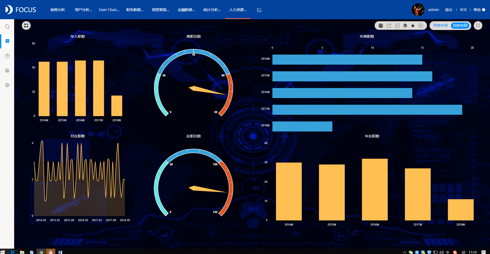

最近，一个知名互联网公司被曝取消了员工的年终奖。虽然该公司的管理层在公告中解释了这一决定，但内部员工仍然对此问题表示不满，并由此产生的后续影响给公司的业务运营带来了不小的影响。事实上，在企业特别是互联网企业的运营中，人力资源的调整往往会成为企业危机的直接“爆点”。

在经济增长总体放缓的背景下，上述案例已经司空见惯：对于个人和社会而言，公司的年终奖励和裁员计划都是影响深远的问题。但是，在面对这些问题时，如何做出更好的决策呢？这不仅仅通过简单的指标来看，例如公司利润，个人关键绩效指标，尤其是大企业，这些人力资源和财务管理问题非常复杂，公司最好基于数据分析思想，科学分析企业人力资源管理问题，并提高在复杂商业环境中适应和预测的能力。

为什么人力资源的数据分析如此重要？如今，大量企业在人力资源管理方面具有很强的随机性。他们往往只依靠公司收入和支出等简单数据做出泛化的判断，但这种判断很容易偏离实际情况。例如，一个部门可能不是一个效益中心，但它具有相对重要的创新价值。如果在公司业绩不佳时废除部门，可能会影响公司的长期发展。一个三级甚至四级的部门可能长期效率低下，但由于其隶属于在重要部门之下，可能会逃过公司的整体人力资源优化，这不利于企业成本的不断优化。

建立人力资源数据分析和可视化系统后，企业可以大大增强对人力资源管理的洞察力。由于数据分析系统将以全面、实时的方式显示员工数量，教育，工资等数据，企业可以更好地了解人力资源管理的现状。在结合公司的财务指标后，还可以对每个部门和员工的绩效进行更准确的相关性分析，并为相关决策提供数据支持。

同时，基于直觉的人力资源管理也可能带来严重的滞后，不利于人力资源的预测和激励管理。许多公司发现公司的财务状况突然急剧变化，或者当新一轮融资没有到位时，他们会考虑调整人力资源，如紧急裁员和减薪。然而，这种攻击不仅会导致企业的成本极度浪费，而且会带来诸如合规等挑战，甚至带来舆论风暴，使企业的整体运作被动。

通过对人力资源管理的精细数据分析，可以帮助企业未雨绸缪，大大提高企业管理的可预测性和主动性。例如，当公司观察到人员在一段时间内迅速扩张，大大超过公司未来1 - 2年可能获得的收益时，他们需要特别关注公司资本链的运作，以及考虑减缓人员扩张和实现更多激励措施。性人事管理政策和其他方法，以避免企业陷入成本危机。企业还可以依靠数据制定更详细的人才发展计划，以满足企业未来的发展需求。

如何构建企业人力资源分析管理系统

DataFocus分析师表示，要构建企业人力资源分析管理系统，首先需要整理出企业当前的人力资源数据，这些数据可能来自企业人力资源数据库，OA系统，财务系统和部分行业数据。通过梳理和整合不同类型的数据库，企业可以建立统一的数据仓库或数据湖，为进一步的数据分析奠定基础。

在具体数据分析方面，企业可以使用DataFocus数据分析平台，从人力资源效率分析，员工关系分析，招聘分析，组织管理分析和员工培训分析等方面构建涵盖各种数据维度的看板。这些看板是直接的。与后端相关的数据库可以通过可视化图表的形式直观地反映人力资源的变化，并通过组合分析实现数据洞察。

在本文所关注的人力资源绩效管理方面，数据分析和可视化系统不仅可以直观地实现员工人数，利润率，人均利润率，人均管理成本，指标等现行指标。不同时间间隔的变化。破天。它还可以将数据洞察汇入特定的部门和个人，显示人力资源绩效的更细微变化，从而使人力资源管理更具针对性。

系统还可以近乎实时地显示员工进入和退出数据以及作业分布等常规数据，并以数据图表的形式直观地显示这些数据的变化，从而支持人力资源和高级管理人员更加清晰控制公司。人力资源的整体情况，加强管理。

目前，DataFocus的人力资源数据分析解决方案已成功应用于大型房地产企业，以及制造业，金融业等行业，在帮助客户优化人力资源管理方面发挥了重要作用。
