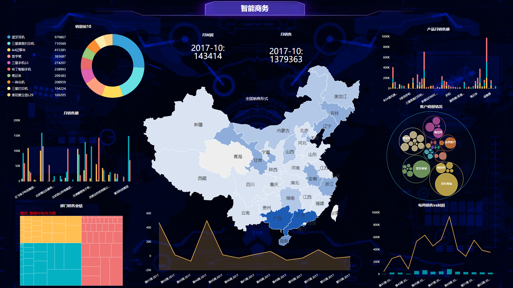

现如今进入大数据时代，无论是企业还是个人，都能深刻的感受到节奏在加快，信息在爆炸，知识在迭代。对于企业来说，有很多方法去应对大数据时代所产生的机遇和挑战，比如雇佣数据分析师或干脆使用DataFocus或tableau等数据分析工具。企业尚在大数据环境中深谙生存之道，而能在大数据环境中意识到这一点并不断迭代的个人，却寥寥无几，大部分人意识到了这个问题，但却一直徘徊在所谓10000小时的大师之路上。但其实，如果从数据分析的角度来看，这个“勤奋”的大师之路，并不是绝对有效的。

我们上次说到10000小时定律，这里还可以给各位分享一个例子。一位叫的Dan读者读了10000小时定律所在的《异类》这本书后，决定要亲身试验一下。那年他恰好30岁，坐着某公司高管的位置，攒够钱后，他就辞职去打高尔夫了。他的计划是，辞职以后，每天练习6个小时，一周练习6天，坚持6年，总计超过10000个小时，然后成为职业选手。

但是这项计划在他练习到6000小时的时候因为伤病最终搁置了，但是6000小时的练习成果是怎么样的呢？6000小时差不多是3年多全职练习时间。按理来说全职练习3年应是比一般人高很多的水平，入门职业更是不成问题。但是，结果却另其大失所望，Dan经过3年多的练习，高尔夫差点指数（高尔夫球水平衡量标准，无标记的越低越好，低于0的在前面加上一个+号，之后越高越好）最低在2014年达到过2.6的好成绩，之后一直在4左右徘徊，直到2015年4月最后一次记录为5.5。 这个成绩代表着什么？很多人就算完全不懂高尔夫球，也可以使用数据分析的角度来看。我们可以查找美国高尔夫球协会USGA的数据。显然，Dan在业余选手中已经算不错。根据USGA的网站统计，仅有5.43%的全国男子差点指数低于2.9. 不过低于4.9的就占到10.11%。但是距离职业选手，这个差距就有点大了。鉴于目前各种比赛网站已经做得眼花缭乱，我们只找到了2002年美国公开冠军赛的参加标准，是差点指数低于1.4。也就是说，Dan的最好成绩，距离拥有参加比赛的资格，还有着不小的距离。

那么关键并不在所谓的天道酬勤，而是要根据现有的数据，不断地进行分析和优化策略。Dan只收集并分析了“10000小时可以成为大师”的数据，以及在高尔夫球场的“自己的数据”。并没有在3年内查找并洞察新的数据，比如与职业选手进行比较等等。就像有些人10年开车只能成为普通老司机，而无法成为职业车手，因为数据停滞不前。所以，我们应每时每刻都做好自己的数据分析，让自己的路径不断地优化。
