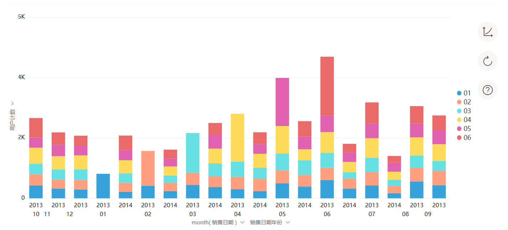
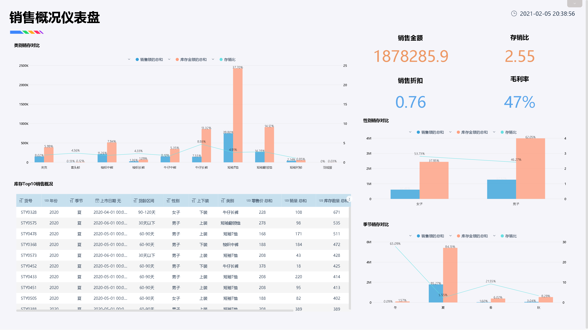
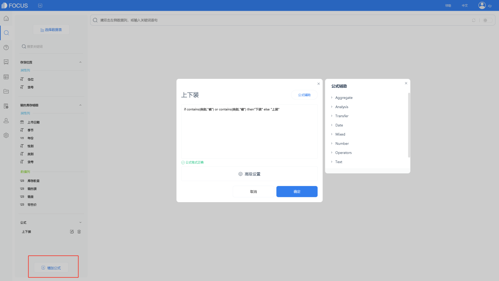
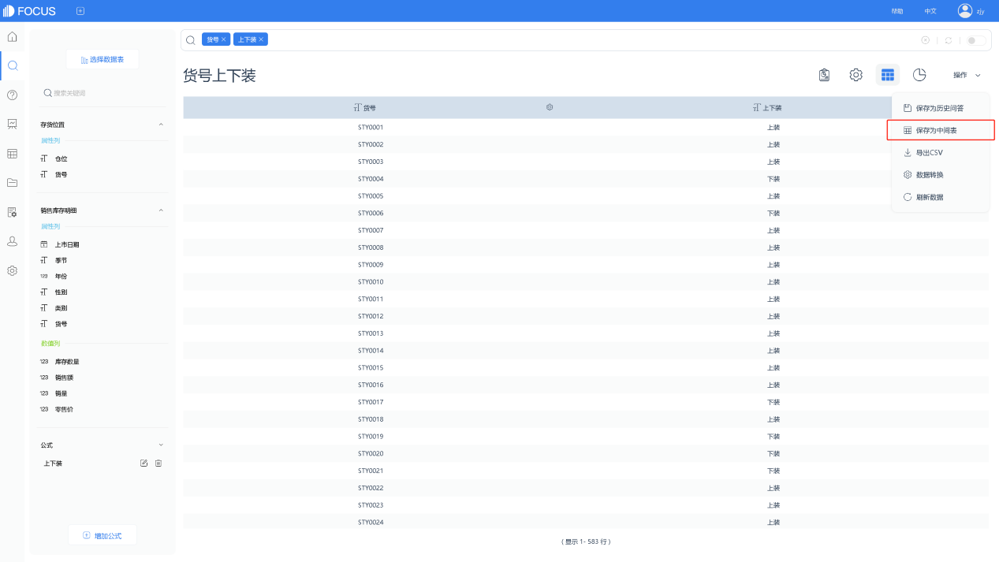
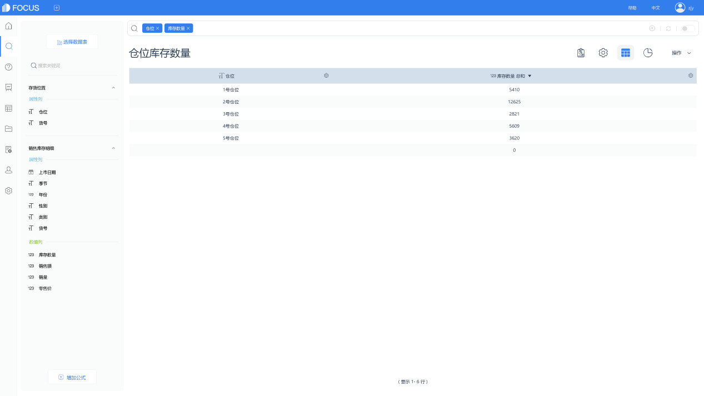
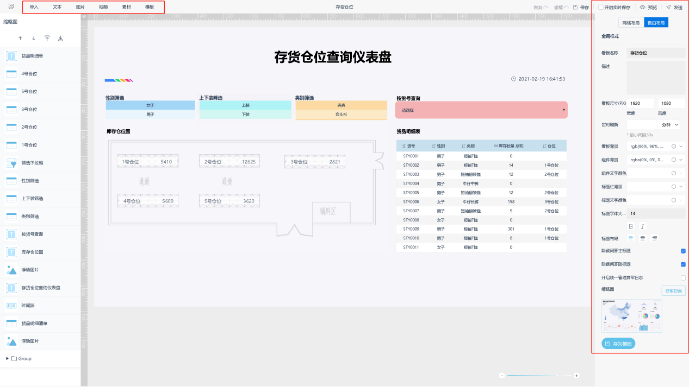
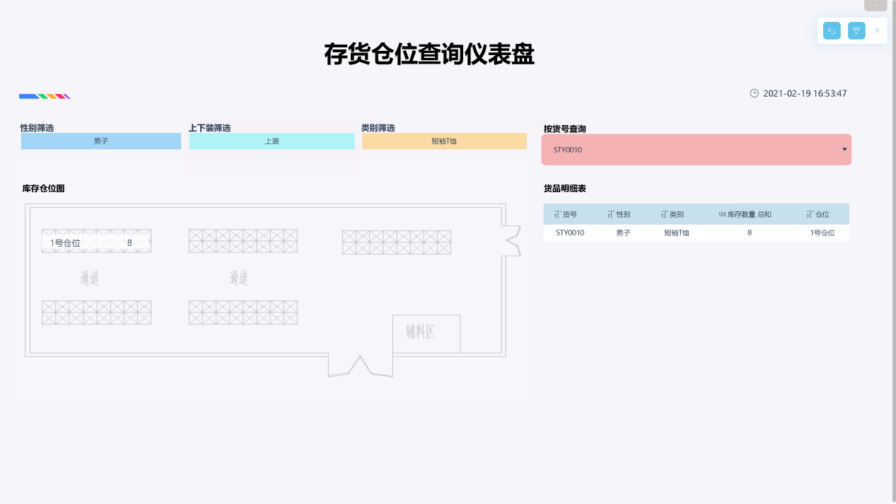

[DataFocus](https://www.datafocus.ai/" \t "https://www.zhihu.com/question/54939549/answer/_blank)搜索式的分析体验，即使没有任何代码基础都可以快速创建可视化大屏，进行自主的探索式分析，简洁、高效是最大的竞争力。传统数据分析产品从上线实施到产生生产力，需要3个月以上，DataFocus可以将这个周期压缩70%。由于更简单的使用体验，数据分析的门槛大大降低，使得企业BI的成功率大幅提高。

它支持40多种图表:

1.平行图

2.组合图

3.气泡图

4.堆积柱状图

5.日历热图

6.指标图

7.子弹图

8.打包图

9.矩形树状图

10.火柴图

11.弦图

12.雷达图

13.箱型图

14.桑基图

15.面积图

16.折线图

17.旭日图

18.完成度图

