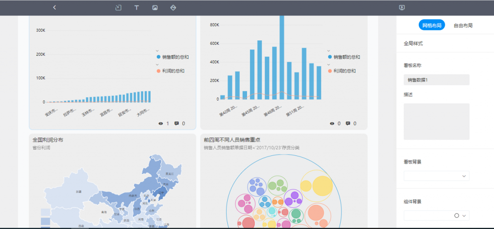
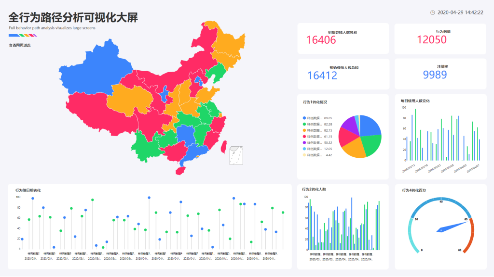
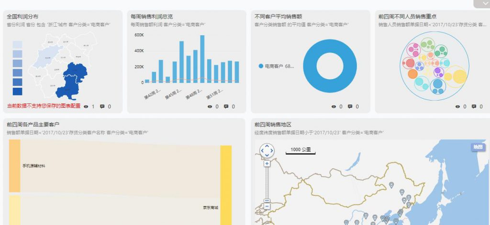

比如，在新项目开始前，准备一个完整有效的企业数据，以便更容易地向客户展示服务，这总是一件好事。可是，企业新项目不成功的缘故就一定是由于少了“防患于未然”的聪慧吗？也不尽然，对企业而言，有着大数据提前准备对策和方式并属实实行是尤为重要的。  
数据提前准备对策应包括下列原素：

  
1、对当今和未来的业务难题有深入的掌握，期待数据能为企业产生回答。  
掌握要运用大数据剖析的业务行业能够 为数据创建业务自然环境，并有利于制订数据搜集和实行对策。此环节的总体目标是明确企业中什么数据与重要业务难题有关，什么不相干。企业还能够伴随着业务要求的转变拓展业务难题和要搜索的数据，可是一开始最好是還是高度关注数据。

<figure>

<figcaption>

数据分析

</figcaption>

</figure>

  
2、数据集中。  
数据务必规范性便于一致，而且企业中的每一个人都应用同样的数据。因而，即便能够 挑选对于特殊业务行业添充此主数据的不一样非空子集，也务必将全部剖析数据储存在IT维护保养的集中型储存库文件。

  
3、标志务必馈入中央政府剖析信息内容储存库的数据源。  
一旦明确了业务实例和难题，就应明确可用以归纳回应业务中急迫难题的数据集和源。这种数据源能够 来源于企业內部或外界。

  
4、鉴别将会有关的将来数据源。  
另外，从现在起鉴别未来业务将会必须的别的数据集或源还为时过早。这种数据源最开始不容易提前准备数据，可是他们的标志将为未来的数据提前准备出示一个路线地图。

  
5、界定的数据提前准备方式。  
有三个基础流程可将整洁数据移进中央政府数据储存库。最先，从数据源中获取数据。随后，将其变换为两者之间要抵达的数据总体目标适配的格式。最终，将其载入到总体目标储存库文件。关键的一部分是转型发展。假如同样的数据字段名将注入新的到达站，但该到达站的格式有别于初始到达站，则务必将数据变换为新格式，便于数据一切正常工作中并在到达站中保持一致。假如人工服务进行，这是一个繁杂的流程，因而必须自动化技术工具。

  
6、选择专业合理的数据剖析工具。  
数据剖析工具，即BI工具，现如今目前市面上的数据剖析工具数不胜数，企业在开展工具型号选择的全过程中，一定需看是不是自主研发的BI、可否出示丰富多彩的制造行业实例及其工具身后能出示的事后服务项目，为此来分辨工具的品质和可执行性，选择专业的BI生产商能够 少走大量弯道，例如深耕细作商务智能和大数据行业14年的亿信华辰，致力于打造出数据项目生命周期的智能化系统产品系列，协助企业和政府部门处理数据运用难点，完成企业生产主力和政府部门治理能力的企业战略转型，让数据驱动器发展。

- 
- 
- 
- 
- 
- 
- 

**DataFocus是一款集齐数据仓库，数据分析，数据可视化，报表系统于一身的“神器”**。它的实现方式与众不同，有自己的特色，不随大众，你肯定见过很多工具都是通过拖拽来实现的，也有通过程序代码、SQL语句来实现的，但是你肯定没有见过无需任何代码、通过**自然语言搜索**来实现的，没错，就是跟**谷歌搜索一样的搜索方式**。除此之外这也是国内首个利用搜索来进行可视化分析的数据分析工具。
