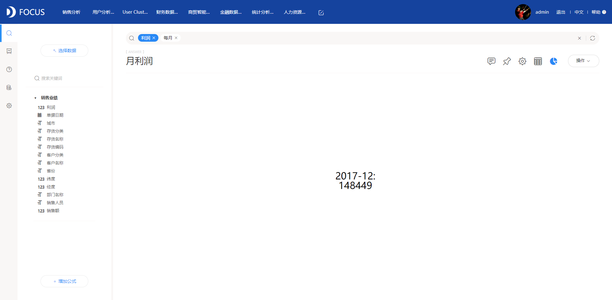
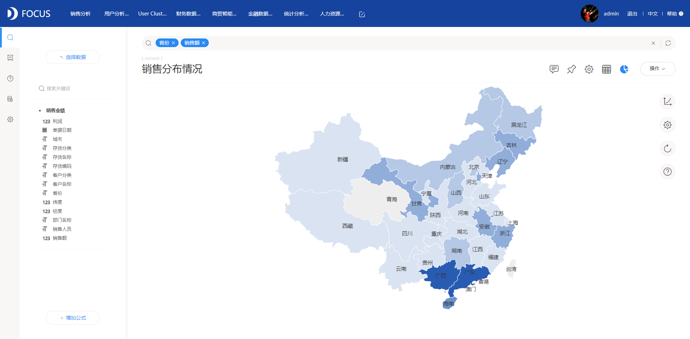
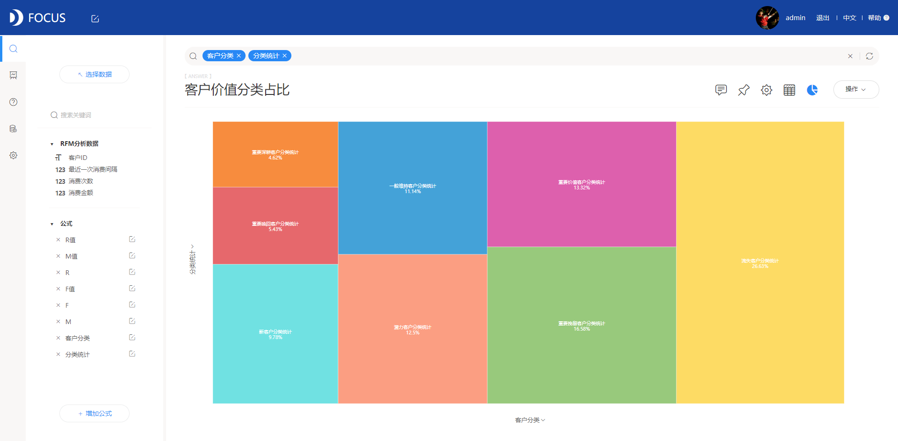
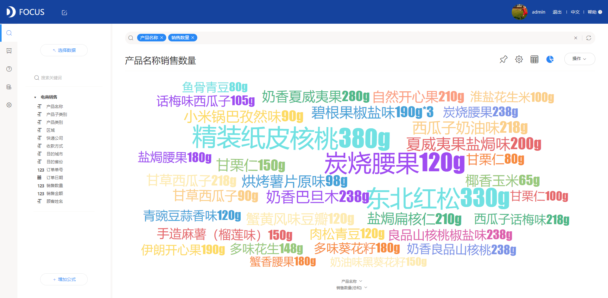
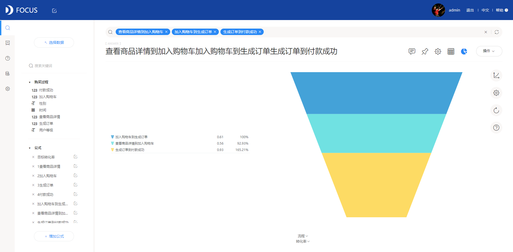
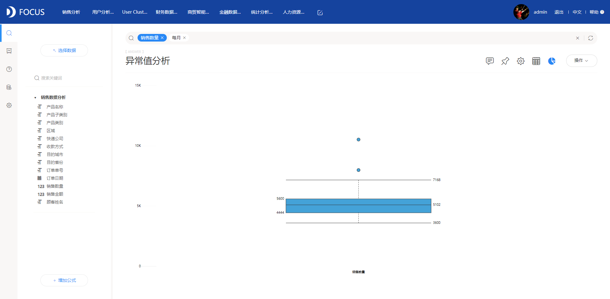
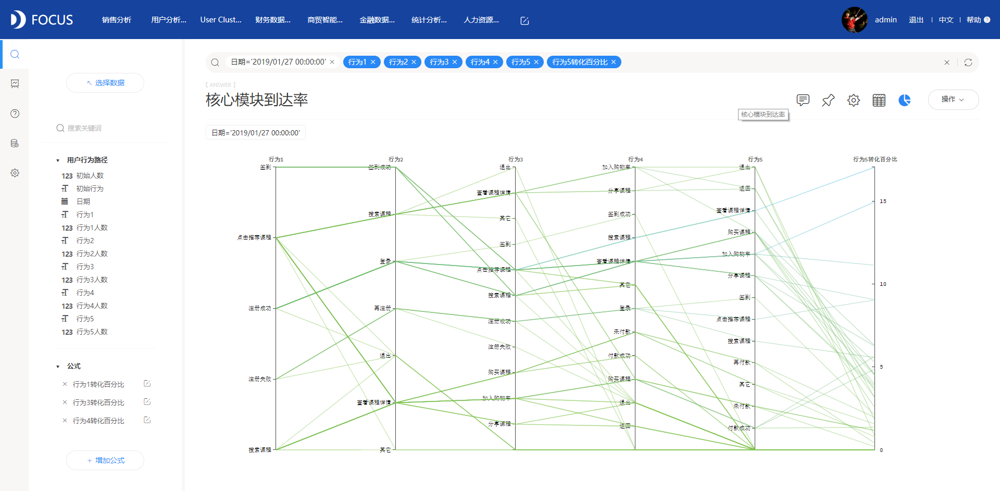

继上一篇数据分析必备知识（二）：可视化图表初阶整理了折线图、柱形图、散点图、饼图4种基本图表的特性及其使用场景，这次整理了一些常用图形，在合适的场景的使用它们，可以为你的分析报告添上靓丽的一笔。

1KPI指标

突出显示一个最终的关键结果数据值。

2仪表盘

显示一个维度数据的累积完成情况。

3位置图

显示数据的地区分布特征，以颜色的深浅来展示区域范围数值的大小。

4热力图

以颜色来反应数据密度，不适用于数值字段是汇总值，需要连续数值数据分布。

5树形图

展示父子层级占比情况，用矩形面积表示占比大小，当数值相近时人眼难以辨别。

6词云图

展现文本信息，对出现频率较高的“关键词”予以视觉上的突出。

7雷达图

一般用来对比某项目不同属性的特点，很多游戏中使用雷达图来进行人物能力对比。

8漏斗图

有固定流程并且环节较多的分析，可以直观地显示转化率和流失率。

9桑基图

用来表示数据的流向。图中延伸的分支的宽度对应数据流量的大小，起始流量总和始终与结束流量总和保持平衡。

10和弦图

一般用来表示双向关系，数据节点如果过多则不适用。

11箱线图

用来展示一组数据分散情况，每一条横线代表分位数，盒内部的横线代表中位数，点代表异常值。

12平行图

平行坐标图的优点是可以把多个变量并形排开，把每一个记录都以折线连接上。这样当数据量大的时候，其实可以很方便地观察各个变量的分布情况。

