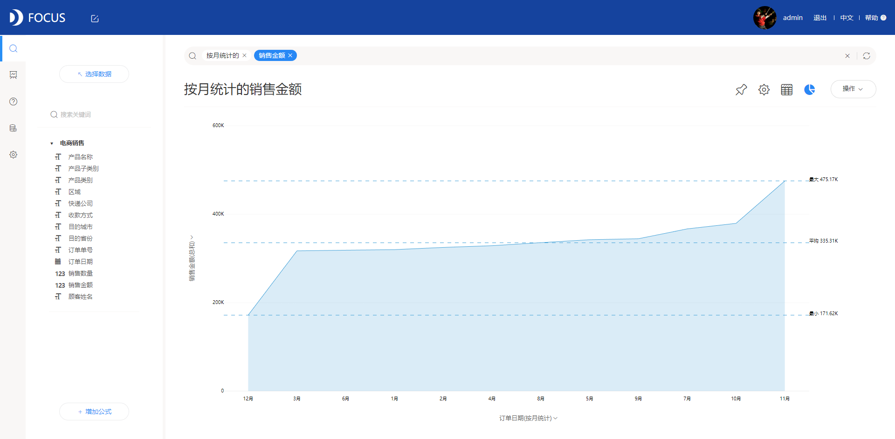

在上面三篇文章中，我们了解到什么是数据可视化，也了解了各个图形的使用场景。在日常工作中，想要设计实用的可视化图形，掌握套路还是很必要的。因此，本文笔者来对常用的图形来一次技巧总结！

1. **比较**

基于分类、时间类数据的对比，通常需要用到比较型图表。

（一）基于分类

1.条目少——柱状图

2.条目多——条形图

3.有负值数据对比——双向柱状图

4.基于流程——漏斗图

5.突出显示——词云图

6.扩大差异——南丁格尔玫瑰图

7.性能——雷达图

（二）基于时间

1.循环数据——雷达图

2.半循环数据——折线图（最佳）、柱状图、条形图、面积图

1. **构成**

局部相对于整体，整体的组成情况是构成图表所用之处。

（一）基于分类

1一维——饼图、环形图

2多类别——环形图

3父子层级——旭日图、树形图

1. 基于时间

1仅相对差异——百分比堆积柱状图、百分比堆积条形图

2总和差异——堆积柱状图、堆积条形图

1. **关联**

通过关联图表，找到数据之间的某种联系。

1基于流程——桑基图、和弦图

2基于变量——散点图、气泡图

1. **分布**

数据集的分布情况，常见使用场景：销售金额的地区分布？客户的年龄段分布？

（一）基于位置

1普通区域分布——位置图（地图）

2资源调配、人口密度——热力图

1. 基于变量

气泡图、箱线图

总结完毕，以上提到的所有图形在DataFocus中都有哦，而且还不止这些图，还有延伸的一些更有趣的图等着你去体验！
