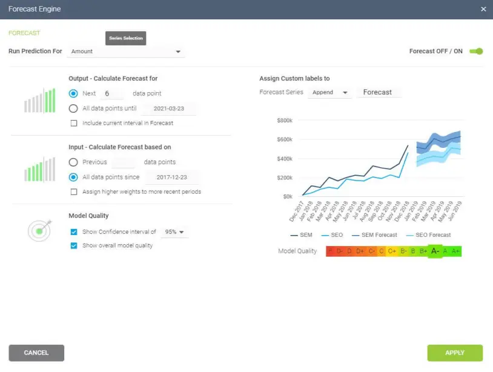

在我们这个数据丰富的时代，了解如何从我们业务的数字洞察中分析和提取真正的意义是成功的主要驱动力之一。

尽管我们每天创建的数据量巨大，但实际上只有 0.5% 的数据被分析并用于[数据发现](https://www.datafocus.ai/infos/what-are-data-discovery-tools)、改进和智能。虽然这看起来并不多，但考虑到我们触手可及的数字信息量，半个百分点仍然占大量数据。

 

由于数据如此之多，时间如此之少，知道如何收集、策划、组织和理解所有这些可能促进业务的信息可能是一个雷区——但[在线数据分析](https://www.datafocus.ai/infos/data-analysis-tools)是解决方案。

在科学领域，数据分析使用更复杂的方法和先进的技术来探索和试验数据。另一方面，在业务环境中，数据用于做出数据驱动的决策，使公司能够提高其整体绩效。在这篇文章中，我们将从商业角度介绍数据分析，同时仍然通过科学和统计基础，这对于理解数据分析的基础知识至关重要。

为了正确看待所有这些，我们将回答一系列重要的分析问题，探索分析方法和技术，同时演示如何在现实世界中以17步成功蓝图进行分析。

 

您的机会：[想要通过几下点击执行高级分析？](https://www.datafocus.ai/console/)试用我们的专业数据分析软件14天，完全免费！

## 什么是数据分析？

数据分析是收集、建模和分析数据以提取支持决策的见解的过程。根据行业和调查目的，有几种方法和技术可以进行分析。

所有这些不同的方法主要基于两个核心领域：定量和定性研究。

为了解释定性和定量研究之间的主要区别，这里有一个视频供您观看：

 

更好地了解定量研究中的不同技术和方法以及定性见解将为您的分析工作提供更明确的方向，因此值得花时间让这些特定知识深入人心。此外，您将能够创建一个全面的分析报告，使您的[分析](https://www.datafocus.ai/infos/analytical-report-example-and-template)飙升。

## 为什么数据分析很重要？

在我们详细介绍分析类别及其方法和技术之前，您必须了解分析数据可以为您的组织带来的潜力。

- 明智的决策：从管理的角度来看，您可以从分析数据中受益，因为它可以帮助您根据事实而不是简单的直觉做出决策。例如，您可以了解在哪里投资资金，检测增长机会，预测收入或在不常见的情况成为问题之前解决它们。像这样，您可以从组织中的所有领域提取相关见解，并在[仪表板软件](https://www.datafocus.ai/infos/best-dashboard-software-features)的帮助下，以专业和交互式的方式向不同的利益相关者呈现信息。
- 降低成本：另一个很大的好处是降低成本。借助预测分析等先进技术，企业可以发现数据中的改进机会、趋势和模式，并相应地规划策略。随着时间的推移，这将帮助您节省实施错误策略的资金和资源。不仅如此，通过预测销售和需求等不同场景，您还可以预测生产和供应。
- 更好地定位客户：客户可以说是任何业务中最关键的元素。通过使用分析来获得与客户相关的所有方面的 360° 视图，您可以了解他们使用哪些渠道与您沟通、他们的人口统计、兴趣、习惯、购买行为等。从长远来看，它将推动您的营销策略取得成功，使您能够识别新的潜在客户，并避免浪费资源来定位错误的人或发送错误的信息。您还可以通过分析客户的评论或客户服务部门的绩效来跟踪客户满意度。

## 什么是数据分析过程？

当我们谈论分析数据时，为了提取所需的结论，需要遵循一个顺序。分析过程包括5个关键阶段。我们将在本文后面更详细地介绍它们中的每一个，但为了开始提供所需的上下文来了解接下来会发生什么，以下是数据分析的 5 个基本步骤的概要。

- 识别：在你接触数据之前，你首先需要确定为什么需要它。识别是您确定需要回答的问题的阶段。例如，客户对我们品牌的看法如何？或者哪种类型的包装对我们的潜在客户更具吸引力？概述问题后，您就可以进行下一步了。
- 收集：顾名思义，这是您开始收集所需数据的阶段。在这里，您可以定义将使用哪些信息源以及如何使用它们。数据收集可以有不同的形式，例如内部或外部来源、调查、访谈、问卷、焦点小组等。这里需要注意的是，在定量和定性方案中，您收集信息的方式会有所不同。
- 清理：获得必要的数据后，就该清理它并准备好进行分析了。并非您收集的所有数据都很有用，在收集不同格式的大量信息时，您很可能会发现自己有重复或格式不正确的数据。为避免这种情况，在开始使用数据之前，您需要确保擦除任何空格、重复记录或格式错误。这样，您可以避免因不正确的数据而损害您的分析。
- 分析：借助统计分析、回归、神经网络、文本分析等各种技术，您可以开始分析和操作数据以提取相关结论。在此阶段，您会发现趋势、相关性、变化和模式，这些趋势、相关性、变化和模式可以帮助您回答您在识别阶段首先想到的问题。市场上的各种技术可帮助研究人员和普通业务用户管理其数据。其中一些包括商业智能和可视化软件、预测分析、数据挖掘等。
- 解释：最后但并非最不重要的一点是，您有一个最重要的步骤：是时候解释您的结果了。在这个阶段，研究人员根据研究结果提出行动方案。例如，在这里您可以了解您的客户是否喜欢红色或绿色，塑料或纸张等包装。此外，在此阶段，您还可以找到一些限制并对其进行处理。

现在您已经对这些步骤有了基本的了解，让我们看一下前 10 种基本方法。

## 数据分析方法的 10 种基本类型

在深入研究七种基本类型的方法之前，重要的是我们快速浏览主要分析类别。从描述性类别到规范性分析，数据评估的复杂性和工作量增加，但也增加了公司的附加值。

a） 描述性分析 - 发生了什么。

描述性分析方法是任何分析反思的起点，它旨在回答发生了什么？它通过对来自各种来源的原始数据进行排序、操作和解释，以将其转化为对组织的宝贵见解来实现这一点。

执行描述性分析至关重要，因为它使我们能够以有意义的方式呈现我们的见解。尽管值得一提的是，此分析本身将不允许您预测未来的结果或告诉您诸如为什么会发生某事之类的问题的答案，但它会使您的数据井井有条并准备好进行进一步的调查。

b） 探索性分析 - 如何探索数据关系。

顾名思义，探索性分析的主要目的是探索。在此之前，仍然没有数据和变量之间关系的概念。调查数据后，探索性分析使您能够找到联系并为特定问题生成假设和解决方案。它的典型应用领域是数据挖掘。

c） 诊断分析 - 为什么会发生。

诊断数据分析通过帮助分析师和高管对发生某事的原因获得坚定的上下文理解，从而赋予他们权力。如果您知道某事发生的原因以及它是如何发生的，您将能够确定解决问题或挑战的确切方法。

旨在为特定问题提供直接和可操作的答案，这是世界上最重要的研究方法之一，其其他关键组织功能，如[零售分析](https://www.datafocus.ai/infos/retail-analytics)，例如

c） 预测分析 - 会发生什么。

预测方法允许您展望未来来回答这个问题：会发生什么？为此，除了机器学习 （ML） 和人工智能 （AI） 之外，它还使用前面提到的描述性、探索性和诊断性分析的结果。像这样，您可以发现数据中的未来趋势、潜在问题或效率低下、连接和伤亡。

通过预测分析，您可以展开和制定计划，这些计划不仅可以增强您的各种运营流程，还可以帮助您在竞争中获得至关重要的优势。如果您通过数据了解趋势、模式或事件发生的原因，您将能够对特定业务领域如何展开进行明智的预测。

e） 规范性分析 - 它将如何发生。

研究中另一种最有效的分析方法。规范性数据技术从预测分析中交叉出来，它围绕着使用模式或趋势来制定响应迅速的实用业务战略。

通过深入到规范性分析，您将在数据消费过程中发挥积极作用，方法是获取排列良好的可视化数据集，并将其用作许多关键领域（包括营销、销售、客户体验、人力资源、履行、财务、[物流分析](https://www.datafocus.ai/infos/logistics-analytics)等）中新出现的问题的有力解决方案。

 

您的机会：[想要通过几下点击执行高级分析？](https://www.datafocus.ai/console/)试用我们的专业数据分析软件14天，完全免费！

事不宜迟，以下是商业世界中的一些用例中的 10 种基本类型的数据分析方法：

### 1\. 聚类分析

对一组数据元素进行分组的操作，使所述元素彼此之间比其他组中的元素更相似（在特定意义上），因此称为“集群”。由于聚类时没有目标变量，因此该方法通常用于查找数据中的隐藏模式。该方法还用于为趋势或数据集提供其他上下文。

让我们从商业角度来看它。在一个完美的世界里，营销人员将能够分别分析每个客户并为他们提供最佳的个性化服务，但让我们面对现实吧，拥有庞大的客户群，这是不可能的。这就是聚类的用武之地。通过根据人口统计、购买行为、货币价值或可能与您的公司相关的任何其他因素将客户分组到集群中，您将能够立即优化您的工作，并根据客户的需求为客户提供最佳体验。

### 2\. 队列分析

这种类型的数据分析方法使用历史数据来检查和比较用户行为的确定部分，然后将其与具有相似特征的其他部分分组。通过使用这种方法，可以获得对消费者需求的丰富洞察或对更广泛的目标群体的深刻理解。

同期群分析对于在营销中执行分析非常有用，因为它可以让您了解广告系列对特定客户群的影响。例如，假设您发送了一个电子邮件活动，鼓励客户注册您的网站。为此，您需要创建具有不同设计、CTA 和广告内容的两个版本的广告系列。稍后，您可以使用同期群分析来跟踪广告系列在较长时间内的效果，并了解哪种类型的内容促使客户注册、回购或以其他方式参与。

开始执行队列分析方法的一个有用工具是谷歌分析。您可以在此有用指南中了解有关在 GA 中使用队列的好处和限制的更多信息。在下图中，您将看到如何在此工具中可视化同类群组的示例。细分（设备流量）分为日期同期群（设备使用情况），然后逐周分析，以提取对性能的见解。

### 3\. 回归分析

回归使用历史数据来了解当一个或多个自变量（线性回归）或多个自变量（多元回归）更改或保持不变时，因变量的值会受到怎样的影响。通过了解每个变量的关系以及它们过去是如何发展的，您可以预测可能的结果并在未来做出更好的决策。

让我们举个例子来说明它。想象一下，您对 2019 年的销售额进行了回归分析，发现产品质量、商店设计、客户服务、营销活动和销售渠道等变量会影响整体结果。现在，您希望使用回归来分析这些变量中的哪些发生了变化，或者 2020 年是否出现了任何新变量。例如，由于 COVID 封锁，您无法在实体店销售那么多。因此，您的销售额可能会普遍下降或在线渠道增加。像这样，您可以了解哪些自变量影响了因变量（年销售额）的整体性能。

如果您想更深入地了解这种类型的分析，请查看本文并详细了解如何从回归中受益。

### 4\. 神经网络

神经网络构成了机器学习智能算法的基础。它是一种分析形式，试图以最少的干预来了解人脑如何产生洞察力和预测价值。神经网络从每一笔数据交易中学习，这意味着它们会随着时间的推移而发展和进步。

神经网络的一个典型应用领域是预测分析。有一些[BI报告工具](https://www.datafocus.ai/infos/bi-reporting)在其中实现了此功能，例如DataFocus的预测分析工具。该工具使用户能够快速轻松地生成各种预测。您所要做的就是根据您的KPI选择要处理的数据，该软件会根据历史和当前数据自动计算预测。由于其用户友好的界面，您组织中的任何人都可以管理它;没有必要成为高级科学家。

以下是如何使用 DataFocus 的预测分析工具的示例：

### 5\. 因素分析

因子分析也称为“降维”，是一种数据分析类型，用于根据称为因子的未观察到变量的数量可能较少来描述观察到的相关变量之间的变异性。这里的目的是发现自变量，这是简化特定细分市场的理想方法。

理解这种数据分析方法的一个好方法是客户对产品的评估。初步评估基于不同的变量，如颜色、形状、耐磨性、当前趋势、材料、舒适度、购买产品的地点、使用频率。像这样，列表可以是无穷无尽的，具体取决于您要跟踪的内容。在这种情况下，因素分析通过将所有这些变量汇总为同质组来实现，例如，通过将变量颜色、材料、质量和趋势分组到设计的潜在变量中。

如果您想开始使用因子分析来分析数据，我们建议您查看加州大学洛杉矶分校的这份实用指南。

### 6\. 数据挖掘

一种数据分析方法，是工程指标和见解的总称，用于附加价值、方向和上下文。通过使用探索性统计评估，数据挖掘旨在识别依赖关系、关系、模式和趋势，以生成高级知识。在考虑如何分析数据时，采用数据挖掘思维方式对于成功至关重要 - 因此，这是一个值得更详细探索的领域。

数据挖掘的一个很好的用例是DataFocus智能[数据警报](https://www.datafocus.ai/infos/business-intelligence-data-alerts)。在人工智能和机器学习的帮助下，它们根据数据集中的特定命令或事件提供自动信号。例如，如果您正在监控[供应链 KPI](https://www.datafocus.ai/infos/supply-chain-metrics-and-kpis)，则可以设置智能警报，以便在出现无效或低质量数据时触发。通过这样做，您将能够深入了解问题并快速有效地修复它。

在下图中，您可以看到来自 DataFocus 的智能警报是如何工作的。通过设置每日订单、会话和收入的范围，警报将在目标未完成或超出预期时通知您。

### 7\. 文本分析

文本分析，在行业中也称为文本挖掘，其工作原理是获取大量文本数据并以更易于管理的方式排列它们。通过严格详细地完成此清理过程，您将能够提取与您的组织真正相关的数据，并使用它来开发可操作的见解，从而推动您前进。

现代工具加速了文本分析的应用。由于机器学习和智能算法的结合，您可以执行高级分析过程，例如情绪分析。这种技术可以让您了解文本的意图和情感，例如，它是积极的、消极的还是中立的，然后根据与您的品牌相关的某些因素和类别给它打分。情绪分析通常用于监控品牌和产品声誉，并了解客户体验的成功程度。要了解有关该主题的更多信息，请查看这篇有见地的文章。

通过分析来自各种基于单词的来源的数据，包括产品评论、文章、社交媒体通信和调查回复，您将获得有关受众以及他们的需求、偏好和痛点的宝贵见解。这将使您能够创建在个人层面上满足潜在客户需求的活动、服务和通信，在提高客户保留率的同时增加您的受众。

### 8\. 时间序列分析

顾名思义，时间序列分析用于分析在指定时间段内收集的一组数据点。尽管分析师使用此方法在特定时间间隔内监视数据点，而不仅仅是间歇性监视它们，但时间序列分析并不是唯一用于收集随时间变化的数据的目的。相反，它允许研究人员了解变量在研究期间是否发生了变化，不同的变量是如何依赖的，以及它是如何达到最终结果的。

在业务环境中，此方法用于了解不同趋势和模式的原因，以提取有价值的见解。使用此方法的另一种方法是借助时间序列预测。在预测技术的支持下，企业可以在一段时间内分析各种数据集并预测不同的未来事件。

透视时间序列分析的一个很好的用例是对销售的季节性影响。通过使用时间序列预测来分析特定产品在一段时间内的销售数据，您可以了解特定时间段（例如，夏季的泳装或万圣节期间的糖果）的销售额是否上升。这些见解使您能够预测需求并相应地准备生产。

### 9\. 决策树

决策树分析旨在作为做出明智和战略决策的支持工具。通过在树状模型中直观地显示潜在的结果、后果和成本，研究人员和业务用户可以轻松评估所涉及的所有因素并选择最佳行动方案。决策树有助于分析定量数据，它们通过帮助您发现改进机会、降低成本、提高运营效率和产量来改进决策过程。

但是决策树实际上是如何工作的呢？此方法的工作方式类似于流程图，从您需要做出的主要决策开始，并根据每个决策的不同结果和后果进行分支。每个结果都将概述其自己的后果、成本和收益，在分析结束时，您可以比较每个结果并做出最明智的决定。

企业可以使用它们来了解哪个项目更具成本效益，从长远来看将带来更多收益。例如，假设您需要决定是要更新软件应用程序还是完全构建新应用程序。在这里，您将比较总成本、所需投资时间、潜在收入以及可能影响您决策的任何其他因素。最后，您将能够看到这两个选项中的哪一个对您的公司或研究更现实和可实现。

### 10\. 联合分析

最后但并非最不重要的一点是，我们有联合分析。这种方法通常用于调查，以了解个人如何评估产品或服务的不同属性，它是提取消费者偏好的最有效方法之一。在购买方面，有些客户可能更注重价格，有些客户更注重功能，有些客户可能更注重可持续发展，无论您客户的偏好是什么，您都可以通过联合分析找到它们。像这样，公司可以定义定价策略、打包选项、订阅包等。

联合分析的一个很好的例子是营销和销售。例如，一个纸杯蛋糕品牌可能会使用联合分析，发现其客户更喜欢无麸质选择和配料更健康的纸杯蛋糕，而不是超级含糖的纸杯蛋糕。像这样，纸杯蛋糕品牌可以将这些见解转化为广告和促销活动，以增加这种特定类型产品的销售额。不仅如此，联合分析还可以帮助企业根据客户的兴趣对客户进行细分。这使他们能够发送不同的消息传递，为每个细分市场带来价值。

 

您的机会：[想要通过几下点击执行高级分析？](https://www.datafocus.ai/console/)试用我们的专业数据分析软件14天，完全免费！

## 如何分析数据？最需要应用的 17 种数据分析技术

现在我们已经回答了“什么是数据分析”的问题，为什么它很重要，并涵盖了不同的数据分析类型，现在是时候通过这 17 种基本技术更深入地了解如何执行分析了。

### 1\. 满足客户需求

在开始分析或深入研究任何技术之前，与组织内的所有关键利益相关者坐下来协作，确定主要活动或战略目标，并基本了解最有利于您的进步或为您提供发展组织所需的愿景水平的见解类型至关重要。

### 2\. 建立你的问题

一旦你概述了你的核心目标，你应该考虑哪些问题需要回答来帮助你实现你的使命。这是最重要的技术之一，因为它将塑造您成功的基础。

为了帮助您提出正确的问题并确保您的数据适合您，您必须提出正确的[数据分析问题](https://www.datafocus.ai/infos/data-analysis-questions)。

### 3\. 数据民主化

在为您的数据分析方法提供一些真正的方向，并知道需要回答哪些问题才能从组织可用的信息中提取最佳价值之后，您应该继续民主化。

数据民主化是一种旨在高效、快速地连接来自各种来源的数据的操作，以便组织中的任何人都可以在任何给定时刻访问它。您可以提取文本，图像，视频，数字或任何其他格式的数据。然后执行跨数据库分析，以获得更高级的见解，以便与公司其他部门以交互方式共享。

一旦你决定了你最有价值的来源，你需要把所有这些都变成一个结构化的格式，开始收集你的见解。为此，DataFocus 提供了一个简单的多合一[数据连接器](https://www.datafocus.ai/infos/data-connectors)功能，可以集成您的所有内部和外部资源并随意管理它们。此外，DataFocus的端到端解决方案会自动更新您的数据，使您能够节省时间并专注于执行正确的分析以发展您的公司。

### 4\. 考虑治理

在商业或研究环境中收集数据时，您始终需要考虑安全性和隐私性。随着数据泄露成为企业关注的话题，保护客户或主体的敏感信息的需求变得至关重要。

为了确保所有这些都得到照顾，您需要考虑数据治理策略。根据Gartner的说法，这一概念指的是“决策权和问责框架的规范，以确保在数据和分析的估值，创建，消费和控制中的适当行为。简而言之，数据治理是流程、角色和策略的集合，可确保有效使用数据，同时仍能实现公司的主要目标。它确保为谁可以访问信息以及如何访问信息设置明确的角色。随着时间的推移，这不仅可以确保敏感信息受到保护，还可以进行整体的有效分析。

### 5\. 清理数据

从如此多的来源收集后，您将留下大量信息，这些信息可能会让人不知所措。同时，您可能会面临不正确的数据，这些数据可能会误导您的分析。为了避免将来处理此问题，您可以做的最明智的事情是清理数据。在可视化之前，这是基础，因为它将确保您从中提取的见解是正确的。

在清洁过程中，您需要寻找很多东西。最重要的是消除任何重复的观察;这通常出现在使用多个内部和外部信息源时。您还可以添加任何缺失的代码、修复空字段并消除格式不正确的数据。

另一种常见的清理形式是使用文本数据完成。正如我们前面提到的，今天大多数公司都会分析客户评论、社交媒体评论、问卷和其他一些文本输入。为了使算法能够检测模式，需要修改文本数据以避免无效字符或任何语法或拼写错误。

最重要的是，清洁的目的是防止您得出错误的结论，从长远来看，这可能会损害您的业务。通过使用干净的数据，您还将帮助 BI 工具更好地与您的信息交互，并为您的组织创建更好的[报告](https://www.datafocus.ai/infos/data-report-examples)。

### 6\. 设置您的关键绩效指标

设置来源、清理数据并建立希望见解回答的明确问题后，您需要设置一系列关键绩效指标 （KPI），以帮助您跟踪、衡量和塑造多个关键领域的进度。

KPI 对于定性和定量分析研究都至关重要。这是您当然不应该忽视的数据分析的主要方法之一。

为了帮助您为计划和活动设置最佳 KPI，以下是相关[物流 KPI](https://www.datafocus.ai/infos/kpi-examples-and-templates-logistics) 的示例：与运输相关的成本。如果您想了解更多信息，请浏览我们[收集的关键绩效指标示例](https://www.datafocus.ai/infos/kpi-examples-and-templates)。

### 7\. 省略无用的数据

赋予你的数据分析技术和方法真正的目的并定义你的使命后，你应该探索你从所有来源收集的原始数据，并使用你的KPI作为参考，去掉你认为无用的任何信息。

减少信息脂肪是最重要的分析方法之一，因为它可以让您集中分析工作并从剩余的“精益”信息中榨取每一滴价值。

任何与您的业务目标不一致或不符合您的[KPI 管理](https://www.datafocus.ai/infos/kpi-management-and-best-practices)策略的统计数据、事实、数字或指标都应从等式中删除。

 

您的机会：[想要通过几下点击执行高级分析？](https://www.datafocus.ai/console/)试用我们的专业数据分析软件14天，完全免费！

### 8\. 构建数据管理路线图

虽然在这一点上，这个特定的步骤是可选的（你现在已经获得了丰富的洞察力并形成了一个相当合理的策略），但创建数据治理路线图将有助于你的数据分析方法和技术在更可持续的基础上取得成功。如果开发得当，这些路线图也会被构建出来，以便随着时间的推移进行调整和扩展。

投入大量时间来制定路线图，帮助您在内部存储、管理和处理数据，这将使您的分析技术更加流畅和实用——这是当今最强大的数据分析方法之一。

### 9\. 整合技术

分析数据的方法有很多种，但在业务环境中分析成功的最重要方面之一是集成正确的[决策支持软件](https://www.datafocus.ai/infos/decision-support-system)和技术。

强大的分析平台不仅可以让您从最有价值的来源中提取关键数据，同时使用动态 KPI，为您提供可操作的见解;它还将从一个中央[实时仪表板](https://www.datafocus.ai/infos/live-dashboards)以易于理解的可视化交互式格式呈现它们。您可以信赖的数据方法。

通过将正确的技术集成到您的数据分析方法中，您将避免分散您的见解，节省时间和精力，同时让您从企业最有价值的见解中获得最大价值。

要了解软件在分析方面的强大功能并增强您的分析方法，请查看我们精选[的仪表板示例](https://www.datafocus.ai/infos/dashboard-examples-and-templates)。

### 10\. 回答您的问题

通过考虑上述每一项努力，使用正确的技术，并培养一种有凝聚力的内部文化，让每个人都接受分析数据的不同方式以及数字智能的力量，您将迅速开始回答您最紧迫的业务问题。可以说，使数据概念在整个组织中可访问的最佳方法是通过数据可视化。

### 11\. 可视化数据

[在线数据可视化](https://www.datafocus.ai/infos/data-visualization-tools)是一个强大的工具，因为它可以让您用指标讲述一个故事，允许整个组织的用户提取有助于业务发展的有意义的见解，并且它涵盖了分析数据的所有不同方式。

分析的目的是使您的整个组织更加知情和智能，并且使用正确的平台或仪表板，这比您想象的要简单，正如我们的[营销仪表板](https://www.datafocus.ai/infos/dashboard-examples-and-templates-marketing)所证明的那样。

主要关键绩效指标：

这个可视化、动态和交互式[的在线仪表板](https://www.datafocus.ai/infos/online-dashboard)旨在为首席营销官 （CMO） 提供相关指标的概述，以帮助他们了解他们是否实现了每月目标。

详细地说，使用现代[仪表板创建器](https://www.datafocus.ai/infos/dashboard-creator)生成的此示例显示每月收入、成本、净收入和每个客户的净收入的交互式图表;所有这些都与上个月进行比较，以便您可以了解数据的波动情况。此外，它还显示每月用户、客户、SQL 和 MQLs 数量的详细摘要，以可视化整体情况并为您的[营销报告](https://www.datafocus.ai/infos/daily-weekly-monthly-marketing-report-examples)提取相关见解或趋势。

CMO 仪表板非常适合 C 级管理层，因为它可以帮助他们监控营销工作的战略成果，并做出[数据驱动的决策](https://www.datafocus.ai/infos/data-driven-decision-making-in-businesses)，从而为公司带来指数级效益。

### 12\. 小心解释

我们已经用了整篇文章来解释[数据解释](https://www.datafocus.ai/infos/data-interpretation-methods-benefits-problems)，因为它是数据分析过程的基本组成部分。它赋予分析信息以意义，旨在从分析结果中得出简洁的结论。由于大多数时候公司都在处理来自许多不同来源的数据，因此需要仔细和正确地进行解释阶段，以避免误解。

为了帮助您完成此过程，我们在此处列出了在查看数据时需要不惜一切代价避免的三种常见做法：

- 相关性与因果关系：人脑被格式化以找到模式。这种行为会导致执行解释时最常见的错误之一：混淆相关性和因果关系。虽然这两个方面可以同时存在，但假设因为两件事一起发生，一个激怒了另一个是不正确的。避免陷入这个错误的一条建议是永远不要只相信直觉，相信数据。如果没有因果关系的客观证据，那么始终坚持相关性。
- 确认偏差：这种现象描述了仅选择和解释证明一个假设所需的数据的倾向，而通常忽略可能反驳它的元素。即使不是故意这样做，确认偏差也可能代表一个真正的问题，因为排除相关信息可能会导致错误的结论，从而导致糟糕的业务决策。为了避免这种情况，请始终尝试反驳您的假设而不是证明它，与其他团队成员分享您的分析，并避免在整个分析项目最终确定之前得出任何结论。
- 统计显著性：简而言之，统计显著性有助于分析师了解结果是否确实准确，或者是否由于抽样误差或纯粹的偶然性而发生。所需的统计显著性水平可能取决于样本量和所分析的行业。无论如何，当结果可能影响决策时，忽视结果的重要性可能是一个巨大的错误。

### 13\. 建立叙事

现在，我们将研究如何将所有这些元素以一种有利于您的业务的方式结合在一起 - 从一点叫做数据故事讲述的东西开始。

人类大脑对强烈的故事或叙述的反应非常好。使用各种[BI 仪表板工具](https://www.datafocus.ai/infos/bi-dashboard-tools)清理、塑造和可视化最宝贵的数据后，您应该努力讲述一个故事 - 一个具有明确开头、中间和结尾的故事。

通过这样做，您将使您的分析工作更易于访问、易于理解和普遍，从而使组织内的更多人能够利用您的发现来发挥可操作的优势。

### 14\. 考虑自主技术

人工智能 （AI） 和机器学习 （ML） 等自主技术在促进理解如何更有效地分析数据方面发挥着重要作用。

Gartner预测，到今年年底，80%的新兴技术将以AI为基础进行开发。这证明了自主技术不断增长的力量和价值。

目前，这些技术正在彻底改变分析行业。我们前面提到的一些示例是神经网络、智能警报和情绪分析。

### 15\. 分担负载

如果您使用正确的工具和仪表板，您将能够以易于理解的价值驱动格式呈现您的指标，从而使组织中的几乎每个人都能够连接并使用相关数据来发挥自己的优势。

现代仪表板整合了来自各种来源的数据，无论您是否需要监控[招聘指标](https://www.datafocus.ai/infos/recruitment-metrics-and-dashboards)或生成需要跨多个部门发送的报告，都可以在一个集中位置访问大量见解。此外，这些尖端工具可以从多种设备访问仪表板，这意味着企业内的每个人都可以远程连接实用见解 - 并分担负载。

一旦每个人都能够以数据驱动的思维方式工作，您将以您从未想过的方式催化您的业务成功。当涉及到如何分析数据时，这种协作方法是必不可少的。

### 16\. 数据分析工具

为了对数据进行高质量的分析，使用能够确保最佳结果的工具和软件至关重要。在这里，我们为您的组织提供四个基本类别[的数据分析工具](https://www.datafocus.ai/infos/data-analyst-tools-software)的简短摘要。

- 商业智能：BI 工具允许您以任何格式处理来自多个来源的大量数据。像这样，您不仅可以分析和监控数据以提取相关见解，还可以创建交互式报告和仪表板来可视化您的 KPI 并将其用于公司的利益。DataFocus 是一款了不起的在线[BI 软件](https://www.datafocus.ai/infos/online-bi-tools)，专注于提供初学者和高级用户都可以访问的强大在线分析功能。像这样，它提供了一个全方位的服务解决方案，包括尖端的数据分析、KPI 可视化、实时仪表板和报告，以及用于预测趋势和最小化风险的人工智能技术。
- 统计分析：这些工具通常是为科学家、统计学家、市场研究人员和数学家设计的，因为它们允许他们使用回归分析、预测分析和统计建模等方法执行复杂的统计分析。执行此类分析的一个很好的工具是R-Studio，因为它提供了强大的数据建模和假设测试功能，可以涵盖学术和一般数据分析。该工具是业内最受欢迎的工具之一，因为它能够使用多种统计方法进行数据清理、数据缩减和执行高级分析。另一个值得一提的相关工具是IBM的SPSS。该软件为所有技能水平的用户提供高级统计分析。得益于庞大的机器学习算法库、文本分析和假设测试方法，它可以帮助您的公司找到相关的见解，以推动更好的决策。SPSS 还用作云服务，使您能够在任何地方运行它。
- SQL 控制台：SQL 是一种编程语言，通常用于处理关系数据库中的结构化数据。像这样的工具在数据科学家中很受欢迎，因为它们对于释放这些数据库的价值非常有效。毫无疑问，市场上最常用的SQL软件之一是MySQL Workbench该工具提供了多种功能，例如用于数据库建模和监视的可视化工具，完整的SQL优化，以及管理工具和用于跟踪KPI的可视化性能仪表板。
- 数据可视化：这些工具用于通过图表、图形和地图表示数据，使您能够查找数据中的模式和趋势。DataFocus已经提到的BI平台还提供了大量强大的[在线数据可视化工具](https://www.datafocus.ai/infos/data-visualization-tools)，具有多种好处。其中一些包括：提供引人注目的数据驱动演示以与您的整个公司共享，无论您身在何处，都可以使用任何设备在线查看您的数据，交互式[仪表板设计](https://www.datafocus.ai/infos/dashboard-design-principles-and-best-practices)功能使您能够以交互式和可理解的方式展示您的结果，并执行可以与其他几个人同时使用的在线自助服务报告，以提高团队生产力。

### 17\. 不断完善您的流程

最后一步对某些人来说似乎很明显，但如果您认为您已经完成了，则很容易忽略它。提取所需的结果后，您应该始终回顾性地审视您的项目并思考您可以改进的地方。正如您在这长串技术中看到的那样，数据分析是一个复杂的过程，需要不断完善。出于这个原因，你应该总是更进一步，不断改进。

 

您的机会：[想要通过几下点击执行高级分析？](https://www.datafocus.ai/console/)试用我们的专业数据分析软件14天，完全免费！

## 数据分析的质量标准

到目前为止，我们已经介绍了一系列可以帮助您执行有效数据分析的方法和技术。但是，您如何衡量结果的质量和有效性呢？这是在一些科学质量标准的帮助下完成的。在这里，我们将进入一个更具理论性的领域，这对于理解科学统计分析的基础至关重要。但是，您还应该了解业务环境中的这些步骤，因为它们将允许您以正确的方式评估结果的质量。让我们深入研究。

- 内部有效性：如果调查结果衡量了他们应该衡量的内容，从而提供可信的结果，那么调查结果就是内部有效的。换句话说，内部有效性衡量结果的可信度，以及它们如何受到研究设计、操作定义、变量测量方式等因素的影响。例如，假设您正在接受采访，询问人们是否每天刷牙两次。虽然他们中的大多数人会回答是肯定的，但您仍然可以注意到他们的答案与社会可接受的答案相对应，即每天至少刷牙两次。在这种情况下，你不能100%确定受访者是否真的每天刷牙两次，或者他们只是说他们刷牙，因此，这次采访的内部有效性非常低。

- 外部有效性：从本质上讲，外部有效性是指您的研究结果可以应用于更广泛背景的程度。它基本上旨在证明研究结果可以应用于现实世界。如果研究可以应用于其他环境、个人和时代，那么外部有效性就很高。

- 可靠性：如果你的研究是可靠的，这意味着它可以被复制。如果在相同条件下重复测量，则会产生类似的结果。这意味着您的测量仪器始终如一地产生可靠的结果。例如，假设医生构建了一份症状问卷来检测患者的特定疾病。然后，其他各种医生使用此问卷，但最终诊断出患有不同病情的同一患者。这意味着问卷对于检测初始疾病并不可靠。这里另一个重要的注意事项是，为了使您的研究可靠，它还需要客观。如果研究结果相同，与评估或解释它们的人无关，该研究可以被认为是可靠的。现在让我们更详细地了解客观性标准。

- 客观性：在数据科学中，客观性意味着研究人员在分析时需要保持完全客观。研究结果需要受到客观标准的影响，而不是受研究人员的信仰、个性或价值观的影响。当您收集数据时，需要确保客观性，例如，在采访个人时，需要以不影响结果的方式提出问题。除此之外，在解释数据时还需要考虑客观性。如果不同的研究人员得出相同的结论，那么这项研究是客观的。对于最后一点，您可以设置预定义的标准来解释结果，以确保所有研究人员都遵循相同的步骤。

所讨论的质量标准主要涵盖定量背景下的潜在影响。定性研究中的分析默认具有额外的主观影响，必须以不同的方式进行控制。因此，这类研究还有其他质量标准，例如可信度、可转移性、可靠性和可确认性。您可以在此资源上更详细地查看它们中的每一个。

## 数据分析限制和障碍

分析数据并非易事。正如您在这篇文章中看到的那样，您需要应用许多步骤和技术才能从研究中提取有用的信息。虽然执行良好的分析可以为您的组织带来各种好处，但它并非没有限制。在本节中，我们将讨论您在进行分析时可能遇到的一些主要障碍。让我们更详细地了解它们。

- 客观性：可以说，在研究中数据分析的最大障碍之一是保持客观。当试图证明一个假设时，研究人员可能会发现自己有意或无意地将结果引向他们想要的结果。为避免这种情况，请始终质疑您的假设，避免将事实与观点混淆。您还可以向研究合作伙伴或外部人员展示您的发现，以确认您的结果是客观的。
- 有缺陷[的相关性：误导性的统计数据](https://www.datafocus.ai/infos/misleading-statistics-and-data)会严重损害您的研究。我们之前已经在帖子中指出了一些解释问题，但这是一个重要的障碍，我们在这里也无法避免解决。当两个变量看起来彼此相关但事实并非如此时，就会发生有缺陷的相关性。将相关性与因果关系混淆会导致对结果的错误解释，从而导致制定错误的策略和资源损失，因此，识别不同的解释错误并避免它们非常重要。
- 隐私问题：在某些情况下，数据收集可能会受到隐私法规的约束。企业从客户那里收集各种信息，从购买行为到地址和电话号码。如果由于违规行为而落入坏人之手，则可能会影响客户的安全性和机密性。为避免此问题，您只需收集研究所需的数据，如果您使用的是敏感事实，请将其匿名，以便保护客户。滥用客户数据会严重损害企业的声誉，因此密切关注隐私非常重要。
- 团队之间缺乏沟通：在业务层面进行数据分析时，每个部门和团队很可能会有不同的目标和策略。但是，他们都在为同一个共同目标而努力，即帮助业务顺利运行并保持增长。当团队没有联系和相互沟通时，它会直接影响一般策略的构建方式。为了避免这些问题，数据仪表板等工具使团队能够以视觉上吸引人的方式通过[数据](https://www.datafocus.ai/infos/data-dashboards-definition-examples-templates)保持联系。
- Innumeracy：企业每天都在越来越多地处理数据。虽然有许多[BI工具](https://www.datafocus.ai/infos/best-bi-tools-software-review-list)可用于执行有效的分析，但数据素养仍然是一个持续的障碍。并非所有员工都知道如何应用分析技术或从中提取见解。为了防止这种情况发生，您可以实施不同的培训机会，让每个相关用户准备好处理数据。

## 大数据环境下的数据分析

大数据对于当今的企业来说是无价的，通过使用不同的数据分析方法，可以以一种可以帮助您将洞察力转化为积极行动的方式查看您的数据。

为了激发您的努力并将大数据的重要性置于上下文中，您应该了解以下一些见解：

- 到2023年，大数据行业的价值预计将达到约770亿美元。
- 94%的企业表示，分析数据对其增长和数字化转型非常重要。
- 充分利用其数据潜力的公司可以将营业利润率提高60%。
- 我们已经通过本文告诉您人工智能的好处。到2025年，该行业的财务影响预计将增长到400亿美元。

数据分析概念可能有多种形式，但从根本上说，任何可靠的方法都将有助于使您的业务比以往任何时候都更加精简、有凝聚力、更有洞察力和成功。

 

您的机会：[想要通过几下点击执行高级分析？](https://www.datafocus.ai/console/)试用我们的专业数据分析软件14天，完全免费！

## 数据分析的关键要点

随着数据分析之旅的结束，我们留下了主要方法和技术的一小部分摘要，以执行出色的分析和发展您的业务。

数据分析方法的10种基本类型：

- 聚类分析
- 同期群分析
- 回归分析
- 因子分析
- 神经网络
- 数据挖掘
- 文本分析
- 时间序列分析
- 决策树
- 联合分析

前 17 种数据分析技术：

- 满足您的需求
- 建立您的问题
- 数据民主化
- 考虑数据治理
- 清理数据
- 设置您的关键绩效指标
- 省略无用的数据
- 构建数据管理路线图
- 集成技术
- 回答您的问题
- 可视化数据
- 数据的解释
- 考虑自主技术
- 构建叙事
- 分担负载
- 数据分析工具
- 不断完善您的流程

我们已经思考了数据分析的定义，并深入研究了以数据为中心的分析的实际应用，有一点是明确的：通过采取措施来安排数据并使您的指标为您服务，可以将原始信息转化为行动 - 这种将推动您的业务更上一层楼。

是的，良好的数据分析技术可以增强商业智能（BI）。为了帮助您更详细地理解这一概念，请阅读我们对[商业智能报告的](https://www.datafocus.ai/infos/business-intelligence-reporting)探索。

而且，如果您准备好执行自己的分析，深入了解您的事实和数据，同时与令人惊叹的视觉效果的数据进行交互，您可以免费试用我们的软件，为期 [14 天](https://www.datafocus.ai/console/)。
