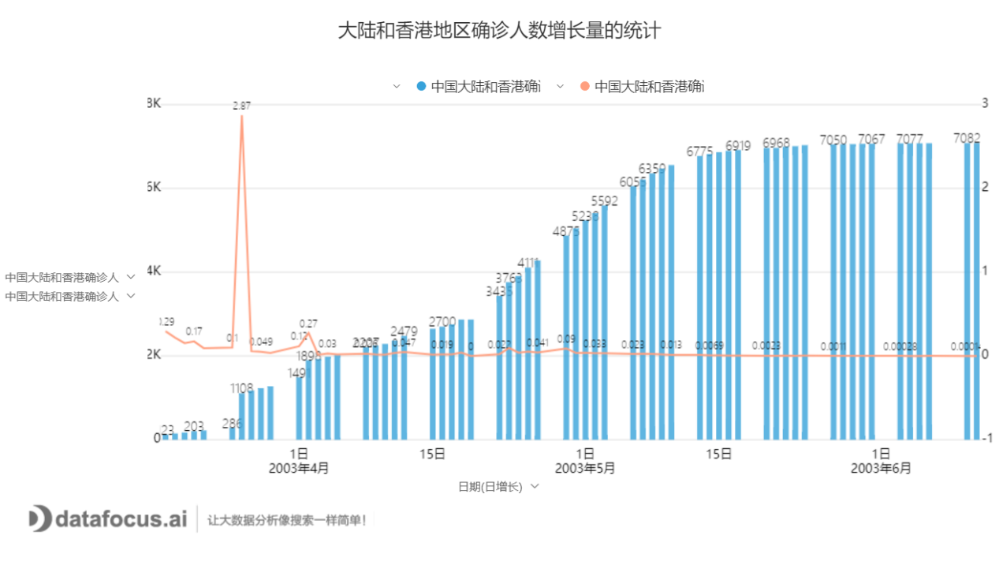
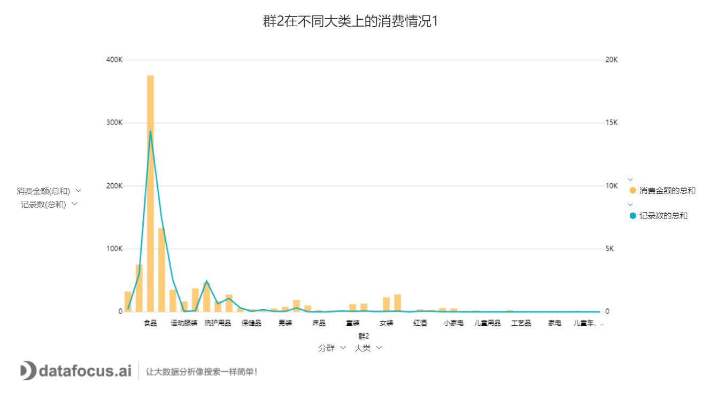

一、数据分析的基本思路

数据分析应该以业务场景为起始思考点，以业务决策作为终点。

1、明确思路

明确数据分析的目的以及思路是确保数据分析过程有效进行的首要条件。它作用的是可以为数据的收集、处理及分析提供清晰的指引方向。可以说思路是整个分析流程的起点。首先目的不明确则会导致方向性的错误。当明确目的后，就要建分析框架，把分析目的分解成若干个不同的分析要点，即如何具体开展数据分析，需要从哪几个角度进行分析，采用哪些分析指标。只有明确了分析目的，分析框架才能跟着确定下来，最后还要确保分析框架的体系化，使分析更具有说服力。

2、收集数据

收集数据是按照确定的数据分析框架收集相关数据的过程，它为数据分析提供了素材和依据。这里所说的数据包括第一手数据与第二手数据，第一手数据主要指可直接获取的数据比如公司自己的业务数据库中的业务数据，第二手数据主要指经过加工整理后得到的数据例如一些公开出版物或者第三方的数据网站。

3、处理数据

处理数据是指对收集到的数据进行加工整理，形成适合数据分析的样式，它是数据分析前必不可少的阶段。数据处理的基本目的是从大量的、杂乱无章、难以理解的数据中，抽取并推导出对解决问题有价值、有意义的数据。数据处理主要包括数据清洗、数据转化、数据提取、数据计算等处理方法。

4、分析数据

分析数据是指用适当的分析方法及工具，对处理过的数据进行分析，提取有价值的信息，形成有效结论的过程。由于数据分析多是通过软件来完成的，这就要求数据分析师不仅要掌握各种数据分析方法，还要熟悉数据分析软件的操作。而数据挖掘其实是一种高级的数据分析方法，就是从大量的数据中挖掘出有用的信息，它是根据用户的特定要求，从浩如烟海的数据中找出所需的信息，以满足用户的特定需求。

5、可视化

一般情况下，数据是通过表格和图形的方式来呈现的，我们常说用图表说话就是这个意思。常用的数据图表包括饼图、柱形图、条形图、折线图、散点图、雷达图等，当然可以对这些图表进一步整理加工，使之变为我们所需要的图形，例如金字塔图、矩阵图、漏斗图等。大多数情况下，人们更愿意接受图形这种数据展现方式，因为它能更加有效直观。

6、撰写报告

撰写数据分析报告其实是对整个数据分析过程的一个总结与呈现，通过清晰的结构和图文并茂的展现方式去展具有建设意义的解决方案。

二、数据分析的基本方法

1、对比分析

时间维度上的同比和环比

不同人群之间的对比

不同类别之间的对比

对比法可以发现数据变化规律，使用频繁，经常和其他方法搭配使用。

2、帕累托分析

帕累托法则，源于经典的二八法则，即百分之八十的问题是百分之二十的原因所造成的。帕累托图在项目管理中主要用来找出产生大多数问题的关键原因，用来解决大多数问题。

在帕累托图中，不同类别的数据根据其频率降序排列的，并在同一张图中画出累积百分比图。帕累托图可以体现帕累托原则：数据的绝大部分存在于很少类别中，极少剩下的数据分散在大部分类别中。这两组经常被称为“至关重要的极少数”和“微不足道的大多数”。

3、聚类分析

聚类分析属于探索性的数据分析方法。通常，我们利用聚类分析将看似无序的对象进行分组、归类，以达到更好地理解研究对象的目的。聚类结果要求组内对象相似性较高，组间对象相似性较低。在用户研究中，很多问题可以借助聚类分析来解决，比如，网站的信息分类问题、网页的点击行为关联性问题以及用户分类问题等等。其中，用户分类是最常见的情况。

图表制作工具为DataFocus
