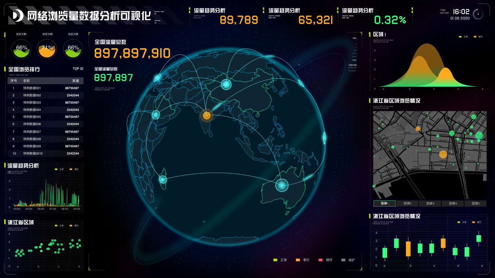

数据是一种绝对客观的工具，用于通过可量化的指标评估产品改进的成功与否。作为产品经理，我们需要养成思考数据和掌握数据分析方法论的习惯。在产品迭代开发的过程中，是数据驱动的，以确保产品开发的更好。

数据分析是产品经理最基本的技能之一。

在很多情况下，我们把数据分析函数当成纯粹的工具函数，比如Excel函数、数据透视表、SQL、tableau等。学习如何使用这些工具并不复杂，但就我个人而言，作为产品经理，我认为数据分析比想法更重要，而不是工具。

**一、数据分析的三个概念**

在讲数据分析的概念之前，让我先解释一下数据分析的三个关键概念：维度、指标和粒度。将维度理解为对数据进行分组的一种方式。假设您有转化率数据，您可以将数据分为以下几组：

• 按系统类型分组，可分为iOS、Android、Windows、macOS 等。

• 根据用户的性别分组，可以分为男性和女性，根据地理位置，可以分为多个国家、省、市等。

• 按年龄分组，分为60后、70后、80后、90后、00后等。

• 按支付方式分组，分为微信、支付宝、银联等。

维度是数据分析的视角，是探索海量数据中包含的信息的关键。

我将指标理解为对结果、数字的衡量。当您收到一份数据副本时，一切都已经建立。例如，当您获得去年酒店的入住率数据时，您可以使用入住率作为指标来衡量去年的入住率。

通过设置客人单价为指标，可以衡量过去一年的房价水平。也可以单独设置一个房间收益（即所有房间的收入是多少）。酒店是平均）指标，用来衡量去年收益酒店整体水平，每个指标都是一个影响业务的数字。

粒度是用来描述一个指标的粗细，是指标统计的口径。以酒店入住率数据为例，入住率、客人单价和单间收益都可以定义为小时天、周、月、季度和年。

在大多数情况下，时间单位用于定义粒度。有时我们使用人口规模（例如个人、群体、班级、学校等）和地理规模（例如城镇、镇、县、市、省和国家）来定义粒度。

如果分割太大或太小，对数据分析都没有帮助。如果酒店入住率是基于年度细分，则只能分析总体趋势的变化。很难分析季节的影响。共享和服务改进的因素；您只能分析一天中不同时间的客户入住率变化，而不能分析需求的周期性变化。

了解了维度、指标和细分的定义，可以得出结论，数据分析的方法是观察不同维度（视角）的数据，根据业务成果指标进行适当的细分，发现机会或问题。

**二、用户决策与使用路径分析**

那么，对于产品经理来说，我们对数据分析有什么看法？我个人理解，我们还是要从用户的需求和决策路径出发，用数据来检验一个产品或服务是否满足所有目标用户的需求，寻找与用户或需求相关的机会和问题。

除某些产品或服务外，大多数产品或服务旨在满足某些用户的需求，即产品或服务的预期用户。用户使用产品或服务来满足他们的需求有一个过程，即“收集信息”-“评估和选择”并发现购买或使用问题。

在推出新产品或新功能时，首先要观察有多少目标用户找到了可以解决他们的问题并满足他们需求的功能或产品。

在互联网产品中，用户可以即时发现问题、收集信息、评估和选择。用户在您的应用中发现问题的最常见方式是小红点、小图标、弹出窗口或广告。用户点击后，会出现一个功能或描述页面，告诉输入用户问题是什么，当前功能可以解决问题。在APP之外，还有短信、推送等方式引导用户查找问题。

这一步需要分析有多少目标用户发现了问题，目标用户是否没有发现问题，非目标用户是否发现了问题（目标用户是否是产品的假设） .不代表实际情况，可根据数据情况调整产品方案。）

分析的指标是短信、推送、小红点、小图标、弹出窗口、广告等的覆盖率和打开/点击率。分析视角是不同的维度、不同的设备、不同的年龄、不同的收入、不同的版本、不同的地区、不同的时间、到达和打开率/点击率。如果我们能覆盖大部分的视角（维度），那么有90%的几率会发现问题。

例如，某些短信频道在某些地区存在问题，无法正常推送。我通常无法显示/单击特定设备的特定版本的系统弹出窗口。某些类型的用户可能无法理解广告。文案；对特定的本地用户等没有需求。同样，如果你开一家线下门店，你也可以分析门店门口和门口的广告曝光率和门店入口转化数据。

统计每天进店的用户特征和数量，观察前门用户的特征、数量和广告，以及进店的用户特征和数量，验证是否匹配。优化你的店铺设计，你店铺的目标用户群、非目标人群等信息是否可以转换。

当用户认识到产品或服务可以解决他们的问题时，需要一系列步骤才能使用该产品或服务。在互联网产品设计中，您为用户设计一组流程。

比如点菜的时候，你设计了一个店铺搜索-选品——用户支付-收款-验证流程，screen-in-store-http://1310。 cn/--付款--收款--评价流程。用户可能在每个阶段都会遇到问题，但仍然使用不同的维度来分析每个阶段的过渡情况，以发现问题或机会。此时，应根据实际业务流程进行数据分析。

**三、钻取分析**

上面从用户的决策和使用路径分析数据，但是这样的分析需要大量的工作。

所以，在实践中，我们通常会先分析高纬度数据，结合我们对用户决策和使用的理解，发现所谓的下钻问题，然后不断细化其维度。发现特定维度的过程。关于什么步骤的问题。

我们以某个特性的使用率作为指标，对其进行分解，分析该特性是否存在问题，是否满足所有目标用户的需求。

首先，通过终端层面的数据分析，发现APP端的转化率远低于PC端的转化率。然后我们查看了iOS和Android在转化率上的差异，发现Android转化率低于iOS，iOS和PC是一样的。让我们看看不同Android 版本的转化率差异，看看每个Android 版本的转化率是接近的。

换个角度，看看Android系统版本和转化率有没有区别，看看其他系统版本的转化率是不是差不多。如果您查看Android 手机品牌的转化率，您会发现其他品牌的转化率相似。

经过上面的过程分析，我们发现很难找到设备的问题。让我们换个角度来看看iOS 和Android 用户组之间是否存在差异。我们看到Android 之前用户的比例相当高。然后，让我们看看iOS 之前和Android 用户的转化率是否都低。老产品转化率低，用户转化率真的很低。

所以，基本上，我们确认老用户可能会遇到这个问题。接下来，我们拆分转化率指标来分析每个阶段不同用户群体之间的转化差异，并找出产品设计的哪个阶段出了问题，从而降低了老用户的转化率。

同样，你可以在不同的用户群体层面进行分析，并继续向下钻取，发现问题和机会。任何维度的异常数据都可能表明存在问题或机会。

有一些推动业务增长的数据分析的经典例子。话虽如此，推特早期分析了用户留存数据，发现除了系统默认关注的账户外，还有更多注册用户直接关注了更多账户。有效的。

所以，在用户注册后，推特会向用户推荐更多各个领域的账号，让用户有选择地关注他们，增加整体活跃度。它从活跃百分比指标开始，在用户组级别进行分析，并通过查看哪些用户更活跃并关注更多帐户来继续深入挖掘以发现新机会。

**总结**

下钻分析、用户决策、使用流程组合分析是产品经理分析数据最重要的起点，也是产品经理对数据分析师的最大优势。

当然，由于数据维度的大量增加，有些场景已经无法在产品经理能够理解和解释的维度上进行分析，通过维度遍历进行分析也比较困难。在这样的场景下，你需要使用数据挖掘的方法来寻找重要的维度（比如主成分分析），并结合其他维度（比如聚类）。这些任务应该由数据分析师执行。
