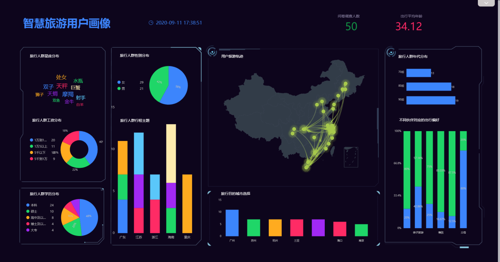

我经常听说[数据分析师](https://www.datafocus.ai/)的工作需要有创造力。但是为什么？创造力究竟在哪里以及如何发挥？

在一个极端，可以认为数据分析员应该很容易被机器取代。对于各种类型的数据和各种类型的问题，应该有一个不确定的分析方法，不会改变。据推测，这可以编码到计算机程序中，数据可以每次输入到程序中，结果在末尾显示。首先，这将消除臭名昭著的研究自由度问题。如果对数据分析有实质性的体制知识，这确实是可能的。为什么每一个数据分析都如此不同，以至于需要一个人来制定解决方案？

嗯，并不是每个分析都不一样。例如，许多功率计算是相同或非常相似的，并且可以在一定程度上实现自动化。但是，这些功率计算的使用或解释方式因项目而异。即使是对同一研究设计的相同计算，也可以根据上下文在不同的项目中以不同的方式解释。其他类型的分析（如回归建模或机器学习）也是如此。

创造力是需要的，因为背景、资源和受众对分析施加了限制，所有我们可能认为"超出"数据的东西。创建数据的上下文、可用于进行分析的资源（时间、资金、技术）以及结果将呈现的受众，都在确定分析员为分析数据而制定的战略方面都发挥着关键作用。分析师通常需要运用一定的创造力才能执行产生有用产出的战略。

**上下文的作用** 问题的背景对于我们如何构造问题、如何将其转化为数据问题以及如何收集数据有着巨大的影响。上下文还允许我们回答为什么数据看起来是它们的方式的问题。相同类型的测量的相同数字可以根据上下文有不同的解释。

**缺少数据** 几乎每个数据集都存在缺失数据，数据分析员在面对缺失数据时可以问的最重要问题是"为什么缺少数据？重要的是要了解数据缺失背后的机制，以便制定处理缺失数据的适当策略（即无所事事、指责等）。但数据本身往往提供很少的信息，有关这个机制：通常该机制在数据之外编码，甚至可能没有写下来，而是存储在最初收集数据的人的头脑中。

采取两臂临床试验与实验治疗和安慰剂。有时通过实验治疗，有副作用，人们会退出试验（甚至死亡），因为他们不能处理副作用。结果是试验实验臂中缺少的数据多于安慰剂臂中的数据。现在数据本身将揭示手臂之间缺失数据率的差异，因为很明显，治疗臂的缺失率较高。但数据不会透露他们退出的确切原因。根据审判的性质和所问的问题，可能有几个不同的方法来处理这个问题。归因可能是可行的，或者可能是某种匹配方案。如何进行的确切选择将取决于哪些外部数据可用，缺少多少数据，以及如何使用结果，以及许多其他因素。

另一个例子可能是分析室外颗粒物空气污染数据。美国环保局运行的监测器通常每六天测量一次。原因是处理 PM 数据的筛选器成本高昂，因此 1 对 6 天的日程安排是平衡成本与数据数量的设计妥协。当然，这意味着在数据记录中，每 6 天中就有 5 天是"缺失"的，即使缺失是故意引入的。同样，数据没有说明它们丢失的原因。人们很容易想象这样一种场景：当 PM 值非常高或非常低时，监视器不会记录数据，这是一种信息缺失。但在这种情况下，缺失的数据可以忽略，通常不会对后续建模产生太大影响。事实上，在这里，归因可能是有害的，因为它没有提供多少好处，但可以大大增加不确定性。

在这两种情况下，数据分析员的工作是评估情况、查看数据、获取有关上下文的信息以及数据丢失的原因（从主题专家那里获得），然后决定一条适当的前进道路。即使有这两种情况，也没有通用的前进道路。

**观众的角色** 受众是另一个关键因素，主要影响我们如何分析数据和呈现结果。一种有用的方法是思考需要生产哪些最终产品，然后从那里向后工作以产生结果。例如，如果"受众"是另一种算法或程序，则输出的确切性质可能并不重要，因为它可以适当地输入管道的下一部分。将优先考虑确保输出是机器可读的。此外，解释性可能没有那么大的分量，因为没有人会看这部分的输出。但是，如果一个人将查看结果，那么您可能需要专注于一种建模方法，让此人对数据进行推理并了解数据如何告知结果。

在一个极端情况下，如果受众是另一个数据分析员，您可能需要进行相对"轻"的分析（也许只是一些预处理），但随后准备数据的方式，它可以很容易地分发给其他人做自己的分析。这可能是以R包或CSV文件或其他内容的形式出现的。其他分析师可能不关心您花哨的可视化或模型;他们宁愿有自己的数据，并作出自己的结果。

数据分析员必须合理评估受众的需求、背景和接收数据分析结果的偏好。这可能需要一些创造性的猜测。如果分析师可以访问受众，分析师应询问如何最好地呈现结果。否则，必须做出合理的假设，或者为演示文稿本身准备意外情况（如备份幻灯片、附录）。

**资源和工具** 数据分析员可能必须在一系列资源限制下工作，从而对数据的处理进行限制。首要的限制可能是时间。一个人只能尝试这么多的东西在分配的时间，或一些分析可能需要太长的时间才能完成。因此，除非能够谈判更多的时间和资源，否则可能需要作出妥协。工具将受到限制，因为某些型号和软件的组合可能不存在，可能没有时间从头开始开发新工具。

优秀的数据分析员必须估计可用时间，并确定是否足以完成分析。如果资源不足，则分析员必须协商获得更多资源，或者调整分析以适应可用资源。当资源受到严重限制时，几乎可以肯定需要创造力，以便从现有资源中挤出尽可能多的生产力。

**总结** 上下文、受众和资源都可以对数据分析进行不同的限制，迫使[数据分析师](https://www.datafocus.ai/)运用不同类型的创造力来完成工作。虽然我在这里分别介绍了每个上下文、受众和资源，但在大多数分析中，所有这些因素将同时发挥作用。约束环境的复杂性（及其各种相互作用）可以快速增长，这给分析师带来了越来越大的压力，迫使他们创造性地思考以产生有用的结果。
