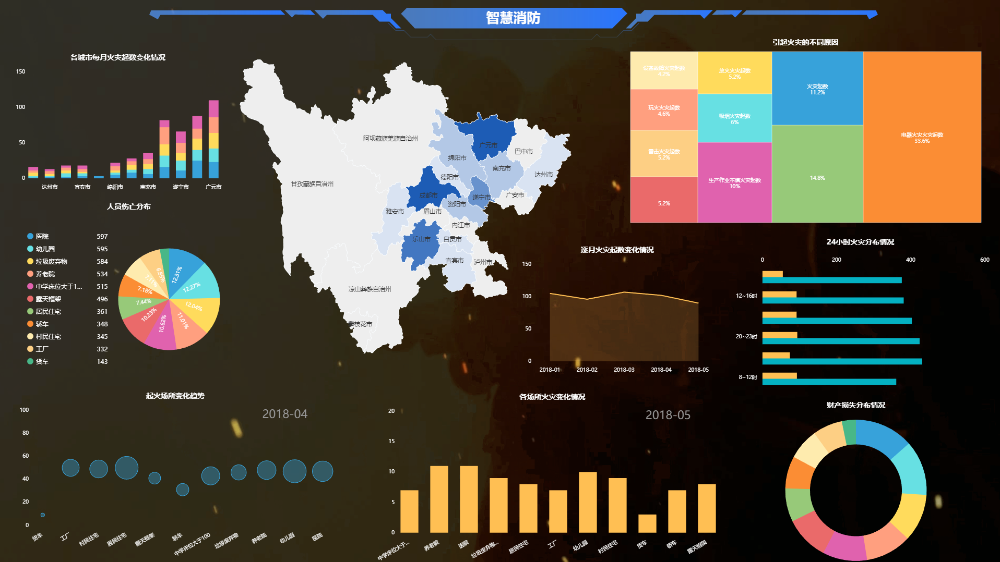

根据DataFocus以前发布的一项分析显示，自2012年以来，最大的人工智能赋能的数据分析所使用的计算量呈指数级增长，而如今这一指标已经增长了30多万倍。数据分析和计算计算方面的改进一直是人工智能进步的一个关键组成部分，因此，只要按着这种趋势走下去，数据分析和计算与人工智能之间的关系将密不可分。同样的，DataFocus基于人工智能的数据分析本身也为人工智能的算法不断的在优化和改进。

我们认为，推动人工智能发展的三个因素是:算法创新、数据(既可以是现有数据，也可以是交互环境下的数据)以及可供数据分析使用的数据量。算法创新和数据很难追踪，但数据计算是绝对可量化的，这为衡量人工智能进步提供了很好的机会。当然，使用大规模计算有时只是暴露了我们现有算法的缺点。但是，至少在当前的许多领域中，更多的计算似乎可以比预期带来更好的结果和价值，并且常常与算法的进步相辅相成。

对于这个分析,我们认为最关键的因素不是一个GPU的速度,也不是说有一个硬件能力很强大的数据中心。但数据的计算量是潜在可能性最大的。每个模型的计算与整个批量计算有很大的不同，因为并行性(硬件和算法)的限制限制了数据模型的大小，或者说可以有效地发挥其计算价值的模型数量。当然，重要的突破仍然是通过少量的数据分析工作实现大规模的以人工智能为基础的数据挖掘和探索。
