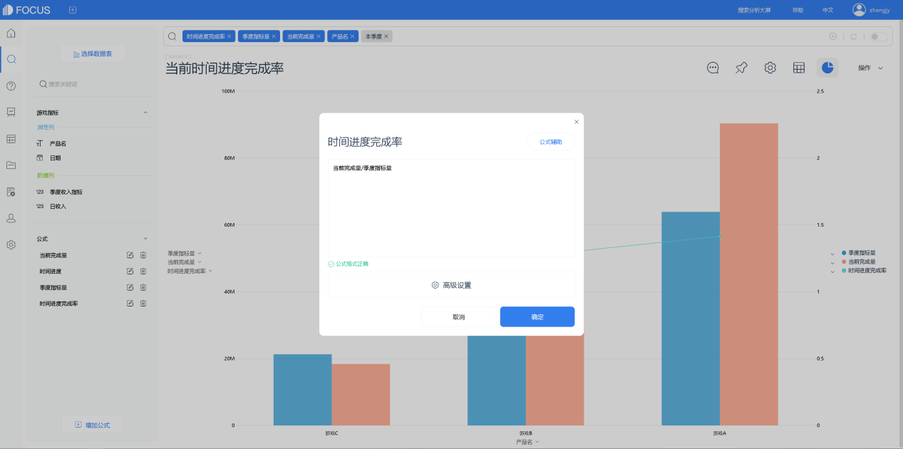
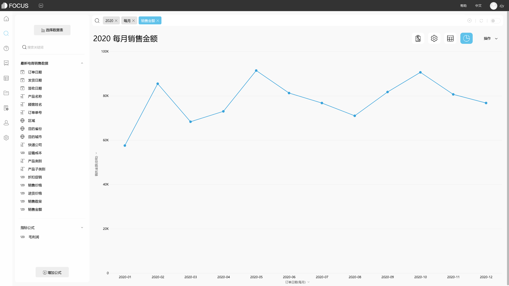

在过去四年中，大数据世界逐渐发展起来，但最好也是最激动人心的部分仍然落后。从任何大型数据部署结果中获得真正的ROI非常重要，使用公司设置流程中的数据来不断改进这些流程和方法，使其成为更加数据驱动的力量。关注未来，使用适应当前趋势所需的工具并解决眼前的障碍是任何公司通过数字化转型的最佳途径。

一些大数据案例仅限于我们的猜测和想象，但我们已经可以看到一些情况，例如客户购买体验的成熟度：祖父母为他们6岁的孙子购买一辆消防车玩具作为生日现在，然后拿起新产品介绍，包括为所有年龄段的儿童提供生日礼物的建议。

那么现如今限制数据分析工具功能的障碍在哪呢，这里我们总结了三点：

1. 数据处理的困境
    
    数据处理一直是一个主要关注点，而数据处理的概念则是更精细的控制，以满足即将到来的GDPR法规和其他法规的要求。公司不仅需要控制谁可以访问哪些数据，还需要控制数据源（监管链），谁拥有或控制，数据是否已被修改，（由数据集替换）和其他相关信息管理可靠性，安全和责任。

1. 云管理错误
    
    管理和跟踪多个云环境是一项艰巨的任务，随着越来越多的数据，应用程序和处理能力转移到云计算，组织可能会被判断为存在问题。乍一看，阴天的出现并不像看起来那么痛苦。毕竟，它提供了无数的机遇和挑战，但我们需要做的是仔细考虑如何构建云管理全球企业。
2. 自助服务的障碍
    
    自助服务在今天非常流行，将数据与数据分开，让用户对此负责。不幸的是，在大多数情况下，出现了瓶颈，这里的障碍是如何让数百名用户同时使用数据。将数据与IT分离并将其转移到用户自助服务模型只是将公司转变为真正的数据驱动型组织的第一步。下一个是将数据从普通业务转变为企业盈利能力的引擎。

DataFocus作为新生代的数据分析工具，有着最新的分析方式——基于自然语言分析的搜索式分析，以及严谨细致的行列粒度数据权限管控和安全的私有化部署方式，助力与您的企业构建数据分析系统。

 
