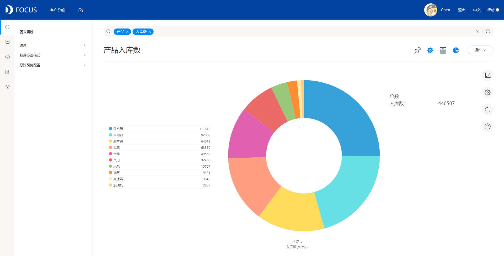

对数据可视化有了一定了解的用户一定知道数据可视化的重要性，应该同样能理解：

对数据有效高效的展示能够极大的提高我们的数据洞察力。

现如今经过近十年的不断萌芽锤炼，国内外都出现不少优秀的可视化工具可供使用，如Tableau、qlik、DataFocus、FineBI等等，在数据可视化从业者的不断研究改进和大量用户的使用反馈中，这些工具已经在不断地优化中得到了一定发展，但是尽管企业对数据可视化的意识和意识在不断增加中，数据可视化项目的长期采用以及企业的回报依然难以实现。

这正是因为有效的数据可视化展示得不到实现所造成。可能是设计时的信息不足，可能是需求过于全面而令人眼花缭乱难以找到重点，也可能是优先级冲突和执行混乱让设计最终脱离实际场景，等等。

而是否能定位数据可视化项目中导致失败的陷阱，很大程度上会比知晓如何成功的实施一个数据可视化项目给予人更多的经验。

接下来大家一起细数数据可视化项目中导致失败的点：

1. 有多少需求做多少

这一点有两个含义，一个是要展现用户的所有需求，另一个是要满足用户的所有需求。前者在于项目负责人在提出设计需求时，是否要将所有的终端用户需求全部满足，后者在于设计者是否要满足项目负责人提出的全部要求。

一个可视化项目需要企业终端-负责人-实施者三方的协作沟通，如果不分优先级满足终端大大小小的各种需求时，必然会造成内容广而不深的困局。细致手机企业用户的业务观点非常重要，但同时谨记我们需要挖掘的，是用户的实际使用场景，以及企业处理业务问题的模式，才是以用户为中心的可塑性可视化方案。

而当客户提出多种要求时并要求全部实现时，往往是因为担心未来情况无法覆盖的不安全感引起的，这常常带来了过多的冗余、花哨的需求。作为实施者我们知道，对工具设计投入越多，往往会被使用的越少，全面的功能带来虚高的满意度的同时，增加了用户的认知负荷和学习成本，这样会使一般企业用户更偏向于舍近求远的选择虽然初级但是更容易操作的工具。数据可视化的核心功能就是帮助用户筛选出最关键的数据，减少细枝末节的功能将更好地发挥它的工具作用，而且数据屏幕本身是有限的，数据密度的限制让它不能也不该有过多的信息。

1. 为可视化而可视化

在调研时，我们发现用户大部分都很喜欢图表，越是丰富、酷炫的图表就越是喜欢。这很好，但是会带来另一些问题，比如将花式图表提供给了对数据不敏感的用户，再比如让用户更注重哪个图表好看而轻视了“图表的选择是由数据决定的”，数据分析的60%以上的工作量在于对数据的清理和准备上，更干净、有条理的数据才是优秀的可视化效果的根本保障。让数据去适应图表往往会使图表无法进行进一步的数据探索以及，因为异常数据显得奇怪没有价值。

图表的选择是一门科学，这里面有较成熟的规则如图形语法。选择图表的因素有很多，比如图表类型（分布和趋势）、数据点（少还是多）、用户角色（运营者、战略策划等等）、用户对数据的熟悉程度（比如分析师或者业务用户）等，所以我们必须积极地给用户讲解原理，并配合实例来解释。

1. 过渡满足用户的色彩需求

用户往往都有自己喜爱的颜色，可以按自己的想法去配置色彩无疑会给他们带来愉悦的满足感。这样的需求往往是让人为难的，一但过于看重这一要求，会给实施者带来无穷无尽的设计负担，还有接受度的平衡问题，更重要的是作为一款面向企业的数据可视化软件，色彩在愉悦用户的同时还肩负着更好的阐释数据的重任，这才是数据可视化的核心需求，色彩理论比起图形语法更为感性、艺术，但是数据可视化是理性的艺术，这就要求设计者要理智的找到符合用户使用场景的配色方案，就像上一条所说的，不能为可视化而可视化。

