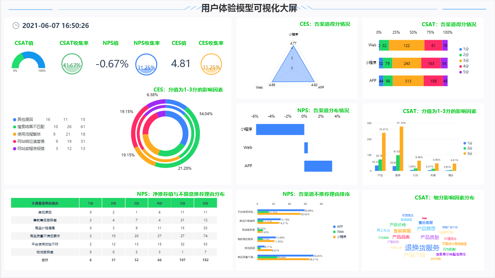
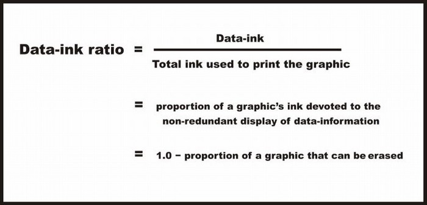
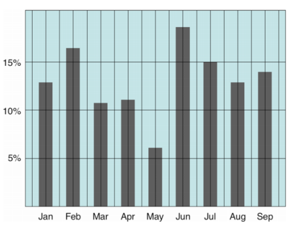

## 为了为业务使用案例取得更好的效果，应合法地承认遵循[数据可视化](https://www.datafocus.ai/)所有原则的架构。

在本文中，您可以了解数据可视化的所有见解、使用原因以及一些应考虑的关键原则。

_杂乱无章和混乱是设计的失败，而不是信息属性。 -_**_爱德华·图夫特_**

每天产生大约2.5万亿字节的原始数据，这一比率正在逐日上升。因此，企业使用各种大数据工具来理解这些海量数据。数据可视化是以更连贯的方式分析复杂数据的绝佳方法。

## 什么是数据可视化？

企业用户/分析员的一般概念是，它是指数据的图形化呈现，目的是为观看者提供对数据的定性理解。

将原始数据转换为解释统计数据并使我们能够深入了解统计数据的图形和视觉效果的方法称为数据可视化。它影响我们使用知识来理解它、发现新模式和做出预测的方式。

照片由巴莱斯·凯蒂在不喷

## 为什么要进行数据可视化？

"计算机善于处理数据。人类擅长视觉效果。当我们查看视觉对象而不是数据表时，我们可以看到趋势、模式和例外情况。

## 让我们来看看数据可视化中的一些关键原则

原则对于最大限度地发挥数据可视化和人工智能的影响至关重要。

**识别最佳视觉效果**

理解手头数据的大小至关重要。我们可以决定要可视化哪些特征以及要传达哪些信息。之后，我们可以为目标受众选择最合适、最简单的图形格式。

_良好的数据可视化会减轻大脑的精力负担，并将其放在眼睛上。—_**_斯蒂芬·很少_**

**主要规则集**

1. **盖斯塔尔特感知原则**
    

当我们看到一组对象时，在看到单个对象之前，我们会感知它们的全部。我们认为整体不仅仅是零件的总和，即使零件是完全独立的实体，我们也会考虑将它们归为一些整体。

对于休闲观察者来说，似乎只有一盏灯在选框周围移动，从灯泡到灯泡，而它实际上是一系列灯泡打开和关闭，灯光不会移动这一切。

视觉感知与盖斯塔尔特原理

这一观察导致制定了一套描述性规则，用于我们如何直观地感知对象。作为设计师，我们所做的几乎所有事情都是基于这些想法。

**2\. 爱德华·图夫特的原则**

术语"图表垃圾"是由爱德华·图夫特开发的。1983年，他出版了他最知名的书《定量信息的视觉展示》。

根据图夫特，五项主要原则如下：

**a. 图形完整性**\- 它表示视觉元素表示数据的准确程度。信息可能差异很大，即使是相关数据，因此人们希望并倾向于不成比例地扩展数据，以便使其适合允许的空间。

**b. 数据墨水比率-**Tufte 将数据墨水称为用于显示数据的不可擦除的墨水。如果从图像中删除数据墨水，图形将丢失内容。目标是设计一个数据墨水比率最高的显示器（即接近 1.0 的总值），而无需消除有效通信所需的某些东西。

数据墨水比率 - 信息维斯：维基（infovis-wiki.net）

**c. 避免图表垃圾**\- 图表中过度和不必要的图形效果使用被称为图表垃圾。根据 Tufte 的说法，所有信息都应该尽可能简洁有效，重点是构建上下文、删除文本标签和添加更多视觉效果。

Chartjunk — Wikipedia

**d.数据密度**\- 图形的数据密度是其用于显示数据的总尺寸的比例。在合理范围内最大化数据密度和数据矩阵。实现此目的的专用方法之一是收缩原理，大多数图形可以在不丢失可读性的情况下缩小。

（ohio-state.edu）

数据密度=数据阵列/数据图形区域中的条目数量

**e.** **小倍数-**同一小图形的系列在一个视觉对象中重复。小倍数是可视化大量数据和高维度的绝佳工具。

**视觉感知的关键规则**

- 我们的大脑无法处理进入我们眼睛的所有光。
    
- 我们的注意力被吸引到一个熟悉的模式。我们"看到"的正是我们期望看到的。
    
- 我们注意到周围环境的某些方面。
    

如果我们违反规则，我们的数据将是欺骗性的或难以理解的。

# 结论

[数据可视化](https://www.datafocus.ai)能够更高效地查看数据中的趋势和模式。有效数据可视化的一些关键方面包括确定最佳可视性、平衡设计、专注于关键区域、保持视觉效果简单、使用模式、比较参数和创建交互性。 如果遵循基本原则，每个人都能轻松地感知到主要目标。它提高了数据见解的表示性。它允许决策者以视觉格式查看数据，以便他们能够理解复杂概念或发现新模式。
