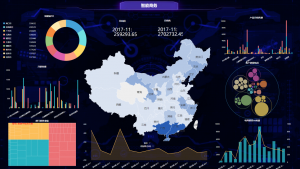

其实大数据在每个行业中都是不可缺少的，而且也都是重中之重。其实大数据在电子商务领域中，不仅越来越的细化，而且也都开始正规不同问题施展的其营销策略。今天小编就和大家说说数据可视化在电子商务领域的应用。

1、产品购买条件实现可视化

用户想要购买一件商品，比如电子产品，那么数据可视化可以帮助商家提供营销的服务，展现出来的产品的性质特征以及相关的购买记录和评价，在线上进行有利的营销，就可以很快的生成订单。或者可以直接通过用户的购买习惯以及购买喜好，通过数据分析，数据可视化的结果可以让商家更加的了解客户的需求，将用户想要购买的产品实现可视化，做到更加精准的营销服务。

2、用户的需求可视化

用户想要购买什么，在从销售产品开始到售后的维修保证，都是用户的管理的环节，通过可视化的结果可以实现用户在线提问，在线投诉，增强问题的反馈性，企业可以第一时间接触到用户的需求以及得到用户的使用体验效果是什么样的，也可以知道用户的满意度是什么样的，用户需求的可视化对于品质的监管过程至关重要，也强化终端效果的一个重要过程。

3、进销存管理可视化

企业随时掌握自己的仓储的情况以及销售量的情况，才能保证销售的持续进行，数据可视化结果可以将进销存情况进行一个呈现，不管是企业的员工还是管理层都可以第一时间的掌握销售的情况，实时的监控自己的销售情况，确定每个月的订单情况以及销售的情况，还要在财务货款以及电子结算等方方面面都可以进行电子化的管控。

以上这些有关数据可视化在电子商务领域的应用总结，相信大家也都是学到了很多。其实不管怎么样，对检测工具都是要使用的，而datafocus作为全球自然语言的分析工具，使用应该时候最多的，所以大家都看看。
