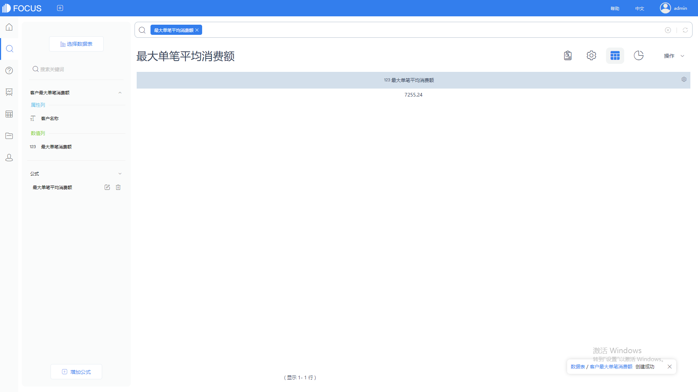
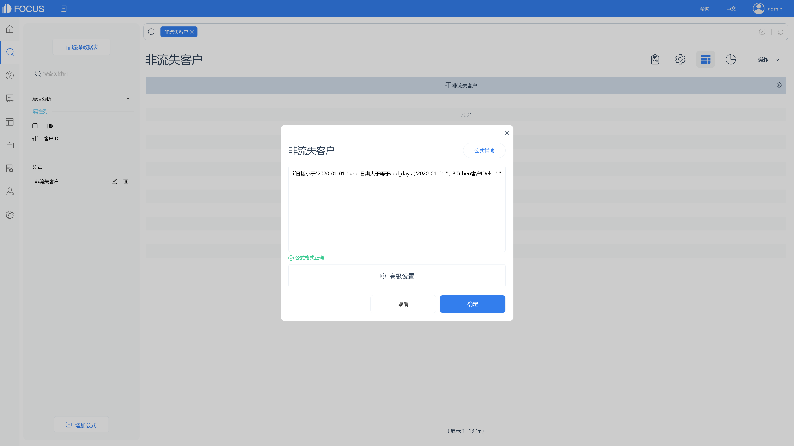

**数据可视化的佼佼者——DataFocus**

数据可视化是什么？简单点来说，数据可视化就是用图形的方式来展示数据的规律。

数据可视化工具，大多相似，那怎么判断可视化工具好不好呢？其实数据可视化的发展，究其原因，一是为了更好地展示数据分析的内容，只有数据分析内容丰富价值高，可视化才能发挥其真正效果，数据分析才是可视化的关键；二是为了吸引注意力，在这个“看脸的时代”，走在路上遇到同样陌生的两个女生，大部分人都会被更漂亮的那位女生吸引，同样的，对于可视化工具，在不了解的情况下大部分人都会更青睐图表做的漂亮的。

而今天所说的DataFocus，其在数据分析上，是首个采用自然语言进行数据分析的工具，拥有专利权；在可视化上，系统智能适配图表，DataFocus拥有20多种图表，类型丰富，操作简单，数据可视化大屏支持自定义配置。DataFocus不敢说是站在可视化的最顶端，但起码是领域内的佼佼者。

那DataFocus到底有何特点，其优势在哪儿？

1、简单易用，容易推广。DataFocus的简单程度，可能会让你小瞧它，会疑问只要这么简单的操作就能进行数据分析了？可以明确地告诉你，就是这么简单。简单也是DataFocus的一大特点，越简单企业内部在推广使用的时候越容易。

2、独创搜索式智能分析。DataFocus是国内第一个采用搜索的方式进行数据分析的工具，使用方式如同谷歌搜索一样，只需要在输入框内输入想要知道的信息，系统实时地返回结果，并且智能地适配图表。

3、高效实用。DataFocus使用过程中无需任何代码，无IT知识的普通业务人员也能快速上手，图表类型丰富，制作简单，满足企业大部分需求。

4、功能强大。自定义可视化大屏，图表联动，图表钻取，数据定时更新，整合多源数据，清洗数据等等，操作简单，但是功能不简单。

有多少人是因为使用门槛高而换过无数可视化工具，而DataFocus，只会让你觉得简单得不可思议。DataFocus在数据分析可视化领域，一直在不断地创新探索，旨在提供更好用更智能更美观的数据可视化分析工具。
