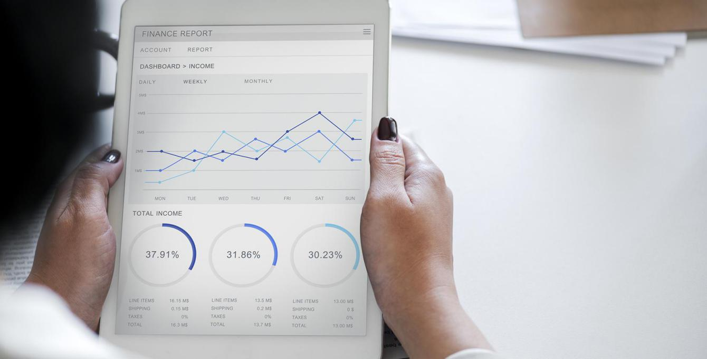
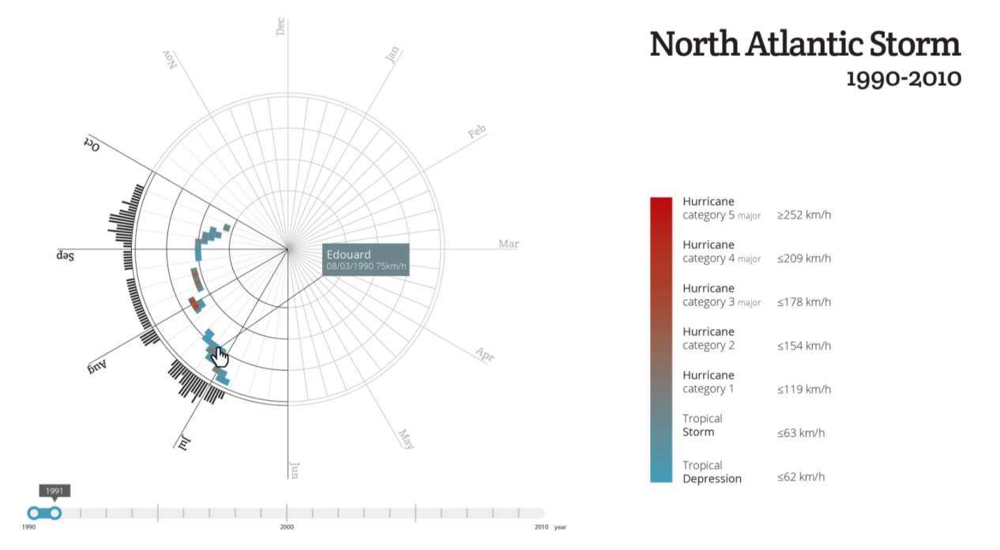

## 数据可视化的最佳实践

****_许多DataFocus的用户都提到一件事，就是开发可视化作品变得更简单了，但是效果难以评估。本文翻译自 的博文，让我们来看看优秀的可视化实践是如何实现的吧。_****

****“杂乱无章和令人困惑不是数据的属性 - 它们是设计的缺点。” - Edward Tufte****

## 什么是数据可视化

Michael Friendly将数据可视化定义为“以某种示意图形式抽象的信息，包括信息单元的属性或变量。”换句话说，它是一种连贯的视觉传达定量内容的方式。根据其属性，数据可以许多不同的方式表示，例如折线图，条形图，饼图，散点图或地图。

确定呈现数据集的最佳方式，并遵循数据可视化最佳实践，对于图形设计人员在创建这些视觉效果时非常重要。特别是在处理非常大的数据集时，开发有张力的表达方式，对于创建既有用又具有视觉吸引力的可视化至关重要。

华尔街日报数据可视化美国失业人数

## 为何使用数据可视化

据IBM统计，每天会有2.5兆字节的数据产生。IBM研究科学家安德鲁·麦卡菲和麻省理工学院的埃里克布林约尔松教授指出，“现在每秒新产生的数据堪比20年前存储在整个互联网上的数据量。”

随着移动互联网和物联网技术的发展，数据量将继续呈指数级增长。IDC预测到2025年将有163个zettabytes（163万亿千兆字节）的数据。

所有这些数据对于人类大脑来说难以理解 - 实际上，人类大脑难以理解[大于](https://selfawarepatterns.com/2014/02/16/whats-the-largest-number-we-can-really-comprehend-its-smaller-than-you-think/) [5的](https://selfawarepatterns.com/2014/02/16/whats-the-largest-number-we-can-really-comprehend-its-smaller-than-you-think/)数字（研究表明5±2的数量是人类不需要进行某种类比或抽象就可以直接感受的）。数据可视化设计人员可以在创建这些抽象中发挥重要作用。

毕竟，如果无法以有用的方式理解和消费大数据，那么它就毫无用处。这就是为什么数据可视化在从经济学到科学技术，医疗保健和人类服务等各个方面都发挥着重要作用的原因。通过将复杂数字和其他信息转换为图形，内容变得更易于理解和使用。

## 何时使用数据可视化

由于对海量的数据做出有意义的理解非常困难，而许多大数据集中又包含了有价值的数据，因此数据可视化已成为决策者的重要方法。为了利用所有这些数据，许多企业认识到数据可视化的价值在于清晰有效地理解重要信息，使决策者能够理解困难的概念，识别新的模式，并获得数据驱动的洞察力，以便做得更好决定。

做出明智决策的前提是读懂大数据 - 无论是在商业，技术，科学还是其他领域，都值得在数据可视化上下功夫。清晰的可视化使复杂数据更易于掌握，因此更容易做出判断并采取行动。

## 可视化的基本原则

### 1、定义明确的目标

数据可视化应该回答重要的战略问题，提供真正的价值，并帮助解决实际问题。例如，它可用于跟踪性能，监控客户行为以及衡量流程的有效性。在数据可视化项目开始时花时间清楚地定义目的和优先级将使最终结果更有用，并防止浪费时间去创建不必要的视觉效果。

### 2、了解你的受众

如果不是为了与目标受众清楚地沟通，数据可视化是无用的。它应该与受众的专业知识兼容，并允许他们轻松快速地查看和处理数据。考虑到受众对数据所呈现的基本原则的熟悉程度，以及他们是否了解这些可视化的主要背景、这些图表是否定期重复使用等等。

### 3、使用可视功能正确显示数据

有很多不同类型的图表。确定哪种类型的数据最适合采用何种图表进行可视化展现，这本身就是一门艺术。正确的图表不仅可以使数据更易于理解，还可以最准确地呈现数据。要做出正确的选择，请考虑您需要传达的数据类型以及向何人传递该信息。

### 以下是数据可视化最受欢迎的图表类型：

****折线图：****折线图应该用于比较一段时间内的值，非常适合显示大小变化。它们还可用于比较多个数据组的更改。

（来源：[环境署](http://www.grid.unep.ch/products/4_Maps/ede_global_surface_temperature.png)）

****条形图：****条形图应用于比较几个类别的定量数据。它们也可用于跟踪数据随时间的变化，但最好仅在这些变化很重要时使用。

（来源：[我们的数据世界](https://ourworldindata.org/water-access-resources-sanitation)）

****散点图：****散点图应该用于显示一组数据的两个变量的值。它们非常适合探索两组之间的关系。

（来源：[我们的数据世界](https://ourworldindata.org/happiness-and-life-satisfaction)）

****饼图：****饼图应该用于显示整体的部分。它们无法显示随时间变化的变化。

### 有序和连贯的组织您的可视化成果

在将大数据集转变成可视化成果时，一致性尤为重要。连贯的设计将有效融入背景，使用户能够轻松处理信息。最佳可视化帮助观众快速得出数据所呈现的结论，而不是还需要额外的沟通和讲解才让人理解。

创建数据层次结构，并以决策者的关心的方式显示各种数据点。您可以从最高到最低排序以强调最大值，或进行分类显示以强调更重要的类别。

甚至显示数据的顺序，使用的颜色（例如最重要的点的颜色更亮，或基线数据显示灰色），以及图表的各种元素的大小（比如扩展饼图的某些切片）图表的常规边框），从而帮助用户更轻松地解释数据。注意在使用这些技术时不应该引入偏差。

交互式数据可视化也是帮助人们解释数据的绝佳方式。

## 其他数据可视化元素

****颜色****被广泛用作表示和区分信息的方式。根据Salesforce最近进行的一项研究，它也是用户决策的关键因素。

他们分析了人们对图表中使用的不同颜色组合的反应，发现人们对具有微妙颜色变化的调色板具有更强的偏好，因为它更具美学吸引力。

然而，他们发现，虽然吸引人，但微妙的调色板使得图表更难分析并获得洞察力。这完全违背了创建显示数据的可视化的目的。

如果对于普通人来说难以阅读具有相似颜色和较低对比度的图表，那么对于没有完美视觉的人来说，它们就更加困难 - 并且他们代表了人口中的重要部分。据世界卫生组织称，估计有2.53亿人患有视力障碍。

幸运的是，有一些工具可用于检查具有这些损伤的人如何将图像可视化，例如Photoshop和Illustrator中的色盲校对。使用足够大的字体大小以及类型和背景之间足够的对比度等其他方面也很有帮助。

如果模拟工具显示调色板的问题，则有一些技术可以提高图形可读性：

- 使用具有高对比度的颜色。
- 补充使用带有图案或纹理的颜色来传达不同类型的信息。
- 使用文本或图标标记元素。

即使数据可视化使用比例模型，也可以在每个步骤之间使用足够的颜色对比度。当用户将鼠标悬停在每个国家/地区时，则显示相应的标签。（来源：[我们的数据世界](https://ourworldindata.org/happiness-and-life-satisfaction)）

字体选择可以影响文本的易读性，增强或减损预期的含义。因此，最好避免艺术字体并坚持使用更基本的serif或sans serif字体。

确保数据可视化的介质具有清晰的字体大小。[Smashing Magazine](https://www.smashingmagazine.com/2011/10/16-pixels-body-copy-anything-less-costly-mistake/)建议“在现代网页设计中，16像素通常应该是最小尺寸”。

## 不要扭曲数据

好的数据可视化应该清楚地讲述故事，避免扭曲。避免使用不能准确表示数据集的可视化表示，如3D中的饼图。

像这样的3D饼图使得用户很难搞清楚每个切片实际可视化的比例。（由[PSDgraphics提供](http://www.psdgraphics.com/psd-icons/3d-pie-chart/)）

数据可视化可以引导观众得出某些结论而不需要修改数据本身。设计者在希望传达主观信息时，如用于公共传播信息图--这一设计方法非常有用，通常是为了支持特定结论而不仅仅是传达数据。颜色选择和调用特定数据点之类的东西可以用于此目的，但这可能会使设计者的可信度受到质疑。

## 错误数据可视化的示例

Y轴不从零开始，可以使数据看起来具有比实际存在的更大的差距。这使得可视化会误导传输信息。

图表的另一个例子是没有将Y轴从零开始，显示了结果偏差的方式。

这个条形图在规模上具有误导性，因为没有Y轴。即使只有小于1％的微小差异，超大的蓝色条也会被放大到不成比例。

当Apple试图说明新iPad电池的电池续航时间延长了70％时，它们不仅高度增加了70％，而且整体规模也增加了，这使得电池显得比以前的iPad电池大得多。（通过[Gizmodo](https://gizmodo.com/5893738/holy-fck-the-new-ipad-has-a-gigantic-70-percent-larger-battery)）

## 良好数据可视化的示例

像这样的条形图是显示数据集之间差异的绝佳方式，而且增强的颜色对比度会使视觉受损用户更容易访问此图像。（由[FiftyThirtyTwenty提供](http://fiftythirtytwenty.com/)）

该销售仪表板使用几种不同的可视化格式，以易于理解的方式呈现相关数据，只需一瞥即可。数据也有很好的标签，进一步澄清了事情。（由[Bagus Fikri提供](https://dribbble.com/shots/3299170-Dashboard-Food-Provider)）

将干净，整洁的设计与易于理解的数据可视化与简单的图表相结合，可实现出色的用户体验。（由[Miklos Philips提供](https://www.toptal.com/designers/resume/miklos-philips)）

## 提高数据可视化的效率

通过搜索的方式，快速将数据进行可视化呈现，从另一种形式上提高了数据可视化开发的效率，尤其对于大数据集的理解有益。（由[DataFocus](https://www.toptal.com/designers/resume/miklos-philips)[提供](https://www.toptal.com/designers/resume/miklos-philips)）

## 结论

良好的数据可视化应该通过使用图形，清晰有效地传达数据信息。最佳可视化使您可以轻松地一目了然地理解数据。他们将复杂的信息以一种简单的方式分解，使目标受众能够理解并以此为基础做出决策。

正如Edward R. Tufte指出的那样，“设计的基本考验是它有助于理解内容，而不是它的时尚性。”数据可视化尤其应该坚持这一理念。目标是通过设计增强数据，而不是引起对设计本身的关注。

最后，祝小伙伴们能将从本文中学到的方法，灵活运用到DataFocus的可视化开发中去，早日成为可视化设计大师！
