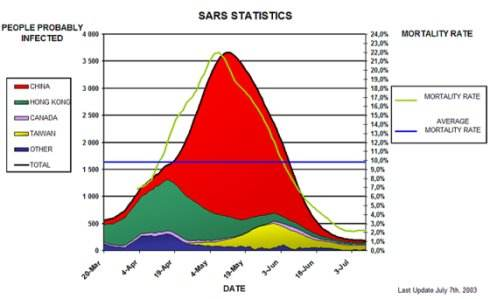

数据可视化是将数据可视化为直观图表的一种观察分方式，可以将数据库汇总每一个数据项作为单个图表元素标识，将大量的数据集构成数据图像，同时以数据的各个属性值为分析维度从不同角度观察数据，以达到对数据进行更深入的分析的目的。结合信息可视化，把数据结果以图片的方式展示，有利于个人活组织简洁有效的向受众传达信息。

这一方法在日常工作学习中常常用到，但在实际应用中常常出现效果达不到预期的情况，这大多是因为对信息可视化的原则不清引起的，在实际的图形化过程中对细节信息的处理会影响到受众的摄取程度，轻则造成信息读取缓慢，重则会出现南辕北辙的误解情况。

这里用几个常用的图表来告诉大家在数据可视化图表中有效的一些事半功倍的小技巧。

1. 饼图的份额排序顺序

饼图用于表示整体中各个不同部分的份额占比情况，是很常用一类图表。当饼图顺序不当时，会让受众感到占比信息不能很直观。比如：

最好的方法是将份额最大的部分放在12点方向，再顺时针放置第二大份额的部分，依次放置。

1. 折线图的线型和节点

在折线图中使用虚线会让图表显得飘忽，尤其是在存在多条折线时，让人觉得混乱不清晰。

而使用实线或者虚实搭配的方式，再加上节点，感官会更好。

1. 面积图互相遮盖数据

面积图中不同类的数据区域会互相重叠，饱和不透明的效果会让数据相互影响而丢失部分。

因此需要确保数据本身不会被设计影响，还原数据的真实权威性，所以可以在面积图汇总使用透明效果来确保用户可以看到全部数据。

由上面几个例子可以看出，设计的细节对信息的影响是很明显的，更好更科学的设计可以在数据分析中帮助我们事半功倍的完成目标。但全面的把握这种细节设计是需要大量实际经验和学习的，好的数据分析软件可以帮助我们节约这一部分的精力。

以上例子中的图表就是用DataFocus数据分析工具来制作的，DataFocus在实际项目中深挖总结可视化实例中遇到的设计问题，开发出了智能高效的自适配的可视化模块，帮助用户以更好的方式展现数据的原貌，帮助用户简洁有效的向受众传达数据信息。
