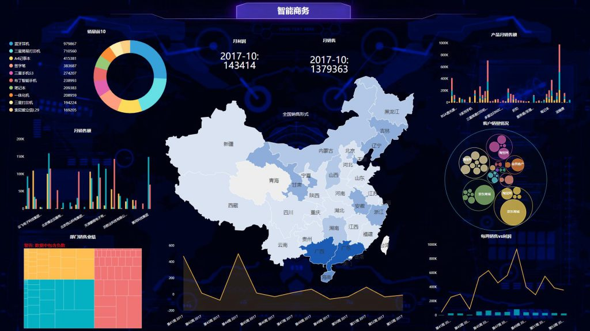

我们以前说到过数据决策和经验决策，有一点要强调的是，我们并不是要全盘否认经验思维。而是要“取其精华、去其糟粕”，拍脑袋决策法依然有优点可言，并根据数据分析结果不断优化决策。其实成功的公司，都是平衡了数据分析思维和经验思维的成果，并不会盲目数字化或看不起BI带来的效用。我们看一个例子，深圳由社交软件发家的某知名马氏企业，拥有一套完整的“智库”体系，将前人的知识和经验累积下来，在优秀的人才任职期间，会让其进行分享并沉淀内容，归入智库。那么此时，好的经验能被保留，新的方法也能实行，是一种非常好的平衡手段。优秀的人才离开，但是他的价值会被留下，让新进来的员工进行学习，迅速接入工作轨道，这些也都会纳入企业的“数据库”。“数据化思维”要持续发挥价值，就要不断地将其中的优秀的、可复制的操作流程标准化，不断地沉淀到企业知识管理系统，不断地分享给不同的团队。

麦肯锡说过一句话，人类最大的问题就是传承问题，每个人的知识到死就带进了坟墓，下一代从出生到成年都必须从0开始学习。而在大数据时代，经验可以转化为数据保存下来，并在实际应用时发挥作用。虽然经验作为数据来说，质量较高且可以较快辅助决策。但是也有其弊端：生不逢时。上个世纪美国某经济学家曾断定美国经济体量过大将出现下滑，而到了20世纪初，克林顿上位后却能依靠“宏观调控微观自主”策略实现每年4%的增长。所以经验有可能会在迅速变化的环境中过时。尤其是一些互联网行业，瞬息万变的市场会让BI的价值显得尤为重要，所以不能忽视新工具而只重视决策者本身的经验。

因此，经验在积累的同时，更需要迭代，这也是数据化管理思维的精髓之一。每一个方法，每一个策略，每一个流程，都需要不断优化，优化的依据就是看其边际效益是否最大。对于个人来说，把经验“数字化”尤为重要，时代在变革，决策方法也在变革，无论是高管还是普通业务人员，都应不断刷新自己的经验，用数据优化新的执行方案。就像DataFocus能在不断搜索刷新自己认知的同时，将看板保存下来。因此对于企业来说，需要有一个系统能将经验不断存储为数据，并用现有数据反推过往经验，让人人有所学，事事有所依。
