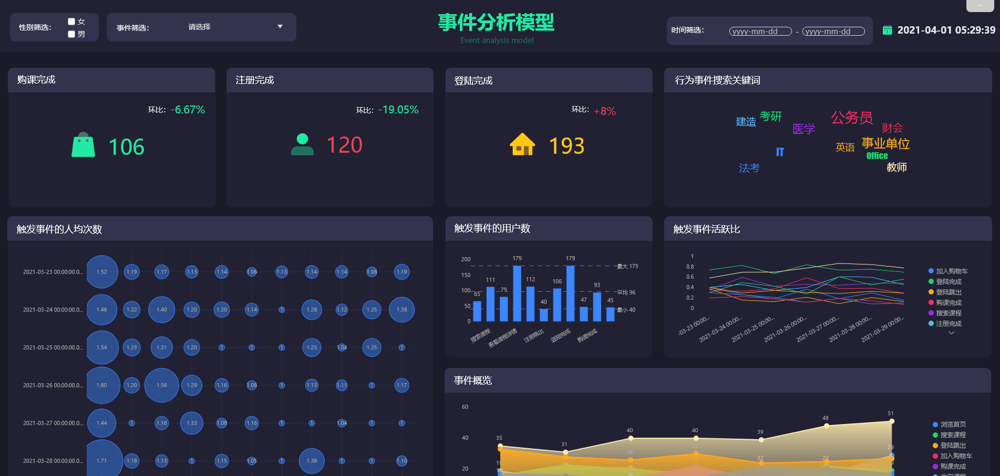
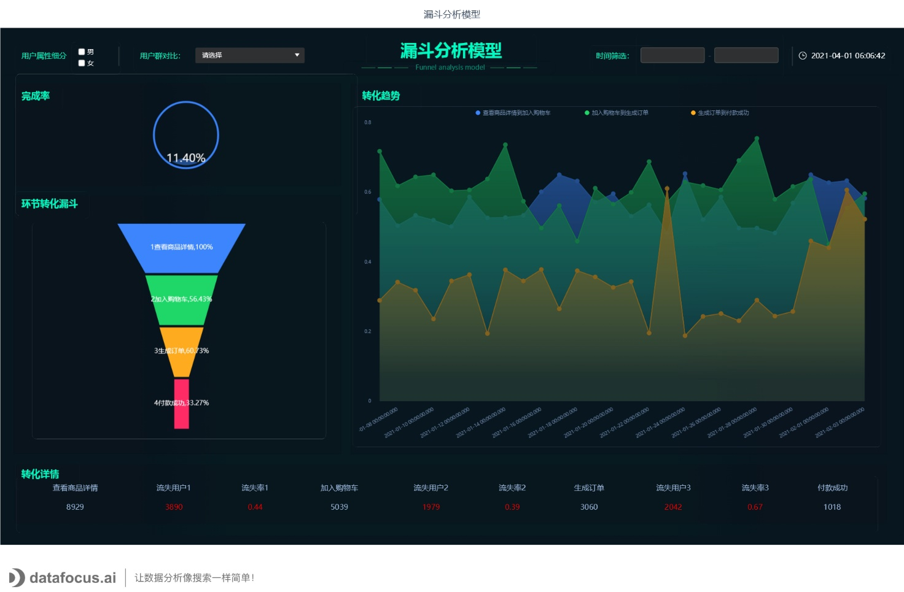

数据看板制作工具的兴起使得创建数据看板变得快速、简单，越来越多具有前瞻性思维的企业开始使用。

在数字时代，几乎不需要一个由信息技术人员组成的部门，也不需要专门的图形设计师，就能创建一个个令人惊叹的数据看板。然而，如果你想一次性获得成功体验，掌握基本的设计原则是至关重要的。

你的业务数据看板应该是用户友好的，并且是决策过程中的基本辅助工具。为了帮助你踏上数据驱动的成功之旅，我们将深入研究20项数据看板设计原则，确保你开发出最全面的数据看板，来满足你的企业业务需求。

让我们开始吧。

**1.首先考虑你的受众**

第一点，受众是你必须首先考虑的最重要的原则之一。你需要知道谁会使用数据看板。

要想成功做到这一点，你需要站在受众的立场上。用户访问数据看板的环境和设备将对信息的展示方式产生直接影响。数据看板是在移动设备中、在办公室的电脑上，还是作为演示工具使用的？

也就是说，永远不要忘记设计数据看板的目的。这样做是因为你想以一种清晰易懂的方式展示数据，以便于特定受众接受。如果受众更传统，那么建议采用不那么“花哨”的设计，如果是展示使用，可以尝试增加更多交互功能。

此外，如果图表看起来太复杂，用户将花费更多的时间在数据分析上，那就体现不出数据看板的价值了。用户不应该需要自己做更多的计算来获得他想要的信息，他需要的一切要清楚地显示在图表上。

我们可以从上面的例子中看到，杜邦分析模型看板为财务部门提供了触手可及的数据，并且清晰展示了数据之间的关系。

**2.不要试图把所有的信息放在同一页上**

数据看板设计提示的下一个问题是信息问题。一张数据看板上的信息应该符合一个主题、服务一个受众。

也就是说，你永远不应该创建一个放之四海而皆准的数据看板，也不要把所有的信息都塞进同一个页面。把你的受众视为一群有不同需求的人——销售经理、市场营销、HR或物流分析专业人员需要的数据是不同的。

虽然这听起来可能需要做很多工作，但实际上比试图将所有数据塞进一个数据看板中要容易得多。当每个角色都有自己的数据面板时，对过滤器、选项卡、选择器的需求被最小化，整个数据看板更直观和扁平化，并且找到重要的信息也要容易得多。

**3.选择正确的数据看板类型**

作为参考，以下是4种主要数据看板类型：

\-战略型：通过分析和衡量各种基于趋势的关键信息，用来监控公司的长期战略。

\-操作型：用于监控、测量和管理时间范围更短或更直接的流程或操作，比如一个生产工序。

\-分析型：这些特定的数据看板包含企业大量综合数据，允许数据分析人员从中深入挖掘和获取见解，帮助公司管理层做出长期的战略决策。

\-战术性：这些信息丰富的数据看板最适合中级管理层，有助于根据跨部门的趋势、优势和劣势制定增长战略。

每个数据看板都应该为特定的目的设计，其具体目标是在业务决策过程中帮助特定受众。信息只有在可直接操作时才有价值。接收用户必须能够将信息用于自己的业务战略和目标。

**4.展示数据的关联性**

不提供数据的关联关系，你就无法判断数据是好是坏，或者数据是否异常？没有比较值，数据看板上的数字对用户来说毫无意义。更重要的是，他们不知道是否需要采取任何行动。

总是试图提供最大限度的信息，即使其中一些对你来说显而易见，你的受众可能会发现它们令人困惑。命名所有坐标轴，并为所有图表添加标题，请记住提供比较值。这里的经验法则是使用最常见的比较，例如，与设定目标、前期或预计值进行比较。

**5.使用正确的图表类型**

了解你想要传达的信息类型并选择适合的图表非常重要。

可视化专家Andrew Abela提出将图表展示的数据关系分为四类：**比较、分布、构成和联系**。

**比较**

比较型图表用于比较值的大小。使用该类型图表可以轻易的找出数据的最大值和最小值，也可以用于查看当前数值和过去的数值相比是增加还是减少。

常见使用场景：今年的销量和去年相比如何，哪种产品的销量最高。

适用图表：**柱形图、条形图、折线图**等。

**分布**

分布类型图用来查看定量值如何沿着数轴从最低到最高分布。用户可以通过图表中数据的形态，识别数值范围的特征值，集中趋势，形状和异常值。

常见使用场景：阅读用户分布；用户年龄分布。

适用图表：**直方图、正态分布图、散点图**等。

**构成**

构成类型图表用于展示部分相较于整体的情况，以及一个整体分成几个部分后各自的占比。该类型图表主要展示相对值，但一些类型也可以展示绝对差异，区别在于显示的是占总量的百分比还是具体数值。

常见使用场景：各地区市场份额占比。

适用图表：**饼图、堆积柱形图、堆积面积图、瀑布图**等。

**联系**

联系类型图表用于展示数据之间的关系，并且可以查找数据间的相关性、异常值和数据集群。

常见使用场景：广告支出和销售额之间的相关性；不同来源流量与网站总流量的关系；

适用图表：**散点图、气泡图**等

根据你想要交流或展示的内容，选择适合的图表类型。将你的目标分为以上四个主要类别之一，将有助于你对图表类型做出明智的决定。

**6.仔细考虑你的布局**

数据看板设计关注的不仅仅是良好的指标和经过深思熟虑的图表，下一步是在数据看板上放置图表。如果你的数据看板是符合可视化规则的，用户会更容易找到他们需要的信息。

一般规则是首先显示关键信息——在屏幕顶部，左上角。这种布局背后有一些科学依据——大多数人都是遵循从左到右、从上到下的阅读习惯。

另一个有用的数据看板布局原则是从大局出发。大趋势一目了然。在此之后，你可以继续展示更详细的图表。请记住按主题将图表分组，将可比较的指标放在一起。这样，用户不必在看数据看板时改变他们的思维方式，例如，从销售数据跳到营销数据，然后再跳到销售数据。

**7.注意颜色——选择几个并坚持使用**

毫无疑问，这是所有数据看板设计最佳实践中最重要的一个。

当谈到颜色时，你可以选择企业的标志性颜色，或者选择一个与主题相符的颜色系列。重要的是保持一致，不要使用太多不同的颜色——这是学习如何设计数据看板时的一个重要考虑因素。

可以选择3到4种颜色，然后玩渐变。一个常见的错误是过于频繁地使用高度饱和的颜色。强烈的颜色可以立即将用户的注意力吸引到某个数据上，但是如果数据看板只包含高度饱和的颜色，用户可能会感到不知所措——他们不知道首先应该看什么。数据看板设计最佳实践在选择颜色时总是强调一致性。

记住这一点，你应该使用相同的颜色来匹配所有图表中的项目。这样做将从用户的角度最大限度地减少所需的脑力劳动，从而使数据看板更容易理解。这样，用户会理解，一种颜色对应着特定项目或元素，这比记忆多组随机颜色要容易得多。

关于颜色的最后一个建议是在使用“交通灯”颜色时要小心。对大多数人来说，红色代表“停止”或“坏”，绿色代表“好”或“开始”（金融行业可不一定）。

**8.不要过度迷恋实时数据**

下一个数据看板设计原则是：不要过度使用实时数据。在某些情况下，过于详细的信息只会导致注意力分散。除非你正在跟踪一些实时结果，否则大多数数据看板不需要不断更新。实时数据用于描绘一般情况或趋势。大多数项目管理数据看板必须定期更新——每周、每天或每小时。毕竟最重要的是正确的数据。

此外，您可以实现智能预警，以便数据看板本身在出现任何业务异常时通知你。结合合适的刷新间隔和智能预警，将帮助你节省无数的工作时间。

**9.注意数据位数、标签、数据格式等**

这一条关于数据看板设计的一些细节，以保证数据看板的清晰度和一致性。

确保你的标签、数据格式在整个数据看板中保持一致至关重要。

另外，在数据看板设计中四舍五入数字也应该是优先考虑的事情之一，因为你不想让你的观众被无数的小数位淹没。过度的数字细节可能会夸大次要元素，让受众无法第一时间获取重要信息。

**10.使用交互元素**

在数据看板中增加一些交互元素，如点击过滤和时间间隔部件，可以让你轻松地深入挖掘某些趋势、指标或见解。

向下钻取是一种智能交互方式，允许用户向下钻取与特定元素、变量或指标相关的更全面的信息，而不会使整体设计过度拥挤。它们简洁、灵活，让你在需要时可以选择查看或隐藏，而不是费力地浏览杂乱无章的数字信息。

另一个至关重要的交互元素是点击过滤选项。此功能使用户只需点击感兴趣的特定位置，就可以将数据应用到整个数据看板，如下图所示:

设计数据看板时，查看长期数据是另一个需要考虑的关键因素。时间间隔小部件将使你能够做到这一点。这是一个简洁的功能，允许你在各种图表上增强单个时间刻度，这意味着你可以轻松地跨天、周、月或年查看您的数据，如下图所示：

**11.注意留白**

这个原则是数据看板设计中最微妙却又最重要的原则之一。 用户通常没有意识到空间在视觉构成中的关键作用，但是设计师们非常关注它，因为当度量、统计和见解不平衡时，它们很难被消化。你应该始终将数据看板主要元素周围的边距加倍，以确保每个元素都有一个平衡的空白区域，使信息更容易吸收。

**12.针对多端设备进行优化**

针对移动设备或平板电脑的优化是数据看板开发过程中的另一个关键点。

移动端的数据看板布局与桌面端不同是有意义的。移动设备的屏幕较小，因此元素的位置会有所不同。此外，与桌面版本相比，分析的层次不会太深，因为这种数据看板需要关注适合屏幕的最关键的视觉效果，通常是高层次的。

为了创建这样的设计，建议修剪所有不相关的多余部分，并跨设备进行测试。

**13.考虑导出效果**

在数据看板设计过程中，还需要考虑导出的效果。如果你计划定期使用导出，就需要考虑优化打印边界、更少的颜色和不同类型的线条样式，以确保即使在黑白打印输出时，所有内容都是可读的。因此，当你计划数据数据看板设计时，还需要考虑未来的用途，以及如何针对不同的导出选项进行优化，或者简单地共享数据看板本身及其所有功能和选项。

**14.避免常见的数据可视化错误**

数据可视化已经从简单的静态演示发展到现在的交互式展示，将视觉感知提升到一个新的水平。它还帮助普通用户和高级分析师创造令人惊叹的视觉效果，向任何潜在的受众群体，从该领域的新手到经验丰富的分析师和策略师，讲述清晰的数据故事。

但是积极的发展也带来了一些负面作用，比如常识错误。在线数据可视化不仅仅是为了可视化而可视化，而是表达清晰和有效的数据见解。避免这些常见的错误:

\-计算失误。例如，如果你进行一项调查，人们可以选择一个以上的答案，你可能需要一些其他形式的视觉效果，而不是饼状图，因为数字不会累加，受众可能会感到困惑。

\-可视化的错误选择。我们已经提到了选择正确类型的图表和数据看板的重要性，选择错误的图表呈现数据之间的关系，会使信息变得模糊。

\-数据太多。不要在单个图表上放太多数据，会影响用户对数据的接收。

此外，您还可以熟悉一般的设计错误，如果你遵循简单原则和色彩理论，您可以尽可能避免这些错误。

**15.永远不要停止改进**

最后但同样重要的是，在我们收集的有效数据看板原则中，根据变化调整和改进设计的能力将确保持续的分析成功。

设计数据看板时，征求反馈至关重要。通过要求你的团队定期提供意见并提出正确的问题，你将能够改进关键绩效指标的布局、功能、外观、感觉和平衡，以确保始终保持最佳价值。定期征求反馈将确保你和客户(或团队)意见一致。正如我们多次提到的，你的受众是你的首要考虑因素，你需要知道如何调整视觉效果来创造价值。

例如，如果你需要展示一个人力资源数据看板，让团队、高管或相关利益相关者在数据看板上向你提供反馈是有意义的，无论是侧重于员工绩效、招聘还是人才管理。这样，你可以确保尊重数据看板设计的最佳实践，并提供出色的视觉效果。

数字世界是不断发展的。变化是唯一不变的，有效数据看板的原则是由不断改进和增强设计工作的意愿决定的。做不到这一点只会阻碍你努力的成功。

所以，永远不要停止改进。

那么，怎样才是一个好的数据看板呢？一个有效的数据看板应该是引人注目、视觉平衡、精简单、便于访问、用户友好的，并适合你的目标和你的受众。

坚持这些原则，你的数据看板会让你的受众印象深刻，同时也让你的数据分析工作轻松很多。

准备好把你新获得的数据看板设计原则付诸实践了吗？
