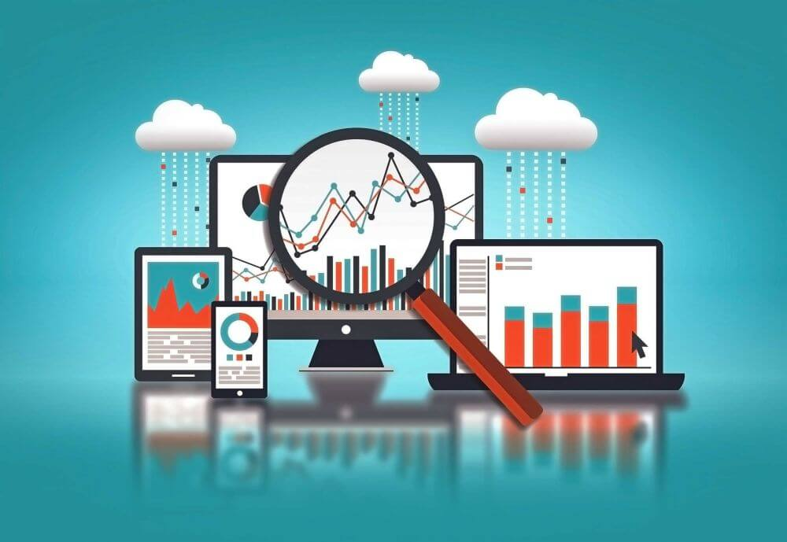

目前，超过37 亿人使用互联网。此外，我们人类每天创建2.5 万亿字节的数据——预计这一数字将随着时间的推移呈指数级增长。

数据永不休眠，在当今世界，如果不利用触手可及的大量数字信息，一个品牌或企业就有可能错过有助于其成长、壮大、发展和保持竞争力的重要洞察力。

关于数字数据的收集、理解和处理，目前有两个关键学科处于领先地位：数据科学和分析。尽管这两个领域交叉并具有许多相同的特征，但两者在许多方面却截然不同。

为了避免您产生任何困惑，并为您提供对这两个创新领域的清晰洞察，我们在此探讨商业环境中的数据科学与数据分析，先从对科学的解释开始。

## 什么是数据科学？

数据科学专注于发现我们可能没有意识到需要回答的问题的答案。该领域的专家利用技术深入研究复杂的数据，结合计算机科学、预测分析、统计和机器学习。

从本质上讲，它是一个综合性领域，专注于从广泛的原始和结构化数字数据中寻找创新见解。

_“数据是一门新科学。大数据掌握着答案。” - 苹果高级零售副总裁__Angela Ahrendts_

我们的目标是为新问题找到切实可行的解决方案，这反过来可以帮助组织将其运营能力、竞争对手和行业的知识提升到新的创新高度。

要更深入地了解这个令人兴奋的领域，请浏览我们关于[最佳数据科学书籍](https://www.datafocus.ai/infos/best-data-science-books)的文章。

## 什么是数据分析？

数据分析侧重于对当前或现有数据集进行处理和关键统计分析。数据分析师的主要作用是创建方法来捕获、收集、管理流程和安排来自不同来源的数据。

在这个过程中，最终发现对现有问题或挑战的可行见解，必须是分析师修补数据分析操作的关键因素。

在此过程中，数据分析师建立了最熟练的方法来呈现可用数据、解决问题并提供旨在实现立竿见影的可操作解决方案，通常适用于组织的日常运营或功能，无论是用于[小型企业分析](https://www.datafocus.ai/infos/business-intelligence-for-small-business)还是大型企业.

如需进一步阅读该主题，这里有 15 本您需要了解的大数据和[数据分析书籍。](https://www.datafocus.ai/infos/best-big-data-and-data-analytics-books)

## 数据科学与数据分析

当谈到数据科学与数据分析时，重要的是不仅要了解这两个领域的关键特征，还要了解将它们彼此区分开来的元素。虽然人们可以互换使用这两个术语，但这两个学科是独一无二的。简单地说，它们不是一回事——至少，不完全一样：

**数据科学**是一组更全面的领域的总称，这些领域专注于挖掘大数据集并发现创新的新见解、趋势、方法和流程。

**数据分析**是一门基于获得可操作见解的学科，以帮助企业在直接意义上实现专业发展。它是更广泛使命的一部分，可以被视为数据科学的一个分支。

关于我们对“数据科学与数据分析”的研究，这两个领域之间的另一个显著差异归结为调查。通常，科学不会深入研究特定的问题，相反，它致力于安排庞大的数据集以揭示新的见解。就其本质而言，数据分析在基于特定目标时最有效，它基于现有见解为问题提供切实的答案。通过使用[数据分析工具](https://www.datafocus.ai/infos/data-analysis-tools)来实现全面的智能，可以对获得企业的可持续发展产生至关重要的作用。

总而言之，科学以需要提出并随后回答的问题为中心获得更广泛的见解，而数据分析是一个致力于为已经存在的问题、议题或障碍提供解决方案的过程。

因此，这两个领域有着难以置信的相互联系，经常协同工作以实现相同的目标：增长和改进。虽然我们可能在谈论“数据分析与数据科学”，但值得注意的是，这两个领域是相辅相成的，而不是相互对立。

在这个高度互联的数字时代，数据是我们的第六感；通过了解这两个领域，您可以在许多重要领域改善您的业务，从市场营销和客户服务到[财务报告和分析](https://www.datafocus.ai/infos/financial-reporting-and-analysis)、员工敬业度、运营效率等等。

## 深入研究：核心差异和一个惊人的相似之处 - 数据分析与数据科学

继续我们的数据分析与数据科学之旅，我们将从目标受众开始更详细地了解每个学科的主要差异。

- **技能**

更深入地研究数据科学与数据分析，将这两个学科区分开来的一个要素是交付成功结果所需的技能或知识。

关于数据分析，对数学和统计技能的扎实理解以及编程技能、[在线数据可视化](https://www.datafocus.ai/infos/data-visualization-tools)工具和中级统计的工作知识必不可少。数据分析师精通 SQL，他们知道一些正则表达式，可以对数据进行切片和切割。

在数据科学领域，除了掌握大量的非结构化指标和洞察力之外，还需要对 SQL 数据库和编码有全面的了解。数据科学家在数据建模、预测分析、编程、数据采集和高级统计方面需要更“复杂”的技能。从本质上讲，他们需要具备相当多的机器学习和工程或编程技能，使他们能够按照自己的意愿操纵数据。

- **范围**

当我们在数据分析与数据科学方面使用“范围”一词时，我们谈论的是大和小，或者更具体地说，是宏观和微观。

本质上，如前所述，科学的核心是一个多学科的宏观领域，涵盖更广泛的数据探索领域，处理大量结构化和非结构化数据**。**

数据分析是一个微观领域，深入研究业务运营的特定元素，在特定时间段内或实时记录部门趋势并简化流程，因此主要集中在结构化数据上。有许多[数据分析示例](https://www.datafocus.ai/infos/big-data-examples-in-real-life)可以说明现实生活场景和对业务的影响。

- **探索**

虽然这两个学科都探索了广泛的行业、利基、概念和活动，但科学通常用于企业分析、搜索引擎工程等主要领域，以及人工智能 (AI) 和机器学习 (ML) 等自主领域。

数据分析是一个不断扩展和发展的概念，但数字信息专业知识或技术的这一特定领域通常用于医疗保健、零售、游戏和旅游行业，以立即响应挑战和业务目标。

- **目标**

将数据分析和数据科学区分开来的另一个关键因素是每个学科的最终目标。

虽然我们已经提到了这个概念，但它非常重要，值得重申：科学的主要目标是利用丰富的可用数字指标和见解来发现我们需要提出的问题，以推动创新、增长、进步，和进化。数据分析的主要目的是利用现有信息来发现特定领域的模式和可视化洞察力，面向基于特定目标、运营和 KPI 采购的可操作数据来源。

- **大数据**

抛开差异不谈，在探索数据科学与分析时，注意两者之间的相似之处也很重要——最大的相似之处是对大数据的使用。

在这一点上，您将了解每个学科以不同的方式利用数字数据来实现不同的结果。尽管存在差异，但两者都以有利于行业、品牌、业务或组织的方式使用大数据。

选择利用大数据分析的全部潜力的企业可以将其运营利润率优化高达60% - 由于这两个领域都专注于大数据，探索科学和分析的回报可能会很大。

## 数据科学与分析：不可忽视的力量

_“数据是一种宝贵的东西，并且会比系统本身更持久。” -_ _Tim Berners-Lee__，万维网的发明者。_

如果充分发挥其潜力，科学和分析都是一股不可忽视的力量——这两个领域可以提高你的业务效率、愿景和智慧，这是其他学科无法做到的。

在连接您的数据时——以一种可以发现新见解的方式使用数据，同时使用当前的见解来确保企业的可持续发展——选择正确的工具或[在线报告软件](https://www.datafocus.ai/infos/online-reporting)是必不可少的。

除了大量直观、有洞察力和可操作的数据仪表板之外，还拥有自助服务分析平台，利用工具，不仅可访问而且会产生您应得的结果，这对任何企业来说都是最重要的。

要了解有关数据科学和分析的更多知识，我们的[30 天试用版](https://www.datafocus.ai/console/)可以在实践中为您提供帮助！完全免费！
