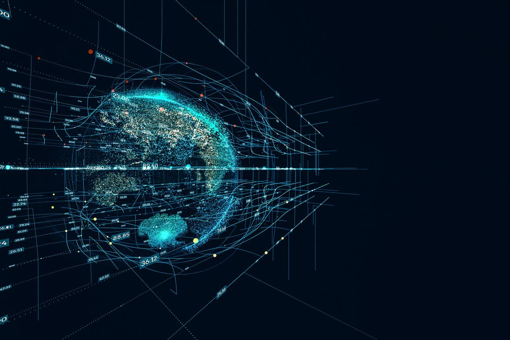

一段时间以来，我一直对数据科学家如何更好地将[数据分析](https://www.datafocus.ai/)活动相互交流到对方和外地以外的人感兴趣。我认为，我们目前的方法是不够的，因为它们大多是从其他领域（特别是计算机科学）借来的。其中许多工具是有用的，但它们不是专门用来传达数据分析概念的，而且往往达不到要求。今年早些时候，我在院长的演讲中谈到了这个问题，以及数据科学领域如何能够从发展自己的理论中获益，从而像其他领域一样简化通信。

我注意到的一件事是，在其他领域，这些领域的发展可以部分地被视为一种日益专业化的趋势。随着某个领域的人越来越专攻某个子专业，专家需要相互沟通和协调，才能生产出完整的产品。随着时间的推移，将一个领域分离成一组专家，推动通信工具的开发，这些工具可以作为相互商定的信息交换所。如果没有足够的工具，增加项目人员所涉及的通信费用将变得太大，整个企业可能会崩溃。这种现象在弗雷德·布鲁克斯的《神话人月》中被著名地描述为与软件工程项目有关。

我认为，谈论其中一些其他领域，以及它们如何克服通信工具增加的专业化和职责分离，可能是有益的。追踪其他领域的历史很有启发性，因为它可能为我们讨论数据分析提供基础。我的播客与希拉里帕克的听众知道，我们经常有一个片段，我们称之为"类比角"，这是简单的统计版本。

其他领域的专业化 第一个例子来自电影制作和剧本的发展。脚本实验室描述了剧本的历史以及电影制作在剧本开发之前是如何运作的：

在思考编剧史时，不能把编剧理论与电影制作的演变分开。最早的电影往往是独奏项目，从构思到完成。被称为"摄影师系统"，这是最原始的电影制作。不久，导演们就成了这个过程的核心，但大多数电影的拍摄都只是对导演想要拍摄的内容一无所知。当导演计划下一步拍摄什么时，剧组经常在等待。

电影是单人项目，或多或少是线性开发的。这是一个低效的系统——如今大多数电影都是以高度非线性的方式制作的，以适应演员的日程安排和各种制作过程。

如今，剧本是一个关键的沟通中心，许多电影制作部门（服装、化妆、头发、道具、套装）都可以围绕它组织他们的活动。试想一下，如果每个部门的代表必须单独咨询编剧或导演关于他们工作的每一个细节。这将是一场日益复杂的噩梦。有了书面文件，如剧本，每个人都可以同意作为权威的"在电影中发生的事情"，人们可以完成他们的工作，而无需不断来回沟通。

第二个类比来自金融。在金融领域，专业化的发展与有限责任类似。在这里，"专业化"是指公司所有者与其经理的分离。因此，公司经理必须有办法向投资者传达公司运营的具体情况。因此，制定财务报表、会计规则和各种公开文件，让投资者分析公司的健康。Graham 和 Dodd 开创性的安全分析本质上是呼吁投资者根据公开的数据来评估公司，而不是基于关于什么造就了良好或安全投资的常见神话和传说。今天，随着所有者与管理者的分离，以及两者（例如 S-1、10-K、10-Q 等）之间标准化通信格式的创建，我们拥有全球资本市场体系的基础。

最后一个类比来自西方古典音乐，在西方古典音乐中，音乐的作曲家和表演者之间常常存在分歧。在更复杂的交响乐中，你可能会说有三个角色：作曲家、表演者和翻译/指挥家。然而，在早期的古典音乐中，这种划分并不存在，作曲家通常自己演奏音乐，通常是自己演奏的。在此设置中，无需将内容写下来，因为音乐可以存储在作曲家的头部并进行表演。这个概念在电影《阿马德乌斯》中被很好地捕捉到了，莫扎特描述他的歌剧《魔笛》是"在我的面条里"（其余的只是涂鸦和胡言乱语）。

当然，歌剧可能是古典音乐的终极例子，在古典音乐中，音乐家、歌手和设计师之间需要某种沟通工具来协调。因此，对于大多数古典音乐，我们有乐谱，它指定了每个乐器和签名者在任何给定时间做什么。有一个标准化的符号，允许其他不熟悉作曲家的人快速掌握发生了什么事情，并收集执行工作所需的时间和资源。

数据分析呢？ 在当今的数据科学中，或者实际上在科学中，大部分内容都遵循"垂直整合"模式，即同一个人提出问题、收集数据并分析数据。在这项工作需要传播给他人（包括你自己）之前，对沟通方法的需求才真正出现。在大型协作中，需要从一开始就进行分析沟通，我的经验是，即使在最佳情况下，方法也是临时的，很难在另一个涉及不同人员的项目中重现。

大多数人会同意，实际进行分析的软件代码是传达正在做的事情的一个重要组成部分。但是，并非每个人都需要或想要代码提供的所有详细信息。也许我们可以从音乐中窃取的一个概念是乐谱和部分之间的区别。在交响乐中，指挥需要满分，因为他们需要知道每个人在做什么。但第一小提琴手只读第一小提琴部分，他们不需要阅读整个乐谱，以便在创造成品中发挥重要作用。

为数据科学开发适当的通信工具对于扩展[数据分析](https://www.datafocus.ai/)、让更多人参与进来以及可重复性/可重复性至关重要，以便更多的人能够了解分析中发生的情况。在那之前，我认为我们将继续将来自其他领域的工具插入数据科学过程，这很好。这些工具是有用的，但我认为最终不是一个完美的适合。
