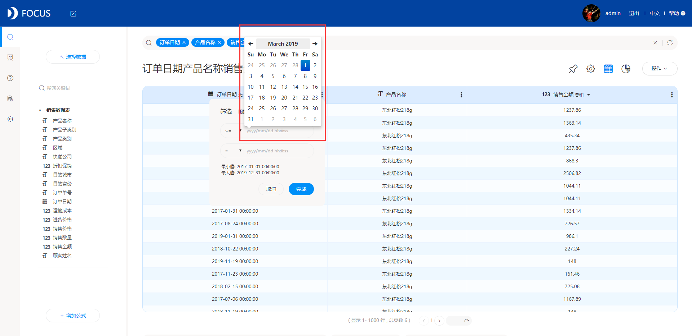
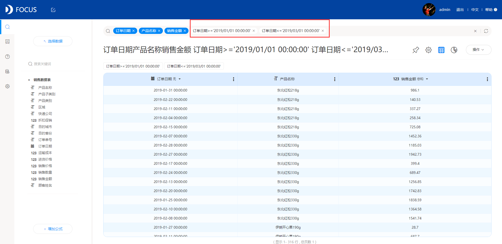
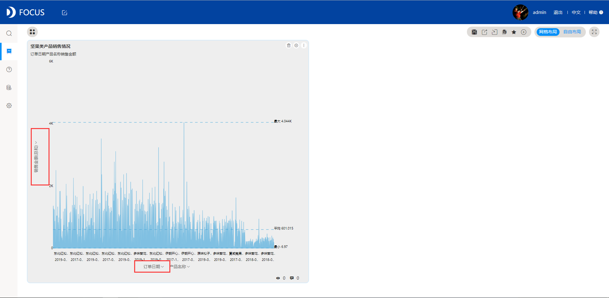

今天想利用一款我们公司在用的DataFocus工具，和大家分享一下如何在DataFocus中进行数据筛选。DataFocus是我们公司最近试用的一款商业智能bi工具，作为数据部门的人员，公司对我们的要求就是能熟悉掌握并运用这款工具。在学习的过程中，我逐渐发现了这款工具越来越多的闪光点，因此就想和大家分享一下，希望能对大家的工作或学习产生一定的帮助。

第一种方法：在搜索界面进行数据筛选；

先在数据搜索界面通过双击或输入中文关键词，制作出一个历史问答，如下图所示；

DataFocus系统会对这个历史问答自动配置一种图表类型，点击右上角的“数值表”按钮，然后点击想要进行筛选的列的右侧的三点符号；

此时就可以对这一列进行筛选，这里举例用的是日期列，因此可以选择某一个日期或某段区间进行筛选；

完成筛选后，在搜索栏中会出现对应的筛选语句，这时数据就会被筛选成你所选择的部分了。选择恰当的图表类型并保存这个历史问答。

第二种方法：在数据看板内进行数据筛选；

如果你已经将某个历史问答放置在数据看板内部了，这时你想要进行筛选，同样也是可以进行的，这时点击X、Y轴的图表标题，同样会出现一个“筛选”对话框，在这里同样可以输入需要筛选的内容即可。

数据筛选作为数据可视化过程中必不可少的一个步骤，拥有着非常高的地位。如何在海量大数据中选择出最有价值的数据，是企业和用户重点关注的话题之一。DataFocus设置的这两种数据筛选的方式，充分考虑到了用户的实际情况，在搜索和数据看板都设有可以筛选的方法，大大方便了用户的操作！
