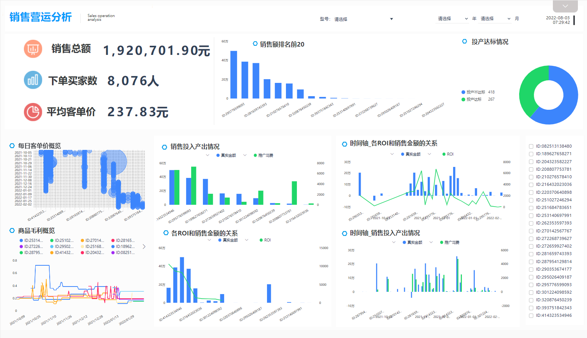
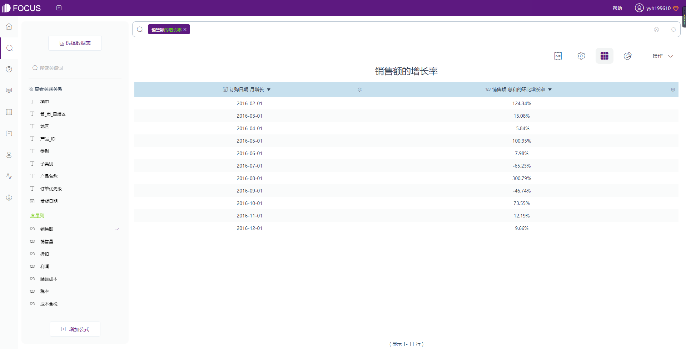
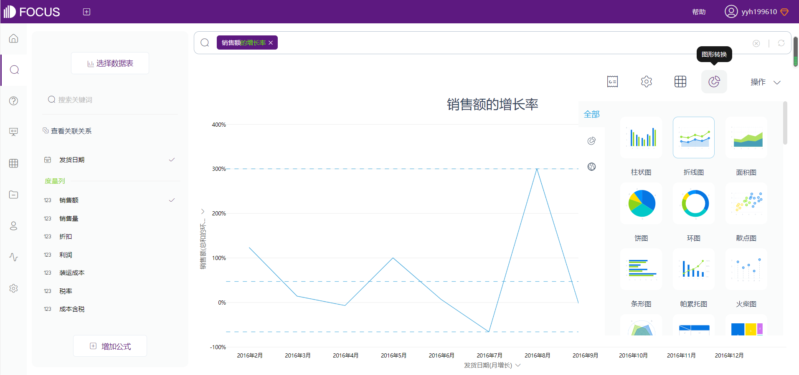
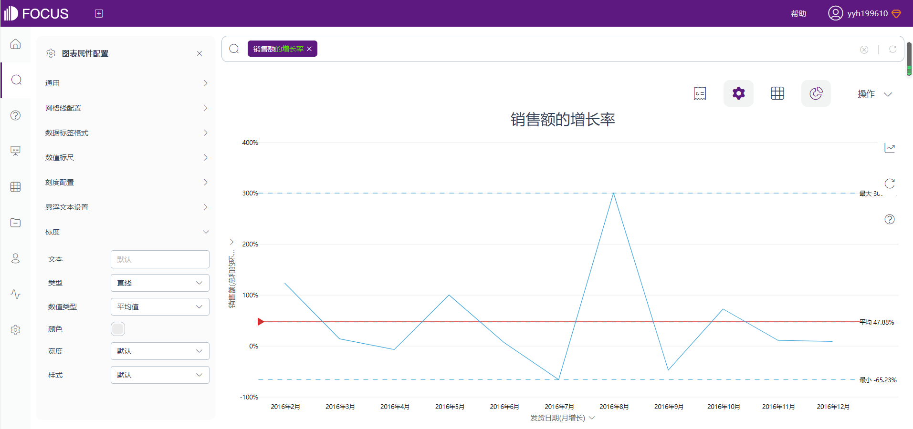
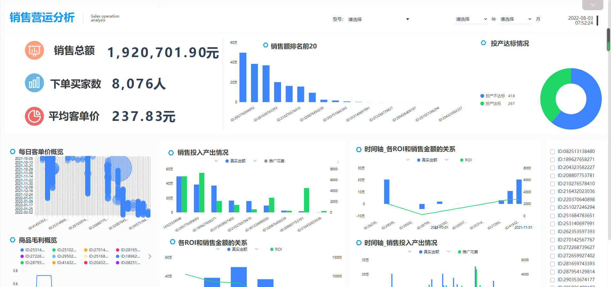

当老板要你汇报一下这个月的销售数据时，结果你给出了这些苍白无力的数据。

老板费了半天劲看了你整理已久的数据，无奈地叹了叹气，就扔在一边不看了。

可你也委屈啊，辛辛苦苦整理的数据为什么老板就是不愿意看呢？

这时候面对这样的情况，如何才能冲出牢笼，打破困顿呢？

来看看这款搜索式BI工具DataFocus制作的可视化大屏，让你的数据说一段故事，生动地汇报给老板项目情况吧！

### 1.数据源

这里选择了全国超市订单数据，该数据在韬问平台上开源，下载链接为[https://www.talktodata.cn/allOpenData/detail/1554399246045958146](https://www.talktodata.cn/allOpenData/detail/1554399246045958146)。

该数据模拟了超市订单的数据，汇集了全国各省市地区超市各产品的销售情况，包括销售额、销售量、折扣、利润、装运成本等数据。

将数据源导入系统，即可在系统中进一步分析数据。

### 2.定义KPI

KPI能很明确地反映销售工作成果，大屏里除了原始数据中已有地销售额、销售量以外，还额外定义客单价、ROI、销售额增长率和同比增长率、销售量增长率和同比增长率等数据指标。

**客单价**

客单价是指商场（超市）每一个顾客平均购买商品的金额，其计算公式是：

客单价=销售额/成交顾客数

客单价越高，代表商铺的服务能力和销售能力越强，顾客的满意度也越高。

**ROI**

投资回报率是指通过投资而应返回的价值，即企业从一项投资活动中得到的经济回报，其计算公式为：

投资回报率（ROI）=年利润或年均利润/投资总额×100%

**销售额/量增长率**

销售额增长率是一家公司某一段时间销售额的变化程度，其计算公式为：

销售额增长率=（新的销售额-原销售额）/原销售额\*100%

**销售额/量同比增长率**

同比增长率，是指和上年同期相比较的增长率，其计算公式为：

同比增长率=（当年的指标值-上年同期的值）÷上年同期的值\*100%

### 3.计算监控指标

在定义好数据指标后，就可以根据数据计算指标了。

在DataFocus系统中可以利用公式系统创建自定义指标，既可以利用公式，又可以利用搜索搜索框里的关键词分析。

如销售额的增长率，可直接搜索“销售额 增长率”来一键分析销售额增长情况。

下图即为新建公式，建立新的关键词。

### 4.指标预警

有了处理好的指标数据后，就可以对这些数据进行可视化了。这里可视化的流程非常简单。

通过DataFocus独有的搜索系统，搜索框输入关键词，系统便可自动绘制图表。

如果有想要使用更合适的图表，点击【图形转换】，即可选择合适的图表类型。系统中除了有柱状图、折线图等基础图形，还有桑基图、弦图等高级图表，根据情况选择合适的图表即可。

想要了解销售额或者销售量的增长率，就比较适合使用柱状图、折线图等，这时候还可以设置指标预警。

点击【图表属性】里的【标度】，类型选择【直线】，数值类型可以自己手动定义数值大小，也可以直接定义最大值、最小值、平均值等等，这里可以根据实际情况来定。

### 5.制作可视化大屏

完成数据可视化后，我们需要再对图表进行配色微调以及美化。如果可视化大屏背景是纯白背景，那么色彩搭配可以稍微亮色一点，取红蓝绿这样色彩鲜艳的配色。

那么如果是蓝黑背景，则可以使用白色字体会更美观，蓝色图表搭配其余配图也会更显科技感。

其次去掉边框和底纹，或者单独插入新的边框，会让图表显得更加美观。

最后在大屏中插入图表注意排版，统一一下字号，使得整体的大屏看起来和谐，调性一致。

如果真的不想自己手动设计一款大屏，那么直接在可视化大屏模板库里选择合适的模板套用即可。

### 6.可视化大屏的实际应用

作为数据分析师总是容易被追着要数据，如果仅仅给出数据本身，那么数据分析师就成为了取数工具人。

而如果能将原始数据进行适量加工，并给出一定的数据结论，制作成动态的数据可视化大屏，再定期发送给相关部门，数据分析师的价值就得到了凸显。

DataFocus制作的数据可视化大屏很酷炫，操作也完全是傻瓜式，哪怕是零基础的业务人员掌握起来也没什么难度。

更多数据以及优质大屏模板，评论区回复【大屏】即可领取。

如果您觉得文章还不错，欢迎点赞、分享、关注！
