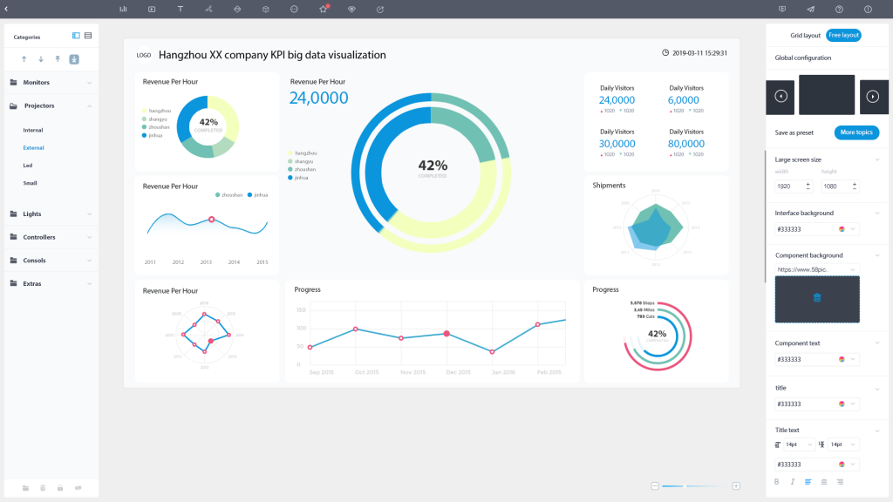

在这个大数据时代，很多企业慢慢地开始进入到数字化转型阶段，实现以数据为驱动的管理和运营模式，并在此基础上运用一些软件工具，如搜索式分析的DataFocus、拖拽式分析的Tableau等，以实现效率最大化。但与此同时，数据驱动的模式虽说可以大幅提升管理和鞠策效率，但依然有它的极限。打个比喻，原来的管理模式是一辆自行车，数字化之后管理模式变成了高铁，虽然效率有大幅提升但依然有其极限。

数据驱动的极限很多人误认为是机器的属性极限，其实不然，最终还是落地到人的问题，尤其是和整个分析团队的协作能力和思考能力有关。企业很多时候会发现数据分析后的结果是错误的，就会第一时间怀疑是不是机器有问题，而其实更可能是一开始的算法和目标就错了。举个例子，在数学上我们有很多关联分析，因素1和因素2可以有很多逻辑关系，他们原本是相关性关系，但分析的时候却当成因果关系，这样一来当团队最终验证结果时就会发现变量不会改变从而产生错误的结论；又比如对于样本的数量和类型把握不正确，导致结论错误；甚至把一个样本的属性当成所有的属性等等。

就像客户关系管理（CRM）是术（工具）与道（方法）的结合，数据驱动更需要道术兼并。很多看似是有道无术的问题，其实本身道就错了，换句话说，数据驱动最大的极限，是在“道”而不是术。举个例子，很多市场营销活动需要调查用户体验，但有很多市场经理却认为体验是无法评估的，却不知道可以使用NPS或Survey等工具。还有很多电商运营人能在平台后台搜集很多信息，比如SKU等等，却不知道什么是关键信息，在业务熟悉的情况下，使用逻辑回归或者决策树就可知道哪些是关键点，更别提连业务都不熟悉了。

还有一点是，当企业进入数字化以后，很多原本鸡毛蒜皮的小事，也要去做数据分析，比如员工的每月表现等，是完全可以主观或是按原来的方法立断的。这样会占用真正需要数据分析的业务的有效时间和有效效率。所以在此基础上，不仅应认识到数据驱动有局限，更应清晰数据分析逻辑，熟悉业务，真正做到道术兼并。
