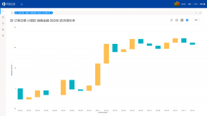

当前大数据已经迅速的融入到人们的工作和生活当中，企业的经营管理过程中也已经无法离开网络，尤其随着DT时代的到来，对于企业来说，经营管理已经不仅仅是人为控制的活动，也不是使用DataFocus或Tableau等BI工具的问题，更多的是数据操控的经营理念问题。做数据，重点都不在数据本事，而在分析，对数据敏感便于能清楚数据异常背后的原因，这需要经验，也需要企业家的思考和执行力。那么，数据对于企业来说到底有多重要？

总的来说，数据转化为信息,信息转化为知识,知识转化为见识,见识转化为决策。大数据最常见的定义是由道格拉斯•兰尼（Douglas Laney）在2001年提出的。兰尼将大数据的特质总结为规模庞大的数据集合（volume）、高速（velocity）地累积和变化、以及广泛（variety）的来源种类。这就是我们如今仍在使用的经典的3V定义。其次，在2012年世界经济论坛上增加了第四个V：价值（value），将大数据作为一种新的经济资产。

现在越来越数字化的交易产生了庞大的数据，通过DataFocus等大数据分析工具，就可以实时分析，企业可以用它更加了解客户，预测消费者在买什么，需要什么，这会让公司更好地针对目标客户销售和改进产品。但是要确定数据此类无形资产的市场估值实际上是不可能的，这并非是因为缺乏度量工具，而是因为人们不可能对一家公司的大数据的价值本身给出一个合理的近似值，除非他明确知道大数据的用途及如何成功运用。一家公司越使用大数据，它的质量和价值就越高。

那如果一家公司没有对应的数据呢？首先当然是提升数字化进程，当然其实数据在匮乏的时候也有指示作用，因此大数据之所以对于一家公司价值不确定正是因为应用模式和应用场景的不同能让大数据的价值发挥天差地别。只要企业家有正确的远见，出于一个目的收集的大型数据库可能被用于完全不同的另一个目的。也正是因为无法预见大数据有哪些新的应用，企业家就很难完全明白该如何处理获得的数据财富。

实际上，一开始很难计划应该记录和处理哪一种大数据。没有能够自动从大数据中获取经济价值的方式，经济价值就是从大数据中找到重要的模式。一半的数据是垃圾，只是我们不知道是哪一半。大数据只提供答案，但它们对该问的问题保持缄默。这些问题来自负责人的智慧。
