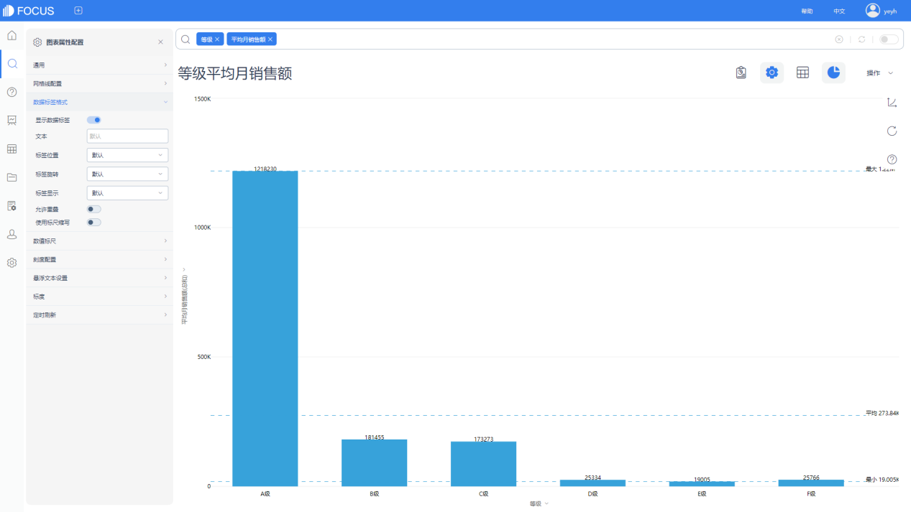

**商业场景**

企业经营一段时间后，要进行市场销售数据调查、整理，并对其销售状况进行分析，从而了解企业经营状况，为进一步做好销售奠定基础。

**案例分析**

市场调研员对郑州市一些区域的主要超市销售数据进行调查，如表所示，试着对该数据进行分析。

 将这些不同区域的超市按照月销售额进行等级划分。**分析思路**

1. 按照不同等级统计各个等级包含的超市数量。
2. 将不同关键字段进行组合，从不同视角数据分析。

**实现步骤**

导入数据表 主要超市销售数据。

搜索中选择该数据表。

接下来，我们需要对平均月销售额进行等级划分，可以通过公式来实现。

将销售额大于50000的划分为A级，将销售额在40000-50000之间的划分为B级，将销售额在30000-40000之间的划分为C级，将销售额在20000-30000之间的划分为D级，将销售额在10000-20000之间的划分为E级，将销售额小于10000的划分为F级。

建立公式，取名为等级，if 平均月销售额>50000 then "A级"else if 平均月销售额>40000 then "B级" else if 平均月销售额>30000 then "C级" else if 平均月销售额>20000 then "D级" else if 平均月销售额>10000 then "E级" else "F级"

再建立公式，等级数量，Count(等级)，清算各个等级的超市数量。

建立完成后我们可以通过组合不同的关键字段来进行数据分析。

将等级和等级数量组合，我们可以看到不同等级的超市数量占比情况。

将等级和销售额组合，我们可以看到不同等级的超市销售总额情况。

将等级、超市名称、销售额、区域组合，我们可以看到不同等级不同区域的超市情况。

将等级和区域设定为x轴，销售额为y轴，图例设置为超市名称，即可看到按照等级和区域划分的超市情况。

我们还可以通过筛选功能，查看详细数据，比如设定区域为金水区，即可呈现该区域不同等级的超市情况。

转换为饼图，可以看到不同等级不同区域不同超市的销售额占比。

