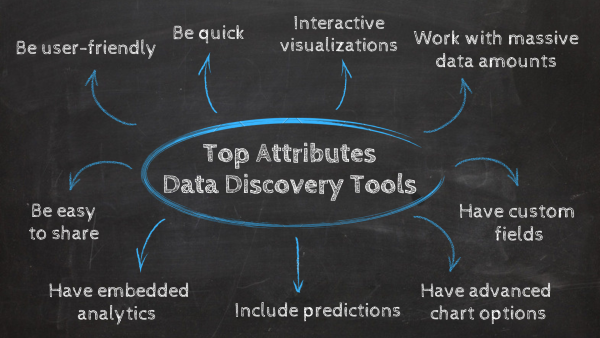
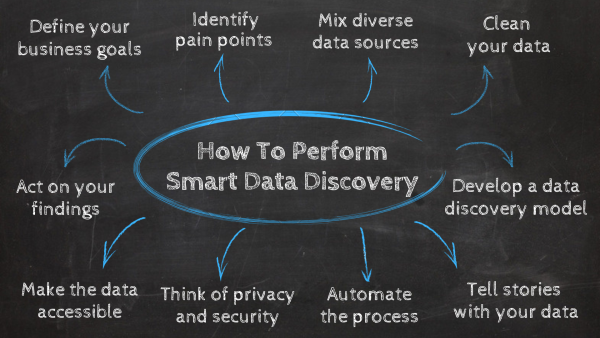

我们生活在一个数据无处不在的时代。在数字时代，那些能够从触手可及的大量数据中榨取每一滴价值，发现促进增长和进化的新见解的人，将永远在商业战场上获胜。

研究表明，79%的企业高管认为，不以正确方式利用大数据的公司将失去竞争地位，最终可能面临倒闭。此外，83% 的高管一直在追求大数据项目以获得竞争优势。毫无疑问，从指标、洞察力和信息中获得最大价值的最佳方式是通过数据发现。

从根本上说，这是一个描述企业从各种来源收集信息并将其实际应用以产生真正价值的过程的术语。企业可以从改进的[数据驱动决策](https://www.datafocus.ai/infos/data-driven-decision-making-in-businesses)以及增强的业务流程和模型中受益，并在推动智能战略的同时更流畅地跨部门分享见解。

作为一个数据驱动型组织，首先要了解您的数据。无论是 IT 专家、CIO 还是项目经理，在当今的数字时代，所有业务用户都需要能够访问和理解数据。

这种方法是一种分析方法，它支持成功并确保组织内的每个人都能够通过无缝、交互的方式理解信息，从而充分利用这些信息。

那么，什么是数据发现？用于此类任务的工具有哪些？什么是数据发现平台，您如何在实际业务环境中使用它？在这里，我们从最重要的问题开始，探讨所有这些主题以及更多主题。

## 什么是数据发现？

数据发现是从各种来源收集数据，以从中发现模式和异常值的过程。借助数据发现工具和可视化数据导航，企业可以获得洞察力并回答关键问题以推动成功。

假设您是企业所有者、分析师、CIO 或项目经理。组织中的每个员工都需要一种方法来阅读、理解和收集以数据形式出现的所有信息的价值。

在现代商业环境中从数据中获取价值对于任何公司的成功都至关重要。发现和分析模式、趋势的能力使企业能够为自己提供竞争优势，实现目标，确保成功，并在数字时代保持相关性。

如前所述，概念本身不是工具。它更像是一个可以用来产生商业价值的术语。也就是说，您可以使用一些[数据分析工具](https://www.datafocus.ai/infos/data-analyst-tools-software)来加强您的工作。

这种发现可以被描述和分类为：

1. **数据准备**：管理各种来源的非结构化原始数据，并将其转换为可用格式的过程。
2. **可视化分析**：让用户理解数据并与之交互的可视化工具，并从中提取可操作见解。
3. **引导式高级分析：**由于报告和可视化技术的组合，这类分析使企业能够全面了解他们的数据，让用户找到改进决策的模式和关系。

也就是说，该过程也可以分为两种类型的数据发现。基本上，两者之间的主要区别在于，一个需要更多的技术知识，而另一个具有更易于使用的方法，可供普通用户使用。我们来更详细地了解它们。

**手动数据发现**：这种类型意味着准备和清理数据的所有繁重工作都由专业分析师和专家完成。在机器学习等先进技术出现之前，专家们需要使用批判性思维来有效地管理数据。

**智能数据发现：**智能数据发现：另一方面，由于使用了允许通过交互式数据可视化进行准备、集成和分析的软件，智能发现具有自动化和用户友好的方法。这使得普通业务用户能够以直观、快速的方式开始使用数据。本篇文章将主要关注智能类型的发现。

以下部分，在BI-Survey指南的帮助下，深入分析了这一趋势的内部运作，并解释了企业如此成功地使用它的原因。

## 大数据发现：为什么如此受欢迎？

既然我们已经探索了明确的数据发现定义，那么让我们深入探讨这一创新概念及其主要好处。

正如我们在本文开头提到的，大数据行业在过去十年中呈指数级增长。研究表明，过去两年产生的数据比之前的整个历史都要多，而且自 2012 年以来，该行业已在全球创造了约 1300 万个工作岗位。预测模式和联系的能力改善了多个企业的工作方式，使其成为全球最大的行业之一，也是当下最热门的趋势之一。让我们看看为什么。

- **改进决策**：数据被视为企业的无价商品和“货币”。它可以帮助公司获得值得信赖的洞察力，并将其应用于竞争优势。它改进了决策过程，推动了增长战略，显着提升了客户体验，使企业能够通过其业务模式推动创新。
- **可访问性：**在现代世界中，IT 或数据专业知识不应成为提取业务洞察力的必要条件。这就是为什么智能数据发现在当今环境中如此重要的原因。这种趋势的核心是可访问性，通过提供必要的工具使任何类型的用户都可以理解重要的数据点。赋予他们使用数据来支持任何重要决策的能力。
- **改进的风险管理**：处理数据并非没有风险，随着数据量的增长，需要保护数据并遵守法律法规。借助数据发现工具，公司可以发现任何潜在威胁并立即解决它们，确保合规性。
- **节省时间和金钱**：在分析方面，时间至关重要。过去，用户必须等待数天才能获得包含过时信息的报告。数据发现平台提供自动化功能以及实时数据访问功能。这两个功能相结合，使企业可以节省资金和时间，他们可以根据从分析中提取的见解来实际优化他们的流程。

但是你如何开始接受这种心态的呢？您如何在您的企业中实施这种类型的策略，以及哪些[可视化分析工具](https://www.datafocus.ai/infos/visual-analytics)可以帮助促进这一过程？

首先，您可以通过特定指标（关键绩效指标）来跟踪您的业务绩效，并获得数据提供的所有洞察。您可以选择许多[KPI 示例](https://www.datafocus.ai/infos/kpi-examples-and-templates)，具体取决于您的行业或部门。然后，您可以将收集到的信息应用到所有团队和部门，这将使您能够做出集体决策，最终解决挑战并在许多关键领域创建可持续的解决方案。

## 您应该在数据发现工具中寻找的主要属性

目前有一些[以商业智能软件形式存在的工具](https://www.datafocus.ai/infos/best-bi-tools-software-review-list)——专门设计用于改进传统 BI 功能的平台。

之前，我们提到了三个数据发现步骤：_数据准备、可视化分析和引导式高级分析。_您使用的用于发现数据的软件应该为这三个关键阶段提供基础。在这里，我们为您列出了这些工具应包括的主要属性：

**1) 用户友好**

过去，数据发现和分析过程留给专业分析师或 IT 专家处理。今天，由于现代技术和数据的民主化，这种情况发生了变化。任何现代工具的原则之一是它需要有一个用户友好的界面。这将使组织中的每个人都能够利用他们的信息和工具。

**2）要快**

随着过去几年数据的增长，市场上提供的[在线数据分析工具](https://www.datafocus.ai/infos/data-analysis-tools)越来越多。随着许多企业都从这些解决方案中受益，您需要确保投资于能够为您的企业提供竞争优势的技术。也就是说，您应该选择快速并提供所需功能的软件，以帮助您准确了解您的工作重点。例如，[自动报告](https://www.datafocus.ai/infos/automated-reporting-system-and-tools)允许您在几秒钟内生成带有实时数据的仪表板和报告。

**3) 轻松处理海量数据**

视觉发现有助于拓展传统[商业智能](https://www.datafocus.ai/infos/bi-skills-for-business-intelligence-career)并提高效率。如果您有来自不同接触点的多个数据库，那么您应该寻找一种工具，无论您希望包含多少信息，它都可以轻松集成。除了连接数据，您选择的发现工具还应该支持处理大量数据。例如，使用高级过滤选项或模式识别。

**4）具有交互式可视化**

人脑处理视觉信息的速度比处理数字快得多。因此，一个高质量的数据发现工具应该包括强大的交互式可视化，使处理和分析信息的过程变得流畅且易于理解。诸如 DataFocus 之类的工具提供了一个[仪表板创建](https://www.datafocus.ai/infos/dashboard-creator)功能，可以选择预设（或重新制作）看板模板，制作包含不同图表类型和颜色的仪表板，使公司中的任何人都能够用数据讲述故事。在下图中，我们为您展示了一个[财务仪表板](https://www.datafocus.ai/infos/dashboard-examples-and-templates-finance)示例，该仪表板显示了第一眼就了解公司财务状况所需的主要指标。

_\*\*点击放大\*\*_

**5) 有高级图表选项**

除了交互式可视化之外，开发良好的软件还应包含高级图表选项，以执行质量分析并从数据中提取最大潜力。其中一些高级功能应该是：

- 能够将多种图表类型合二为一。
- 添加辅助轴以进行高级比较和分析。
- 有不同的趋势指标，如积极或消极结果的颜色。
- 允许条件格式指出意外值并发现隐藏的趋势或模式。
- 使用比较周期特征来比较两个不同时期的数据，并根据绩效和目标得出结论。

**6）自定义字段**

自定义字段是另一个重要的功能。它们允许用户创建单独的计算字段，以及在不同连接类型的帮助下将多个类别维度组合成一个合并字段。专业的仪表板工具（例如 DataFocus）提供了创建自定义字段的功能，可以通过搜索功能或公式编辑功能进行创建。

**7) 预测**

在投资这些解决方案时，预测分析功能是必不可少的。通过使用人工智能和机器学习技术来分析当前和历史数据，用户可以轻松识别可用于回答一组关键问题的模式和趋势。生成准确的性能预测，使公司能够以智能的方式提前为未来的发展做好准备。

**8) 易于分享**

协作是成功的数据管理的基础。因此，共享能力是您在投资 BI 软件时应该期望找到的属性之一。DataFocus允许您根据利益相关者的角色和他们需要使用的数据，为他们提供不同类型的访问。能够轻松地共享见解和报告，将增加团队之间的沟通，从而带来更高效的环境。

**9) 允许嵌入式分析**

另一个很棒的功能是嵌入功能。现在越来越多的组织意识到协作数据驱动环境的力量，实现将人和数据结合在一起的功能变得至关重要。从这个意义上说，嵌入式分析是实现这一目标的桥梁，通过将交互仪表板及其所有功能集成到内部和外部应用程序，用户可以从任何位置轻松访问。这样，[嵌入式仪表板](https://www.datafocus.ai/infos/embedded-dashboards)可以显著提高数据发现的速度和易用性。

总之，您不需要成为专家分析师或阅读编程代码来理解业务中的数据并从中获得价值。一个可靠的数据发现工具应该使人们能够阅读和理解所有部门的模式，并相互共享这些信息。无论您是提取和评估[人力资源 KPI](https://www.datafocus.ai/infos/kpi-examples-and-templates-human-resources)还是准备特定的[零售绩效指标](https://www.datafocus.ai/infos/kpi-examples-and-templates-retail)，正确的工具都必须能够适应您的特定组织需求。

要在您的企业内开发真正的现代业务环境，您必须实现数据发现，以便保持相关性和成功，并促进数据驱动的文化。如果您不这样做，您将无法跟上数字世界的需求。如果你不能学会如何最大限度地利用你的数据，你的业务将会落后。

也就是说，您应该采取一些必要步骤来确保您的努力在公司文化中根深蒂固。让我们更详细地探讨它们。

## 如何执行智能数据发现？

**1) 定义您的业务目标**

执行智能数据发现的第一步是定义您的业务目标，这样您就可以让您的流程专注于正确的信息。为此，您可以与主要利益相关者和团队成员会面并开始对话，以定义业务的主要战略目标以及跟踪进度和衡量成功所需的[指标。](https://www.datafocus.ai/infos/operational-metrics-and-kpi-examples)

该过程的这个阶段也有利于让公司中的每个人都参与数据发现方法和流程，并在您的组织中建立强大的数据驱动文化。

**2）确定你的痛点**

在确定目标之后，是时候确定您的痛点或阻碍您成为更聪明、更智能的业务实体的障碍了。虽然每个组织本质上都是不同的，而且一个规模肯定不能适合所有人，但有许多痛点经常从一个组织跨越到另一个组织。这里有一些例子：

- 对组织内大量信息的访问有些受限且缓慢。
- 来自不同来源的大量数据使得有效地收集、理解和应用非传统信息似乎是不可能的。
- 当前系统和平台的复杂性意味着用户花费太多时间来管理、理解和报告数据，而使用它来推动进步和创新的时间却更少。

这听起来很熟悉吗？在您的组织中实施新的和创新的 BI 或[仪表板工具](https://www.datafocus.ai/infos/online-dashboard)将有助于解决大量这些障碍（我们稍后将更详细地探讨），您也将通过这些步骤完成工作。

**3) 混合不同的数据源以获得更深入的见解**

如您所知，数据来自各种来源，包括结构化和非结构化。通过从现有的结构化和非结构化、多样化来源中收集见解并以不同的方式看待它们，您将发现能够推动业务发展的新见解。

通过整合来自各种不同来源的数据，并在协作环境中与企业的关键成员收集数据，您将能够融合这些指标和洞察力，拼凑出一个知识难题，从而打开通往高级组织成功的大门。

这样做将使您更清楚地了解您需要做什么来实现您的业务目标（甚至发现新的目标），并设置可以帮助您实现目标的 KPI，以一个集体来齐心协力工作，而不是独立的部门单独工作。例如，[财务报告](https://www.datafocus.ai/infos/financial-reporting-and-analysis)流程可以被不同的利益相关者使用，无论是内部（跨部门沟通）还是外部（其他公司、投资者、股东等）

**4）清理你的数据**

从所有与您的业务相关的来源收集数据后，您将需要处理大量信息。同时，您可能会遇到会损坏您的发现过程的不正确数据。出于这个原因，您应该始终在可视化之前清理所有内容再开始从中提取见解。

您可以从添加任何缺失的代码、修复空字段、消除重复和不正确格式的数据开始。然后你可以更深入地清理你的文本数据。许多企业使用调查、社交媒体评论和其他对其分析至关重要的文本输入。为了让算法检测模式，需要“清理”文本数据，以避免无效字符或任何语法或拼写错误。

清理阶段的最终目标是避免使用可能损害您的业务的误导性数据的风险。它还将帮助[BI 报告工具](https://www.datafocus.ai/infos/bi-reporting)更好地与您的信息交互，并执行智能数据发现过程。

**5) 开发数据发现模型**

什么是智能数据发现模型？从根本上说，这种模型是一种使用数据的战略方法。它们通常涉及收集、管理和分析，以及组织在发现对业务发展至关重要的新见解时采取的数据驱动行动。为工作选择最佳[报告工具](https://www.datafocus.ai/infos/online-reporting)也是一个重要因素。

这些不同系统和流程的“建模”通常涉及使用图表、符号引用和文本信息来表示数据在业务中流动的方式。就方法而言的模型示例，包括实体关系图、数据映射规范、数据矩阵和流程图。

我们已经考虑过“什么是数据发现模型？”，并探索了此类模型的示例，但这里的要点是：要走上全公司范围内的数据驱动启蒙之路，您必须了解您的信息流并制定组织战略，以确保以最有凝聚力的方式进行处理。

**6）用你的数据讲故事**

确保您的组织是一个完全由数据驱动的实体的最有效方法之一是能够使用您的数据创建一个易于理解、鼓舞人心的叙述——组织内的每个人都可以参与其中，无论他们的技术能力如何。

要实现这一点，必须采用数据可视化，为了帮助您入门，您应该探讨以下 3 个问题：

- 我应该选择哪些[数据可视化类型](https://www.datafocus.ai/infos/how-to-choose-the-right-data-visualization-types)以及如何选择？
- 我可以阅读哪些可视化书籍来了解我的数据故事？
- 我可以从哪些[数据可视化示例](https://www.datafocus.ai/infos/best-data-visualizations)中寻找灵感？

如果您能够讲述一个故事并用您的数据描绘出一幅图画，您将需要确保整个组织都可以访问它，从而帮助您建立一个更具凝聚力和繁荣的公司。

**7) 自动化您的流程**

下一步是使用自动数据发现。正如我们之前在关于清理数据的观点中提到的那样，拥有如此大量的信息，准备过程可能很耗时，最重要的是，风险很大。人类可能会犯错误，例如对数据进行错误分类，这可能会在未来导致更大的问题。因此，使用具有自动化技术的[BI 解决方案](https://www.datafocus.ai/infos/business-intelligence-bi-solutions)意味着您将受益于更高级的数据分类技术，例如基于目录的搜索或模式搜索。这样，您的数据将提供更准确和更具表现力的结果。

自动化的另一个重要好处是实时决策。将所有数据实时保存在一个地方将使讨论能够根据可用的最新信息做出准确的业务决策。

**8）考虑隐私和安全**

当您处理大量数据时，公司有义务考虑隐私和安全性。在处理财务、客户数据甚至健康相关公司的健康信息等敏感信息时尤其如此。事实上，在过去几年中，随着欧洲国家实施了诸如GDPR之类的严格法规，安全性已成为人们关注的话题。这些法规的制定是为了应对日益增多的数据泄露事件。截至 2022 年，在过去 5 年 中，违规行为增加了21% 。

在数据发现工具的帮助下，此步骤不会成为负担。这些解决方案能够发现敏感数据并确保其遵守任何隐私法规。这是通过按敏感程度发现和分类数据集来完成的，允许组织应用所需的安全和隐私协议，例如加密。

**9) 使数据可访问**

我们已经通过这篇文章多次说明了可访问性对于成功数据发现的重要性。当我们谈论可访问性时，我们的意思是使用用户友好的工具，组织中的任何人都可以使用而无需任何技术知识，而且还能够随时从多个设备访问它。例如，营销团队应该能够快速访问[IT 指标](https://www.datafocus.ai/infos/kpi-examples-and-templates-it)以支持他们的电子商务战略。像这样，您将为急需的数据驱动文化建立基础，并授权组织中的每个人加入。

**10) 根据你的发现采取行动**

收集、清理和可视化数据后，即可进行分析，以提取可行的见解并改进战略和运营决策。在这里，您可以依靠我们之前提到的各种应用程序（例如预测分析）来发现隐藏的模式，从而更深入地了解某些场景。这里的一个重要注意事项是始终不断发展和重新思考您的策略。通过使用我们刚才提到的所有技术和步骤，您将获得有关您的业务的宝贵知识，这将使您在竞争对手中脱颖而出。

## 数据发现用例

到目前为止，我们已经提供了详细的定义，以及您应该考虑使用的一些数据发现最佳实践和功能。为了更好地理解这些流程的价值，我们现在将介绍几个业务环境中的用例。

**战略规划：**一般来说，数据发现系统可以通过提供对实时信息和历史工作情况的访问来增强战略规划中的许多领域。这个完整的视图允许用户在考虑所有关键因素的情况下做出明智的决策。例如，决定来年预算分配的首席财务官可以查看部门绩效，了解哪些工作和预算最需要关注。

**识别客户问题：**如前所述，数据发现允许企业汇集来自各种来源的数据并以创新的方式使用它。例如，它使他们能够360度了解与客户行为和互动相关的一切。这样，他们可以发现任何问题，例如意外的客户流失、高回报的产品问题、促销失败以及任何其他客户不满意的迹象。这些问题可以借助诸如文本情感分析之类的技术来识别，这些技术可用于了解客户对您的品牌的看法。

**安全预防**：数据泄露正成为越来越受关注的话题，新的安全法规的实施迫使公司关注他们的安全和隐私工作。数据发现可以通过执行自动数据分类来查明任何安全漏洞。这涉及对数据进行标记和标注，以轻松识别不符合要求的点。此外，它还允许用户概述任何可疑活动，并防止内部和外部安全威胁。

**社交媒体分析**：社交媒体渠道的数量不断增加，使公司面临着适应和学习如何利用它们来发挥自身优势的挑战。数据发现使他们能够通过交互式[社交媒体报告](https://www.datafocus.ai/infos/social-media-reports-examples-and-templates)，集中查看与客户行为相关的相关指标。通过这种方式，任何问题都可以实时解决，并且可以只将精力集中在最成功的渠道上。

**机器维护**：在传统的制造公司中，解决机器问题的唯一方法是派遣技术人员维修设备。这通常会延迟生产过程，并会耗费工厂的资金和时间。通过使用预测分析和自助数据发现，制造商可以分析他们的历史整体设备效率，并确定可以防止再次发生的可能故障因素。

随着技术的不断进步，BI 的这一分支正在进一步发展，我们必须在实施它时更深入地研究我们业务中正在发生的事情。它将把我们带到何处，它如何影响我们组织的未来和我们做出有价值决策的能力？

## 智能数据发现或增强智能：发现业务分析的下一阶段

各组织机构正在采用有助于提高决策能力的数据发现工具。我们现在看到这个概念演变成所谓的_智能数据发现_或增强智能。

增强智能通过使用机器学习算法、[数据警报](https://www.datafocus.ai/infos/business-intelligence-data-alerts)和人工智能功能来自动发现数据中的趋势和相似性，从而提高商业智能。这极大地提高了决策速度，并使您更容易获得信息驱动的洞察。

Gartner 最近负责引入了“智能数据发现”这一术语，他们将其定义为“一种新一代能力，可以让商业用户或公民数据科学家能够从高级分析中获得洞察。”

后来，Gartner——一家在软件、平台和工具方面具有重大影响的公司——决定进一步修改术语，以更准确地表示其能力，将其称为增强智能。

_要了解 Gartner 帮助激发了哪些数据发现工具以及他们对该领域的见解，请浏览此__案例研究__。_

### 增强智能：增强分析和增强数据准备

Gartner 发布了一份完整的报告，讨论了增强分析在未来的重要性。让我们进一步研究一下。

**_增强分析_**使用机器学习算法和自然语言处理来自动化您从数据中获得的见解。从本质上讲，它通过自动化数据准备和进一步促进整个企业的共享，简化了获得洞察力的过程。它加快了从数据中获取价值的过程。

**_增强型数据准备_**使企业内的人员能够访问更有目的性的数据，以便他们能够更加自信、轻松地测试基于信息的决策制定的所有假设和方法。它促进[数据质量管理](https://www.datafocus.ai/infos/data-quality-management-and-metrics)和治理，并允许数据透明。

**为什么它们很重要？**

以下是使我们认为增强分析和增强准备都至关重要的一些原因：

- 您可以跨部门做出更准确的预测和解决方案。
- 他们为战略决策腾出了更多时间。
- 它们提高了数据的可访问性。
- 它们对 ROI（[投资回报率](https://www.datafocus.ai/infos/kpi-examples-and-templates-marketing#return-on-investment)）和 TCO（总拥有成本）产生积极影响。

这些只是您可以从适用于您的业务的智能增强数据发现解决方案中获得的少数好处。随着技术的飞速发展，新的分析解决方案不断推出。作为专业人士，及时了解所有最新的[商业智能趋势](https://www.datafocus.ai/infos/business-intelligence-trends)和信息是非常值得的。

在企业因致力于数据创新而生死存亡的时代，数据的发现不仅仅是一项可选活动。在现代，这是必需品。为了成为真正的数据驱动型并推动决策能力走向成功，组织必须采用一种流程，来促进用户和部门之间的协作，并让那些不是数据专家的人也能理解数据。

## 现代数据发现工具

这些工具提供可视化呈现，包括地理地图、图表、图形和颜色编码元素，以促进数据发现过程，并揭示数据中的模式或趋势，不仅在过去和预测意义上，而且在实时意义上. 这种有组织、精简和可视化的数据通常以[实时仪表板](https://www.datafocus.ai/infos/live-dashboards)、报告、图表和表格的形式出现在一个集中的、易于导航的位置。

数据发现产品和工具是培养更具生产力、效率更高、洞察更丰富、发现分析更智能的组织的途径。任何值得使用的商业智能平台或工具都将提供本指南前面概述的所有关键属性，同时帮助您成功地完成在这个残酷的数字时代取得持续商业成功所需的每一个步骤。

为了让您清楚，以下是您应该在数据发现软件中寻找的属性的摘要：

- 他们瞄准业务用户，提供一个没有代码的环境。
- 它们使企业能够获得各种数据源。
- 它们提供数据准备和建模功能，例如组合来自不同来源的数据。
- 它们通过[在线数据可视化](https://www.datafocus.ai/infos/data-visualization-tools)提供易于理解的数据描述。
- 它们可以实现用户交互的可视化。
- 它们通过引导式高级分析属性支持统计分析，这些属性在实施后立即准备就绪。
- 它们提供了多种选择，以促进同行之间的见解分享。
- 它们允许您根据历史表现生成准确的预测
- 分析和数据准备得到简化和集成。

在DataFocus，我们为发现过程提供了这些以及更强大的功能。无论您的部门、行业或当前的数字成熟度如何，我们的仪表板、工具和模板都将帮助您推动业务走向光明和繁荣的未来。

要查看我们提供的示例以及我们如何改进您的数据发现过程，请探索我们的[仪表板示例](https://www.datafocus.ai/infos/dashboard-examples-and-templates)或注册，[30天](https://www.datafocus.ai/console/)完全免费试用！

请记住，数据就是力量——明智地使用它，您将拥有触手可及的世界。
