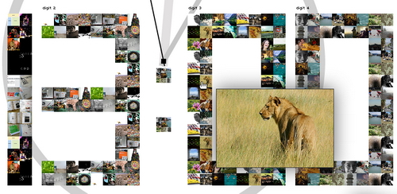
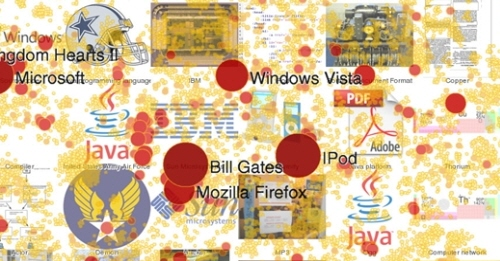
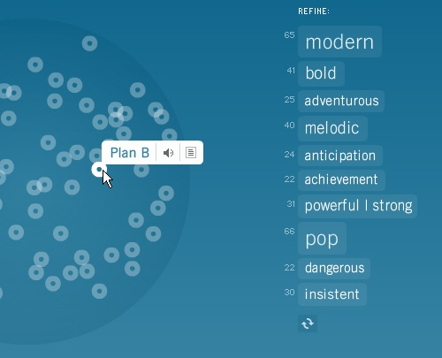
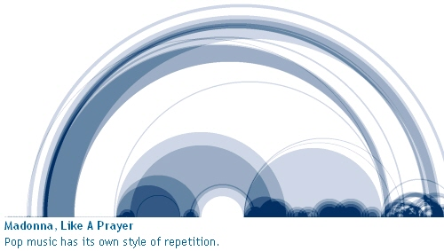
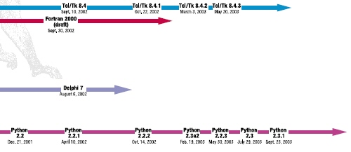
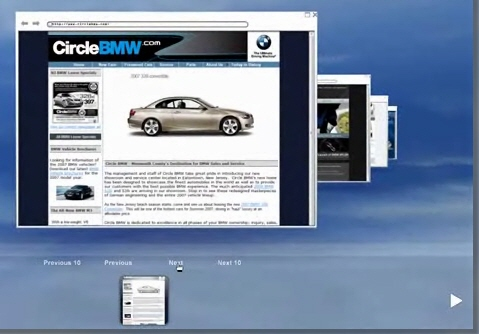

数据呈现可以是美观，优雅和描述性的。每天、每个项目都会或多或少的用到传统的数据可视化方法：使用表格、直方图、饼图和条形图。但是，为了有效地向读者传达信息，有时您需要的不仅仅是结果简单的饼图。事实上，有更好、更深刻、更有创意和****绝对迷人的数据可视化方法****。其中许多可能在未来几年内无处不在。

以我们从未想过的方式呈现数据的最有创意的方法是什么？让我们来看看****最有趣的数据可视化现代方法****以及相关文章，资源和工具吧。

### 1.心灵图

注意，这不是地铁交通图（尽管看起来很像）！Informationarchitects.jp提供了网络上最成功的200个网站，按类别、邻近度、成功度和受欢迎程度，以思维导图中的视角排序。显然，这种可视化方法是以前从未有过的。非常全面。

### 2.显示新闻

Newsmap是一个可视化反映Google新闻聚合器不断变化的环境的应用程序。数据块的大小由它们当前的流行程度来定义。

Digg BigSpy在人们挖掘时将热门故事排在最前面。更热门的故事有更多的挖掘。

Digg Stack：当用户挖掘它们时，Digg故事将自己排列成堆栈。故事越多，堆栈就越大。

### 3.显示数据

Amaztype是一种印刷书籍搜索，它从亚马逊收集信息并以您提供的关键字形式呈现。要获得有关给定图书的更多信息，只需单击即可。

Flickrtime正在使用类似的想法。该工具使用Flickr API实时显示上传的图像。图像形成时钟，显示当前时间。

时代杂志使用视觉山丘（尖峰）来强调其地图中美国人口的密度。

CrazyEgg可让您使用热图来探索访问者的行为。更常被点击的更受欢迎的部分被突出显示为“暖色” - 红色。这种方式可以用来改善页面布局，优化用户体验。

瑞典教授Hans Rosling 在TED的演讲，是传奇的演讲，他讲述了一种呈现统计数据的新方法。他的Trendalyzer软件（最近被谷歌收购）将复杂的全球趋势转变为生动的动画，使数十年的数据流行起来。亚洲国家，图中丰富多彩的气泡，代表了不同国家的健康和财富。在罗斯林的手中，诸如预期寿命、儿童死亡率、贫困率的全球趋势，变得清晰、直观，甚至有趣。顺便说一句，有一款DataFocus软件可以通过搜索的方式实现这一点，非常简便。

可视化维基百科中的Power Struggle显示热图中最受欢迎的文章和最常见的搜索查询。

 

### 4.显示连接

Burst Labs在泡泡中为您的搜索查询（最喜欢的艺术家，电视节目，电影，流派等）推荐类似或相关的项目。不是很新，但仍然鼓舞人心。

歌曲的形状：音乐是什么样的？歌曲的形状试图回答这个看似无厘头的问题。这项工作中的定制软件以半透明拱形的形式绘制音乐模式，允许观众看到字面上、网络上可用的任何构图的形状。

Lanuage Poster证明即使简单的线条也足够描述编程语言的发展历史。

### 5.显示网站

Spacetime以3D形式提供Google，Yahoo，Flickr，eBay的网页图像。该工具以易于查看的，3D排列的优雅方式显示所有搜索结果。公司承诺，通过页面和缩略图标挖掘、寻找项目的日子已经结束。

### 6.文章和资源

- 

该项目提供了最美丽的数据可视化方法以及进一步的参考和书籍建议。画廊有450多个参赛作品。

最后，给大家推荐一款大数据可视化产品DataFocus，可以通过搜索方式极其简便的实现数据可视化工程。
