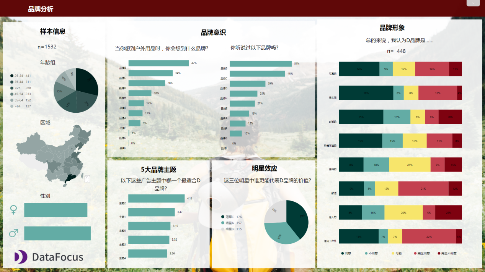
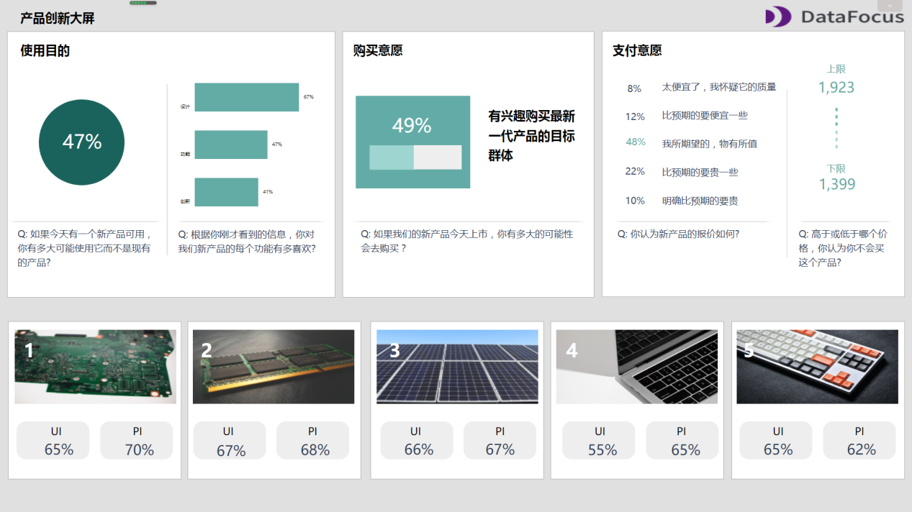

每一个产品经理都希望在产品开始立项设计前，得到用户最真实的需求反馈，为自己的产品设计提供良好的支撑；

每一个产品经理都希望自己的设计的产品得到用户的认可和亲睐；

每一个产品经理都希望用户能在使用产品的过程中不断反馈对于产品改进的意见和建议。

那么，我们如何才能得到用户的前期意见和后期反馈呢？

这个时候我们需要的是数据的支撑，只有数据才能让一切更有说服力(前提是真实、有效的数据)、只有数据才能让我们更清楚地了解到我们想法的可行性……。

**既然这样，那数据从何而来？**

这自然少不了市场调研。市场调查就是指运用科学的方法，有目的地、系统地搜集、记录、整理有关市场营销信息和资料，分析市场情况，了解市场的 现状及其发展趋势，未市场预测和营销决策提供客观的，正确的资料的过程。只有通过对用户的调研才能收集最基础的用户数据、从最基础的数据上进行分析，从而了解用户的真实需求。

本案例中用到的数据分析工具是——**DataFocus**，通过DataFocus内置的数据可视化大屏，可以将多个相互有影响的指标进行交互分析；同时，借助看板中的筛选器，可以进行时间、品牌等字段之间的灵活切换，增加了指标之间的联动性；最后，借助API数据接口将数据库接入到DataFocus中，可以实时了解数据变化情况，当原始数据发生变化时，可视化大屏的结果也呈实时变动，无需重新创建，加快了数据分析的效率。

## **品牌分析大屏**

在市场调研中使用数字化大屏是大型资产机构和公司可以利用的一大优势，可以作为企业营销计划的基础。按照企业的不同需求，明确市场调研的目标，调查宏观市场的发展变化趋势。

下述是第一个市场调研大屏所展示的基本内容：可视化大屏左侧展示的此次市场调研的有关样本信息。此次抽样调查共调研了1532人，其中女性746人，占比48.7%，男性占比53.3%，被调查者的主要年龄分布在25-44岁之间。

大屏中部通过两个提问来搜集户外装备产品的**品牌知名度**：首先提问：当你需要用到户外用品时，你第一时间会想到什么品牌（可多选）？这是一个主观开放题，让被调查者自己思考品牌名称可以更公平的了解品牌在人们心中的位置，以及他们在普通消费者的知名度。品牌B显然是最出名的，有47%的人都会提到它。接下来，为他们提供品牌列表并询问是否认识，这样的调研方式可以最大程度上降低对被调查者的心理诱导。

剩余的调研指标更侧重于样本的某一部分：知道品牌D的有29%，即448人。可以针对该部分人群进行进一步的了解，例如，询问被调查者对适合品牌的广告主题的看法，从消费者的角度去了解品牌对外所反映的形象；其次，也可以通过为品牌选定代言人的方式了解品牌价值，什么样的公众人物或者品牌调性，可以让人们会立刻联想到这个品牌。

## **产品创新大屏**

第二个市场调研大屏关注的是产品创新，从大屏中可以深入了解未来的产品开发、定价决策和未来的市场潜力。

第一个指标是调研样本的使用意图，这是对想要推出的新产品的初步反馈，了解市场将如何接受它。如果与旧的产品或竞争对手的相比，新产品的热情非常低，这就说明新产品明显缺乏附加价值。

进一步考虑购买意愿，询问特定目标群体是否会积极购买。营销人员可以借助该指标对新产品做出决策，并预测未来的销售情况。这个值越高越好，因为购买意愿越高，代表目标市场对该产品的反响越积极。

接下来是支付意愿（WTP），支付意愿为我们提供了一个供参考的价格范围，在该价格范围内，消费者会购买产品，不会因为价格不会而对质量存疑，也不会因为价格太高而承担不起。

最后，在此仪表板的底部，可以看到按购买意愿排名前5位的产品：它们是最值得关注的重点产品。

## **客户满意大屏**

最后一个试产调研大屏不使用被调查者的样本，而是询问已经存在的客户，包括其对某个品牌的体验和满意度评价。

第一个指标**评估客户忠诚度**，从0-10评分，询问他们向其他人推荐产品或服务的可能性。净推荐值(NPS)将0到6的分数划分成贬损者，7到8作为被动者，9到10作为推荐者，然后用推荐者的百分比减去贬损者的百分比，就可以得出净推荐值(NPS)。在一定程度上，NPS可以直接反映出企业在客户内心的认可程度和购买意愿，可以看到企业当前和未来一段时间的发展趋势和持续盈利能力。

客户努力得分(CES)通过询问客户获得所需帮助的难度来衡量客户对品牌的体验。这个难度从1（简单）到10（困难）排名，可以计算其平均值，目的是保持该数字较低，以避免客户体验中的摩擦。

最后，大屏底端将客户满意度细分成四个不同的方面进行评估：产品质量、定价、设计和客户服务。客户满意度需要定期跟踪，是衡量品牌形象的最重要指标之一，也会影响净推荐值。从粘性分析中可以知道，一个新客户的获客成本是非常高的，但维护用户回购的成本却相对较低。在满意度评价中评价为不满意的客户，90%都不会再次回购，因此，**做好客户满意度工作，可以用更低的获客成本得到更多的利润。**

通过对市场大环境的调研，挖掘市场潜在需求量，了解消费者的分布及其特性，可以帮助企业制定营销策略，寻找企业发展新的突破点。

点击注册，可享免费试用30天，联系客服小姐姐还可以获得免费数据源和精美模板哦，快来试试吧~
