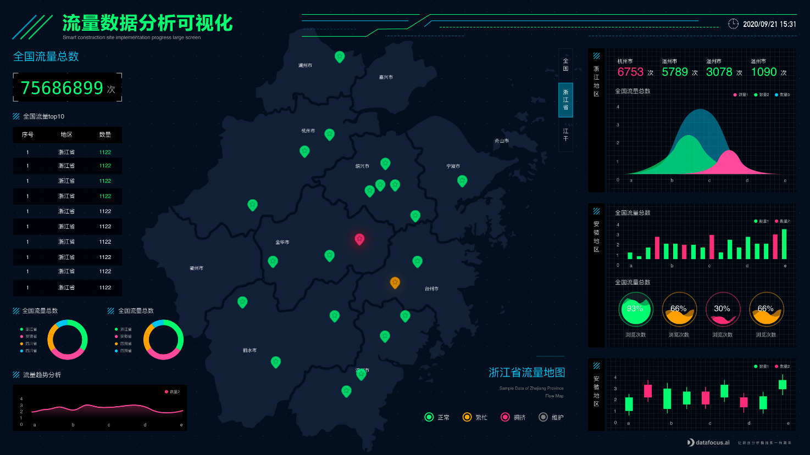

PPT是日常工作中经常会用到的工具，它跟Word、Excel都是承载内容用的，但它们从本质上又不太一样。Word偏向于阅读型，像是书籍，把内容写进去，然后供大家自己去阅读；Excel是做报表、列表用的，它统计汇总，让你一目了然，而PPT，更偏向于用来讲解用的，比如演讲的时候使用的更多的是PPT，会议上一般也会采用PPT形式。演讲者通过PPT的内容展示和讲解技巧，让听众获取里面的信息，并达到预期的效果，因此一个好的PPT，它需要更加清晰，明了。

那如何让PPT更加清晰明了呢？其中非常重要的一点就是PPT内容的展示，在PPT演讲过程中，经常会有数据分析的结果展示，这部分不要有过多的文字描写，要学会用可视化图表代替文字说明，对于受众来说，几百个字不如一张图看的简单易懂。既然要用图表来代替文字，那就需要专业的可视化工具来辅助，当然工具也不是随便怎么样的都可以，需要选择实用的，操作简单的，功能齐全的，图表样式丰富的，DataFocus就是这样一款性价比较高的专业可视化工具。

DataFocus有多种图表类型，基本满足各类可视化的需求，像是桑基图、词云图、平行图、热力图等高级图形都有，而且所有图形都不需要另外的配置。系统在后台都会自动配好，操作可以说是所有可视化工具里面最简单的，只需要两步，搜索，出图即可得到图表，如下图。

在PPT中，我们可以插入DataFocus制作的图表，来代替分析结论的文字说明，以一张图，展现所有的结果以及特点。看的人也会看得更容易，反向衬托出制作PPT的人其专业程度。所以，不要在用大篇幅文字来制作PPT了，用DataFocus，用图表，你会发现你的演讲或者会议，会更吸引人。
