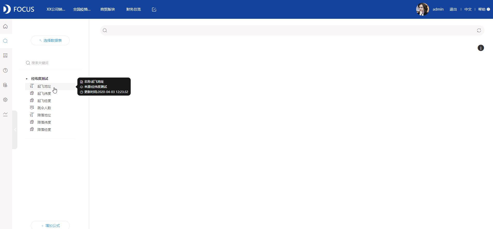

现在市场上各类可视化工具遍地开花，却也参差不齐，值得推荐的怎么能不说说DataFocus和Tableau！！在优秀的道路上，当仁不让！

两款都是企业级的大数据工具，在我上学参加统计专业比赛的时候，描述性统计模块很多图形都是通过Tableau来完成制作的，用EXECEL当然也可，但是耐不住Tableau的图形丰富和优秀的可视化效果！

DataFocus近两年自己在用的，也是在知乎上被安利的！操作相对来说更加方便！！！一用上我就爱了爱了，DataFocus是企业级的数据分析工具，根据企业的基本需要，一般会考虑的点结合DataFocus来说一下。

一、内存计算能力

数据的激增，对于分析工具的数据处理能力有了一定的挑战。能否能够在大批量，数亿条数据的情况下快速给出结果？

DataFocus采用MPP方式将数十亿行数据存在内存中，常规级数据查询秒级反应，快速搭建数据模型，缩短分析时间。

二、操作简便性

操作的简便能让普通业务人员也能快速上手，从从“IT主导的报表模式”向“业务主导的自助分析模式”转变，是BI的趋势。

DataFocus采用独有的自然语言处理引擎技术，支持中、英文双语搜索。你想要的环比、同比、统计分组等等都可以通过自然语言输入搜索即可得到答案。另外系统无拖拽、零代码，鼠标单双击解决一切操作。

三、可视化效果

可视化效果已经不仅仅是代表数据转化为平面图形的美观效果。对于数据可视化分析来说，架设一个多视角数据模型用户就可以从任意角度观察数据、探索数据。

不说，直接上图：

轨迹图制作

词云图制作

看板交互（钻取、联动、跳转）

tableau的各个功能分布在不同的桌面软件上，DataFocus一个网页就解决一套问题。另外就是，DataFocus毕竟是国内的产品，客服什么的都能很快的解决问题，效率比较高。但是这两款都是我的爱，无论从可视化的丰富性还是功能性，推荐！
