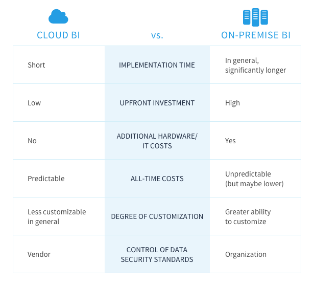

[基于云的 BI 工具](https://www.datafocus.ai/infos/cloud-bi)近年来越来越受欢迎。尤其是中小型企业已经意识到，BI 基础设施的外包可以提供以前只有大型企业才能获得的资源。基于云计算的软件托管在供应商的服务器上，并通过互联网访问。因此，系统故障、办公室依赖或额外的 IT 基础设施都不是问题，但仍有一些公司保持怀疑。他们决定在公司自己的计算机和服务器上安装本地的BI 软件。当然，每个公司都是不同的，它的员工决定哪种解决方案最适合特定数据。一般来说，如果把所有的优点和缺点放在一起，可以看到基于云的BI的好处掩盖了它的挑战。

在DataFocus，我们是云 BI 解决方案的支持者，我们发现它是最有效的。但是，我们也意识到了这种解决方案的缺点，这让一些公司犹豫到底是将数据放在云里，还是放在实际的服务器中更好。由于我们的一些客户有特殊的需求和期望，我们扩大了我们的服务范围，包括个人的本地 BI 解决方案。在这篇文章中，我们总结了云计算与本地 BI 的所有优缺点 - 现在轮到您决定为您的业务选择哪个选项了。

**云 BI 与本地 BI 策略**

## 基于云的 BI 的优势

### 快速实施

在公司场所实施 BI 基础设施过去需要几个月的时间，但现在可以压缩到几天甚至几个小时。[自助服务分析工具](https://www.datafocus.ai/infos/self-service-analytics)为日常业务用户提供自动化和随时可用的解决方案。此外，包括DataFocus在内的最佳 SaaS 提供商鼓励潜在用户尝试[免费试用](https://www.datafocus.ai/console/) ，并了解这个概念是否会给他们的公司带来切实的利益，而不会有投资失败的风险。

### 更高的采用率

显然，没有人希望自己购买最终并没有真​​正被企业实际使用的高成本本地软件。当您的 BI 解决方案仅基于本地服务器，且难以使用，导致只有经过培训的员工才能从​​中获取见解时，很可能会发生上述的情况。SaaS 自助服务解决方案并非如此——它们对于普通业务用户来说易于使用。云 BI 的更高采用率源于更低的学习成本，但也源于更好的可访问性。当您的数据在云端时，只要您有良好的互联网连接和登录凭据，您就可以随时随地访问它。不需要访问现场服务器。此外，它允许更快地共享数据。您可以简单地通过电子邮件发送链接，而不是通过电子邮件发送繁重的文件——这肯定会增加您的同事使用数据的舒适度。您选择的 BI 技术越直观、越平易近人，您的使用率就越有可能飙升，从而为企业提供更多洞察的机会。

### 全方位服务

当您决定使用[SaaS BI 工具](https://www.datafocus.ai/infos/saas-bi)时，就好像您选择了一个全方面的服务一样。供应商负责平台的基础设施和供应，定期更新和增强他们的工具，以提供最新版本的软件。在公司的网站上，您可以根据客户群的规模来扩大和缩小数据资源，而 IT 团队可以专注于他们的核心任务，而不会在客户数量突然增加时陷入困境。

### 入门成本低

SaaS BI 解决方案不需要硬件、软件开发、IT 资源、机器或服务器——这意味着它的用户成本更低。来自云计算的软件按月或按年订阅付费，这使得成本可预测。如果您想要一些附加选项，可以支付额外费用。另一个值得考虑的方面是 BI 成本在整个团队中的分布。如前所述，大多数云 BI 工具对任何人都易于使用，不仅仅针对经过培训的员工，因此人均使用成本会大大降低。基于订阅的云 BI 的另一个巨大好处是，可以签订短期合同并使用 BI 解决方案，例如，只需几个月而不需要购买完整的许可证。一般来说，总体拥有成本有利于云计算。很显然，如果您选择长期订阅，则经常性费用最终将超过对本地软件的一次性前期投资成本。但是，不要忘记本地选项所涉及的次要成本，例如人力资本投资、服务器维护和服务器更换。

## 基于云的 BI 的缺点

### 安全

每周媒体上都会出现有关于隐私数据安全漏洞的新爆料。难怪公司不愿意将他们的数据委托给云计算。会计、商业机密、商业战略、员工信息或客户名单等敏感数据构成了公司的长期资产，一旦损失，公司将面临严重的危机。尽管传统的本地解决方案并非没有缺点，但将企业的专有数据托付给第三方意味着对数据放弃过多控制。当数据安全掌握在云供应商手中时，他保证严格遵循的数据安全标准，但仍然不能让所有组织都对这种安排完全放心。当数据分布在由不相关用户共享的大量设备和资源上时，您不知道您的数据究竟位于何处的感觉可能会导致持续的担忧。此外，如果一个云系统被入侵，丢失的信息量将远远大于在一台计算机上都是的信息量。

### 检查您的工具是否可扩展

一些云存储服务允许有限的带宽。如果公司的数据量超过限额，可能会收取额外费用。但是，也有一些供应商允许在订阅中使用无限带宽——这是公司在选择云存储供应商时要考虑的一个因素。

### 可访问性

事实上，仍有一些地方没有互联网连接，您无法访问您的数据。由于数据被锚定在服务器上，本地解决方案意味着更少的移动性。此外，IT 基础设施也可能出现故障。试想一下：周一早上走进办公室，发现由于服务器停机，无法访问您的文件。传统服务器也可能被黑客入侵，硬盘驱动器可能出现故障，计算机可能被盗。因此，信任云终究是值得的。
