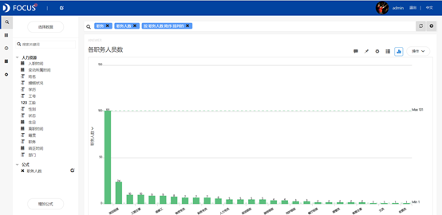
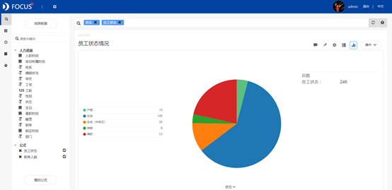
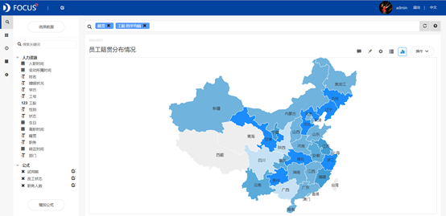
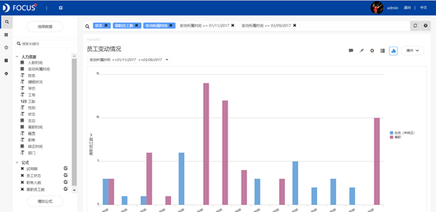
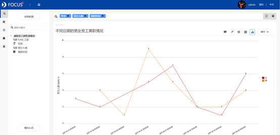
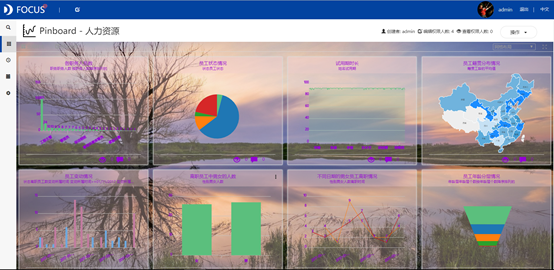

摘要 ：为了能够充分合理运用公司的人力资源，此次案例选取了某企业现有的人力资源数据，主要内容包括对员工的基本情况进行简单的统计分析，接着对2017年1月至3月的企业员工变动情况进行分析，并着重分析了性别对于员工离职是否有一定的影响，结果发现，性别对于员工离职几乎没有影响，离职的高峰期大概在每年的1月至3月之间。

关键词：Datafocus；人力资源；统计；员工离职

## 一、案例背景

为了更好地完善公司的人力资源制度改革，帮助公司人力资源管理走向规范化、标准化、职业化，通过有效管理，更大程度提升调动员工工作积极性。 此次案例选取了某企业的人力资源数据，首先对员工的基本情况进行简单的统计分析，接着对2017年1月至3月的企业员工变动情况进行分析，并着重分析了性别对于员工离职是否有一定的影响。

## 二、案例问题

（一）员工基本情况统计 通过对该企业员工的基本情况的分析，了解企业员工的各职务的人员数量，分析员工的籍贯分布以及目前所处的状态，了解各个部门人员需求的情况。 再对员工的年龄进行分层，了解企业的人员分布情况。

（二）离职情况 通过对一段时间内员工的变动情况进行分析，对企业这段时间的人事变动有一定的了解，便于公司制定相应的计划，为公司决策提供一定的依据。 再进一步通过观察离职员工中男女的比例，以及每天离职的男女性人数，判断性别对于离职是否具有一定的影响。

三、案例分析 首先将分析的"人力资源"csv文件导入Focus系统。

（一）员工基本情况统计 1.各职务人员数统计 通过条形图可以较直观的对比出该企业的员工职务分布情况，包括设有多少种岗位和各岗位现有的人员数量，得到的图形如下图所示。 

图 1 各职务人员数

从图中可以看出该企业员工数量最大的职位是销售员，还可以反映出各个部门人员需求的情况。 2.员工状态统计 饼图可以快速统计该企业的员工现在所处的状态，得到的图形如下图所示。

图 2 员工状态情况

从图中可以看出该企业的员工状态情况中占比最大的是在岗，其次是离职。 3.员工试用期情况 折线图方便对比该企业对于新员工试用期时间长短的变化情况得到的图形如下图所示。 

图 3 试用期时长

从图中可以看出该企业对于新员工试用期基本稳定维持在三个月左右。 4.员工籍贯情况 通过制作位置图，可以明确的观察到位置图颜色深浅的变化，得到的图形如下图所示。 

图 4 员工籍贯分布情况

从图中可以看出该企业的员工基本来自除了青海和西藏全国各地，而且位于甘肃，贵州，浙江，辽宁的员工的平均工龄高于其他省份。 5.员工年龄分层统计 平均年龄与员工知识更新速度和接受新知识的能力成正比。年龄区间划分为30岁以下、30岁－40岁、40岁－50岁、50岁－60岁、60岁以上四个区间，对年龄分布进行分析，可以判断人员是否年轻化还是日趋老化，如下图所示。 

图 8员工年龄分层情况

从图中可以观察到本企业员工的平均年龄为39岁，反映员工整体偏年轻化。 （二）离职情况 1.员工变动统计 通过制作条形图，直观的对比2017年1月至3月这段时间员工的变动情况，包括离职和入职，如下图所示。 

图 5 员工变动情况

观察上面的柱状图，蓝色代表入职的新员工，紫色代表离职员工，可以看出该企业这两个月的离职员工明显大于入职，说明此时企业的劳资关系存在问题，需重点关注。但这段时间入职的员工多于其他时间，因此可以推断这段时间是跳槽的旺季，因此有很多员工来到该企业，也有一大部分的员工离开去别的公司。 2.离职员工中男女的人数统计 通过对离职员工的性别进行辨别，统计出离职员工值男女的比例情况，查看性别是否对员工离职产生影响。 

图 6 离职员工中男女的人数

从图中可以观察到离职员工中男性的数量比女性多了一个人。 3.不同日期的男女员工离职情况 为了进一步了解男女职工的离职情况，继续统计了每天男女职工的离职情况，如下图所示。 

图 7 不同日期的男女员工离职情况

从图中可以观察红色代表女职工，橙色代表男职工，从折线图中观察不到明显的男女职工离职情况的规律。 （三）数据看板 最后将这8个结果图导入"人力资源"数据看板中，为了使数据看板更为美观，对看板进行了以下布局操作： 进行全局样式设置：将界面背景设置为图片，上传图片并设置为平铺；将组件背景设置为颜色——半透明；将标题栏设置为颜色——半透明；组件文字设置为紫色；标题文字设置为紫色并居中。 操作结果如下： 

图 9 数据看板

四、结论

综上所述，该企业员工数量最大的职位是销售员，员工状态情况中占比最大的是在岗，其次是离职。公司对于新员工的试用期基本稳定维持在三个月左右。该企业的员工基本来自除了青海和西藏全国各地，并且甘肃，贵州，浙江，辽宁的员工的平均工龄高于其他省份。该企业员工的平均年龄为39岁，反映员工整体偏年轻化。 2017年1月至3月期间，该企业这两个月的离职员工明显大于入职，说明此时企业的劳资关系可能存在问题。但这段时间入职的员工多于其他时间，因此可以推断这段时间是跳槽的旺季，因此有很多员工来到该企业，也有一大部分的员工离开去别的公司。在离职员工中男员工仅比女员工多一人，且男女职工离职情况无特殊规律。

五、对策建议

1、关注企业人事变动。若人员变动过大，一般表明人事不稳定，导致企业生产效率低，以及增加企业挑选，培训新进人员的成本。若人员变动过小，又不利于企业的新陈代谢，保持企业的活力。

2、注重企业的人员分布。人员的稳定性和创造性，吸收新知识、新技术的能力，均将影响企业内人员的工作效率和组织效能。企业的员工理想的年龄分配，应呈金字塔为宜：顶端代表46岁以上的高龄员工；中间部位次多，代表36岁－45岁的中龄员工；而底部位人数最多，代表26岁－35岁的低龄员工。
