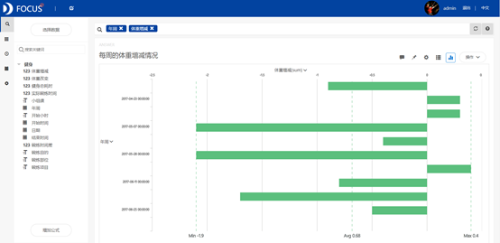
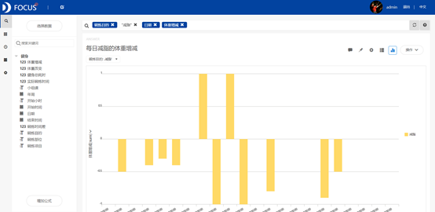
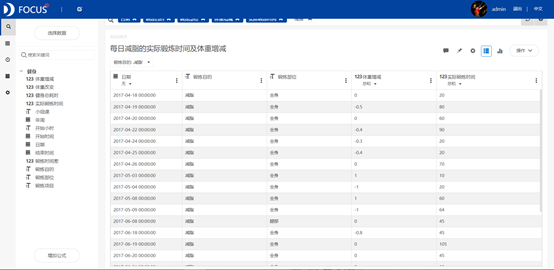

摘要 ：健身这个词汇已经越来越成为一种国人的新时尚。此次案例分析的数据为2017年4月18日到2017年7月5日某健身达人的健身情况记录数据。通过对这名女性实际锻炼时长对体重增减影响的研究，发现实际锻炼时长对体重增减存在一定的影响。接着对这名女性的主要锻炼目的及最后达到的效果研究，发现锻炼时间不够或者锻炼时间的间隔太长，会容易导致体重反弹。因此认为健身一定要学会坚持，要不时为自己增加负荷，在健身锻炼前更要制定锻炼计划。

关键词：健身；减脂；实际锻炼时间；瓶颈期

一、案例背景

健身是一种体育项目，如各种徒手健美操、韵律操、形体操以及各种自抗力动作，体操可以增强力量、柔韧性，增加耐力，提高协调，控制身体各部分的能力，从而使身体强健。

此次案例分析的数据为2017年4月18日到2017年7月5日某健身达人的健身情况记录数据。主要内容包括分析每日实际健身时间与体重变化的情况，然后发现她的主要锻炼目并观察最后结果是否满足了她的目的等。其中体重改变的数据是对比该名女性第一天开始健身时的体重数据，体重增减数据则是对比上一次锻炼时的体重数据。

二、案例问题

在健身快速发展的现在，制定一个有效的健身计划，了解自己健身的效果对于每个健身达人来说都极为重要。但用EXCEL来处理自己的健身数据会略显麻烦而且十分浪费时间，使用datafocus产品就可以快速处理数据，极大的减少做报告的时间。

三、案例分析

1.每周的体重增减情况

通过条形图可以较直观的对比从2017年4月18日到2017年7月5日这段时间内每周这名女性的体重增减情况。

图 1 每周的体重增减情况

从图中可以明显地看出这名女性的体重在第一周时有所下降，但是在第二周和第三周时，她的体重却有一定的回升，当度过这段时间的上升后，她的体重开始迅速下降。

2.每天实际锻炼时间与体重改变的情况

为了进一步了解这名女性的体重变化，接下来通过柱状图可以比较这名女性每次去健身时，每日的实际锻炼时间长短和体重改变情况。

图 2每日实际锻炼时间与体重变化

从图中可以看出这位女性每日的实际锻炼时间不稳定，但整体时间基本保持在50分钟以上；从体重变化的柱状图上则可以看出一开始的几天内体重减少的幅度很小，甚至体重还略有增长，度过开头的几天后，体重有了很大幅度的下降，但经过差不多两个月的大幅下降，体重下降开始渐渐步入瓶颈期，下降的幅度变低了。

3.实际锻炼时长对体重增减的影响

通过图2可以看到这名女性的体重较开始锻炼时有了明显的下降，接下来利用气泡图比较锻炼时间长短对于体重增减的影响。

图 3实际锻炼时长对体重增减的影响

这张气泡图中的气泡的大小代表了实际锻炼的时间长短。从图中可以看出一开始的几天内体重没有明显的变化，甚至健身时间越长，体重反而略有增加，经过这段时间后，即使不进行长时间的健身也能够达到减脂的效果，但差不多两个月后，体重下降开始进入瓶颈期，进行同样时间的锻炼体重却没有太大的变化，此时应重新加大训练的强度，增加锻炼的时间。

4.小组课对体重增减的影响

为了了解如何正确的健身，很多热爱健身的人都会愿意通过加入健身小组课向健身教练请教，通过折线图可以对比小组课是否能更加有效的到达健身的目的。

图 4小组课对体重增减的影响

从图中可以直接地看出这名女性参与小组课时的体重增减并没有非常明显的波动，甚至不如她自己锻炼不加入小组课。

5.锻炼目的及其时间分配

通过饼图可以直观的看出该名女性锻炼的所有目的以及她对于这几个目的所分配的时间。

图 5锻炼目的及其时间分配

从图中可以看出这名女性健身的目的包括减脂、锻炼力量和练习柔韧度，但最主要的目的是减脂，占总体实际锻炼时间的44.6%。

6.每日减脂的体重增减

从图5中看出这名女性健身最主要的目的是减脂，那么她的体重增减是否满足了她减脂的目的。

图 6每日减脂的体重增减

从图中可以看出这名女性除了2017年5月3日和5月8日，其余的时间基本达到了减脂的目的。

7.每日减脂的实际锻炼时间及体重增减

从图6中可以看出在2017年5月3日和5月8日，体重的增减出现了异常，因此加入实际锻炼时间观察可能引起异常的原因。

图 7每日减脂的实际锻炼时间及体重增减

图 8 数据表

图7的气泡图反映的是每日减脂目的下的实际锻炼时长对体重增减的影响，气泡的大小代表了实际锻炼的时间长短。从图7中可以更直观的看出2017年5月3日和5月8日这名女性的体重异常。

从图8的数值表中则可以看出2017年5月3日这名女性仅仅锻炼了10分钟，因此可能导致体重略有反弹，5月8日那天虽然锻炼了60分钟，但从日期中可以看到上次健身是在四天前，健身时间间隔稍大，可能导致了这名女性体重的异常。

（二）数据看板

最后将这7个结果图导入"健身情况"数据看板中，为了使数据看板更为美观，对看板进行了以下布局操作：

进行全局样式设置：将界面背景设置为图片，上传图片并设置为平铺；将组件背景、标题栏设置为图片；组件文字设置为白色；标题文字设置为白色加粗并居中。

选择"自由布局"，将最后一个图表拉长填满整个看板。

图 9数据看板

四、结论

综上所述，通过对2017年4月18日到2017年7月5日这段时间内的某女性的健身情况统计，可知这名女性的体重在健身这段时间基本呈下降的趋势。

这名女性每日的实际锻炼时间基本保持在50分钟以上，体重也有了一定的下降。实际锻炼时长对体重增减存在一定的影响，且该名女性的减脂瓶颈期应该是两个月，此时应重新加大训练的强度，增加锻炼的时间。

这名女性健身的主要的目的是减脂，她基本上很好的达到了减脂的目的。但有两天存在异常，出现异常的原因可能是2017年5月3日她仅仅锻炼了10分钟，5月8日那天虽然锻炼了60分钟，但从日期中可以看到上次健身是在四天前，健身时间间隔稍大。

五、对策建议

1.健身一定要持之以恒。健身锻炼是很艰苦，要有充分的思想准备。

2.增加负荷。健身爱好经过一段时间的锻炼，肌肉增大了，力量也加强了，为了使肌肉继续增大或保持良好的状态，就需要经常给它以新的刺激，促进肌肉不断增长。

3.健身锻炼前，首先要制定锻炼计划。包括锻炼次数、锻炼时间、锻炼部位、锻炼组数、动作次数和器械重量等。
