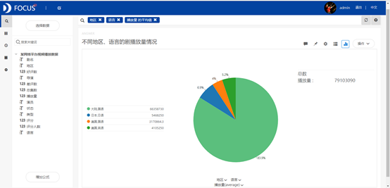
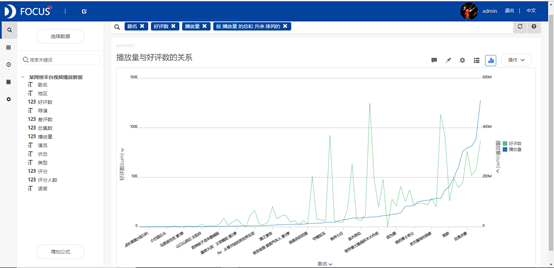
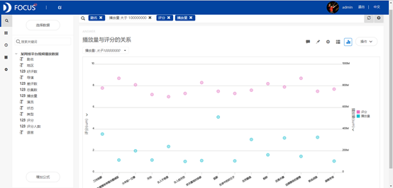
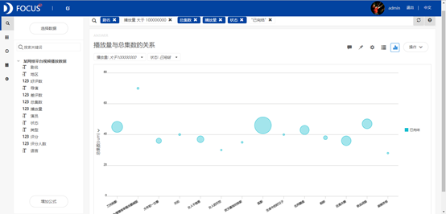
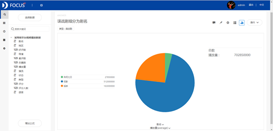
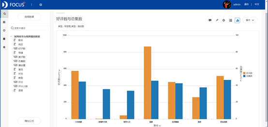

摘要 ：网络平台中，播放量是网络平台最看重的数据指标。在大数据的背景下，此次案例通过分析某平台已播放剧的评分、好评数、总集数等指标来研究影响播放量的因素，从而预测播放量可能高的剧的一些指标情况，以提高平台未来的播放量。通过分析发现，播放量与好评数、总集数和剧类型之间有着较明显的依赖关系，而与评分没有较大的关系。好评数越多的剧的播放量越高，而总集数在40集左右的剧的播放量最高。观众最喜爱的两类剧是军旅剧和谍战剧。

关键词：Datafocus；播放量；因素分析

## 一、案例背景

在互联网时代下，中国的影视行业正在变革，最明显的是，播放平台的重心由传统电视台转向视频网站。网络平台中，播放量是衡量一部剧市场地位的核心标准。网络平台可以基于大数据的背景，统计分析用户的喜好和习惯，为其推荐喜欢的视频，从而牢牢地黏住用户以及提升网站的营销竞争力。视频播放量作为一般网站最看重的数据指标，很大程度上也影响着网络平台的营业收入，网站往往会通过衡量评分、剧类型、好评数等多方面因素来推荐一个视频使其产生热点效应，从而使其有较高的播放量。

## 二、案例问题

视频播放量可能受到很多因素的影响，如评分、类型、演员等等。本文将着重讨论分析影响视频播放量的主要因素，并将这些因素进行有机结合，研究它们对视频播放量产生的综合影响效果。由于视频网站视频播放量数据信息量巨大，播放量随时间变化频繁，用EXCEL来进行操作会略显麻烦，使用Datafocus产品就可以快速处理大量数据，分析的准确性也高。

## 三、案例分析

将分析的"某网络平台视频播放数据"CSV文件导入到Focus系统中。

（一）播放量的影响因素分析

1.地区和语言分析

为了分析不同地区和语言的剧播放量情况，绘制出饼图如图1所示。从饼图中可以看出地区为大陆，语言为国语的剧的平均播放量最高，占总播放量的80%以上，说明国产剧最受观众欢迎。

图1 不同地区和语言的剧播放量情况

2.好评数分析

为了分析好评数与播放量之间的关系，将播放量进行升序排列，然后绘制出折线图如图2所示。从折线图中，我们可以看到，好评数和播放量总体上都呈现出上升的趋势，即说明好评数较多的剧的播放量也相应的高，好评数多说明剧的关注度高，观看该剧的人会比较多，所以播放量自然就比较高。

图2 播放量与好评数的关系

3.评分分析

将播放量大于100000000的剧名筛选出来，利用散点图比较其播放量和评分情况。从图3中可以发现评分值在8附近波动不大，播放量也大多在400000000以下，只有狐影这一部剧的播放量显著地高于其他剧。这说明播放量与评分之间没有特别大的关系，即评分高的剧的播放量不一定高，播放量高的剧的评分也不一定高。狐影的播放量之所以显著地大于其他剧的播放量，由后面的分析可知该剧属于谍战剧类型，受观众的欢迎度高，并且可以从数据表中发现该剧好评数很多，而又由播放量与好评数的关系分析结果可知，好评数多的剧的播放量高，好评数少的播放量不高。

图3 播放量与评分之间的关系

4.总集数分析

将播放量大于100000000的剧名筛选出来，绘制气泡图来分析播放量与总集数之间的关系。从图4中可以发现播放量较高的这些剧的总集数在40集上下波动。距离40集越近的剧的播放量越大，而距离40集越远的剧的播放量越小。

图4 播放量与总集数的关系

5.剧类型分析

饼图可以直观地反映不同类型剧的播放量情况以及占总播放量的比重。从图5中可以看出播放量最高的两类剧分别是军旅剧和谍战剧，其播放量占总播放量的百分比分别为30.6%和29.7%，其次是家庭剧、喜剧和偶像剧。这说明军旅剧和谍战剧是最受观众欢迎的两类剧。需要针对这两类剧进行详细分析，找出导致其播放量较高的原因。

图5 不同类型剧的播放量统计

### （二）综合分析

详细分析军旅剧和谍战剧的播放量情况，统计这两类剧里哪些剧的播放量较高以及哪些剧的播放量较低。分析不同剧的播放量呈现差异的原因，研究这些剧的播放量与好评数、总集数之间的内在联系。

1. 军旅剧播放量分析
    
    将图5中的军旅剧在Focus系统中钻取剧名，绘制成条形图，如图6所示。从条形图中可以看出并非所有的军旅剧播放量都很高，四部剧中有三部剧播放量很高，只有彭德怀元帅这部剧的播放量很低。
    
    
    
    图6 军旅剧细分为剧名的播放量统计
    
2. 谍战剧播放量分析
    
    将图5中的谍战剧在Focus系统中钻取剧名，绘制成饼图，结果如图7所示。从图7中可以看出狐影和蚂蚱这两部剧的播放量较高，而殊死七日的播放量较低。
    
    
    
    图7 谍战剧细分为剧名的播放量统计
    
    3.好评数与总集数情况统计
    
    观察工作表中的数据发现军旅剧和谍战剧的地区均为大陆，语言均为国语，状态也都是已完结，所以利用条形图来着重分析总集数与好评数的差异性。从图8中看出，播放量较少的两部剧的好评数也都很少，总集数也略少于其他剧，所以其播放量就比较低，这与前面关于播放量影响因素的分析相一致。
    
    
    
    图8 好评数与总集数情况
    
    ### （三）数据看板
    
    最后将这8个结果图导入"某网络平台视频播放情况"数据看板中，为了使数据看板更为美观，在全局样式中选择第三个预设样本，将界面背景设置为浅蓝色，标题文字的颜色设置为橙色。操作结果如下：
    
    
    
    图9 数据看板
    
    ## 四、结论
    
    网络平台的视频播放量与地区、语言、好评数、总集数和剧类型有着较明显的相互依赖关系，而与评分没有较大的关系。地区为大陆和语言为国语的剧最受观众欢迎；好评数越多的剧的播放量越高，好评数越少的剧的播放量也相对较低；总集数并非越长剧的播放量就越高，而是在40集左右的剧的播放量最高，距离40集较远的剧的播放量较低，所以要使播放量较高，首先需要把剧的总集数大概控制在37—45集之间。通过比较不同类型剧的播放量发现，军旅剧和谍战剧是最受观众欢迎的两类剧。
    
    ## 五、对策建议
    
    该平台在购买或者投放一部剧的时候，应该充分地考虑剧的地区、语言、好评数、总集数以及剧的类型等情况。首先剧的地区为大陆，语言为国语，其次好评数较多，剧的总集数也在40集左右，并且剧的类型也是比较受观众欢迎的军旅剧或者谍战剧的话，可以考虑购买并投放该剧，其最终的播放量应该会比较高。如果剧的好评数较少或者总集数跟40集相差较大，最好不要购买和投放这种剧。
