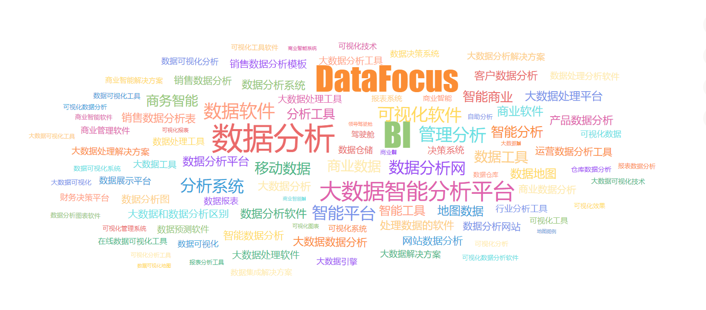

在这个大数据时代，客户数据是很多TO C企业都会特别重视的数据维度，针对客户数据的数据分析也是很多决策者几乎每天都需要看到和应用的内容。很多决策者聘请了专业的数据分析团队，也有干脆购买了类似于DataFocus、Power BI等自用BI工具的企业进行自主数据分析。

而会员数据是客户数据内最为核心的数据之一，代表的是最忠诚的客户群体数据以及企业的私域流量数据。因此，会员标签在会员数据的整理的工作中是一个非常重要的方法。因为多变的市场环境和客户特点，最好需要有实时的数据分析系统进行支持。总的来说，就是全渠道抓取和导入会员标签数据，存储在BI工具或其他软件内，并可保存成看板，更加准确的表述会员特征，进而定义精准营销策略，并反馈执行结果评估营销效果。

比如可以通过商品标签进行数据采集，从各个平台很容易抓取到商品的各种标签，如SKU、合适人群等。结合会员标签的数据采集，比如POS系统、问卷、电商平台甚至手工录入等手段，并整合到企业数据仓库中，标签进行整合整理、清洗。

B工具有一点好处在于，就算保存了相应看板，也能根据源数据的更新进行更新。比如静态数据，像是会员注册数据、活动报名数据等，或者动态数据，比如一些订单数据的变化，都能够反映在实时看板当中，增量数据可以定期更新。

这些标签就可以用于实时的数据分析，无论是使用搜索式数据分析软件搜索标签本身，还是利用SQL语句调用出相应数据。可以用于市场营销对象的维度抽取、营销活动的规则解析以及营销和销售效果分析等。
